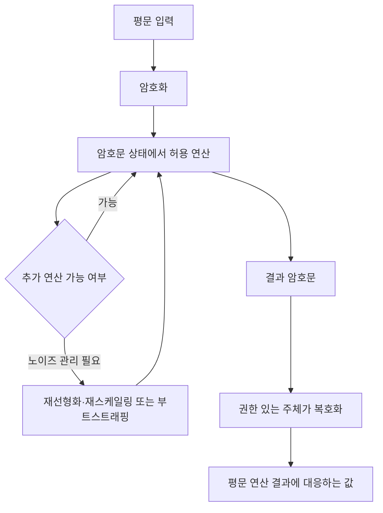

핵심 용어

- **부트스트래핑(Bootstrapping)**: 암호문 안의 노이즈를 줄여 추가 동형 연산을 이어갈 수 있게 하는 절차로, 암호문 상태에서 복호화 회로에 해당하는 계산을 수행한다.
- **CKKS 스킴**: 실수·복소수 값의 근사 산술을 암호문 상태에서 지원하는 동형암호 방식이다.

## 30초 인출

- 본질: 동형암호는 데이터를 복호화하지 않고 암호문 상태에서 계산하는 암호 방식이다.
- 메커니즘: 암호문 연산 결과를 복호화하면 대응하는 평문 연산 결과를 얻으며, 지원 연산과 노이즈를 관리한다.

---

## 1교시 예상문제 (10점)

> 동형암호의 원리와 부분·완전 동형암호의 차이를 설명하시오. (예상)

---

## 1교시 10점 답안

### 1. 정의·목적

정의: 동형암호는 암호문 상태에서 계산하는 암호 방식으로, 복호화 결과가 대응하는 평문 연산 결과를 나타낸다.

목적: 처리자에게 평문을 공개하지 않고 계산해 데이터 노출을 줄인다.

### 2. 유형

| 유형 | 연산 범위 | 예시·특징 |
|---|---|---|
| 부분 동형암호(PHE) | 특정 연산 지원 | RSA·ElGamal 등 |
| 준 동형암호(SHE) | 제한된 횟수의 연산 | BGV·BFV 등 |
| 완전 동형암호(FHE) | 일반 연산 지원 | 연산 중 노이즈 관리가 필요 |

제안: 데이터 민감도와 연산 요구에 맞는 방식을 선택하고 지연·자원 사용을 사전 측정한다.

---

## 2~4교시 예상문제 (25점)

> 동형암호의 동작 원리와 유형을 설명하고, 노이즈 관리 및 적용 시 고려사항을 제시하시오. (예상)

---

## 2~4교시 25점 답안

### Ⅰ. 동형 연산 원리

동형암호는 암호문에 허용된 연산을 적용하고, 결과 암호문을 복호화해 평문 연산 결과에 대응시키는 암호 방식이다. 처리자는 입력 평문을 보지 않고 계산할 수 있지만, 지원 연산·정밀도·성능은 스킴과 파라미터에 따라 달라진다.

### Ⅱ. 유형과 연산 범위

| 유형·스킴 | 연산 특성 | 답안에서 짚을 점 |
|---|---|---|
| 부분 동형암호(PHE) | 특정 연산을 지원 | 어떤 연산을 지원하는지 스킴별로 확인 |
| 제한적 동형암호(SHE) | 제한된 깊이의 연산 회로 지원 | 회로 깊이에 맞춰 연산을 설계 |
| 완전 동형암호(FHE) | 임의의 유한 회로 계산을 지원하도록 구성 | 노이즈·연산 깊이 관리가 필요 |
| BGV·BFV | 정수 기반 정확 산술 | 정확한 정수 연산에 사용 |
| CKKS | 실수·복소수의 근사 산술 | 결과 오차와 스케일을 고려 |

### Ⅲ. 노이즈와 적용 조건

암호문 계산은 연산이 누적되며 노이즈와 회로 깊이의 영향을 받는다.

| 단계 | 보안·계산 고려사항 |
|---|---|
| 연산 설계 | 필요한 산술 연산과 회로 깊이를 정한다. |
| 암호문 계산 | 노이즈·스케일을 추적하고 지원 범위를 넘지 않게 한다. |
| 결과 처리 | 입력·출력 처리와 키 관리를 별도로 보호한다. |

### Ⅳ. 적용 설계 점검

| 설계 조건 | 확인 항목 |
|---|---|
| 연산 회로 | 덧셈·곱셈 종류와 깊이에 맞는 스킴 선택 |
| 정확도 | 근사 연산이면 허용 오차와 스케일 확인 |
| 운영 성능 | 처리 시간·메모리·암호문 크기 측정 |

### Ⅴ. 기술사적 제언

| 문제 | 해결 방안 |
|---|---|
| 업무에 맞지 않는 스킴을 택하면 정확도·성능 제약으로 활용이 어려울 수 있다. | 데이터 민감도와 연산 요구에 맞춰 스킴·파라미터를 정하고 실제 회로로 정확도·성능을 검증한다. |

## 출제 이력
- 제133회 1교시 5번은 동형암호의 동작 원리와 유형을 묻는다.
- 제125회 1교시 문항은 완전 동형암호의 개념과 부트스트래핑을 묻는다.

## 공식 참고
- [Microsoft SEAL: Homomorphic Encryption](https://github.com/microsoft/SEAL) — CKKS의 근사 산술 및 암호문 연산 설명.
