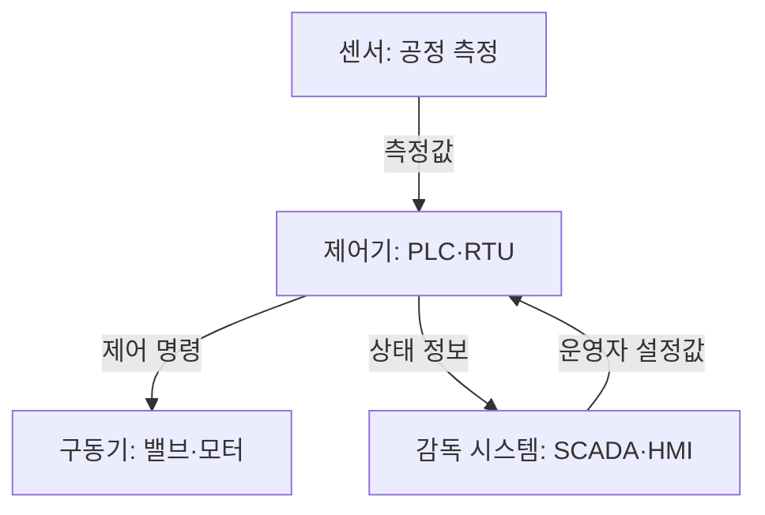

핵심 용어

- **산업제어시스템(ICS)**: 센서·제어기·감독 시스템으로 산업 공정을 감시하고 제어하는 시스템이다.
- **Purdue 모델**: 산업제어 환경의 정보기술·운영기술 계층을 설명할 때 쓰는 참조 모델이다.

## 30초 인출

- 본질: ICS는 산업 공정을 감시하고 물리 장비를 제어하는 체계다.
- 메커니즘: 센서·제어기·운영화면이 연결되어 동작하므로 변경의 가용성·안전 영향을 평가한다.

---

## 1교시 예상문제 (10점)

> 산업제어시스템의 특성과 IT 환경과 다른 보안 우선순위를 설명하시오. (예상)

---

## 1교시 10점 답안

### 1. 정의·목적

정의: 산업제어시스템(ICS)은 산업 공정의 상태를 감시하고 물리 장비를 제어하는 하드웨어·소프트웨어 체계다.

목적: 공정의 안전성과 연속성을 지키면서 제어망과 설비를 보호한다.

### 2. IT와 OT 보안 우선순위

| 관점 | IT 환경 | OT·ICS 환경 |
|---|---|---|
| 우선 고려 | 기밀성·무결성·가용성 | 가용성·안전성과 실시간성 |
| 변경 관리 | 주기적 패치 가능 | 공정 영향 평가 후 신중히 적용 |
| 대표 통제 | 계정·단말·네트워크 통제 | 구간 분리·산업 프로토콜 감시·일방향 전송 |

제안: 공정 영향과 안전성을 먼저 평가하고, 시험 후 변경을 단계적으로 적용한다.

---

## 2~4교시 예상문제 (25점)

> ICS의 구성과 보안 특성을 설명하고 IT·OT 환경의 차이를 고려한 보호대책을 제시하시오. (예상)

---

## 2~4교시 25점 답안

### Ⅰ. 구성과 보안 경계

ICS는 센서·제어기·감독 시스템을 연결해 물리 공정을 운영한다. Purdue 모델은 계층을 이해하는 참고 구조이며, 실제 망 설계는 공정과 위험에 맞춰야 한다. 화살표는 센서 측정값이 제어기로 전달되고 제어 명령이 구동기로 가는 관계를 나타낸다. SCADA·HMI는 상태를 받고 운영자 설정값을 제어기에 보낸다. 네트워크 경계와 통신 통제는 Ⅲ절에서 다룬다.

### Ⅱ. IT·OT 보안 차이

| 구분 | IT 환경 | OT·ICS 환경 |
|---|---|---|
| 우선 고려 | 기밀성·무결성·가용성 | 안전·가용성·실시간 운전 |
| 변경 | 상대적으로 잦은 패치 | 공정 영향 검토·시험 후 변경 |
| 관측 | 단말·계정·네트워크 로그 | 공정 상태와 제어 통신을 함께 관측 |

### Ⅲ. 주요 위협과 통제

| 공격 경로·위험 | 통제 |
|---|---|
| 유지보수 단말·매체를 통한 악성코드 유입 | 반입 승인, 악성코드 검사, 유지보수 계정·접속 기록 관리 |
| 불필요한 IT·OT 연결과 횡적 이동 | 구간 분리, 허용 통신만 개방, 경계 장비와 중계 구간 감시 |
| 산업 프로토콜의 인증·암호화 제약 | 수동형 통신 감시, 명령 허용목록, 공정별 이상 징후 확인 |

### Ⅳ. 운영 보호 절차

| 단계 | 핵심 조치 |
|---|---|
| 자산·위험 파악 | 설비, 통신, 안전 영향과 복구 우선순위 식별 |
| 변경·접근 관리 | 작업 승인, 계정 최소화, 시험·롤백 계획 적용 |
| 사고 대응 | 안전한 상태 전환과 수동 운전·복구 절차 훈련 |

### Ⅴ. 기술사적 제언

| 문제 | 해결 방안 |
|---|---|
| 일반 IT 보안 도구를 공정 영향 검토 없이 설치하면 제어 운영에 지장을 줄 수 있다. | 공정 담당자와 변경 위험을 검토하고, 우선 수동형 모니터링을 적용한 뒤 시험 구간에서 검증해 단계적으로 확대한다. |

## 출제 이력
- 제132회 1교시 5번: ISA/IEC 62443 기반 산업제어시스템 보안.
- 제125회 1교시: ICS/SCADA 보안 위협 및 대책.
