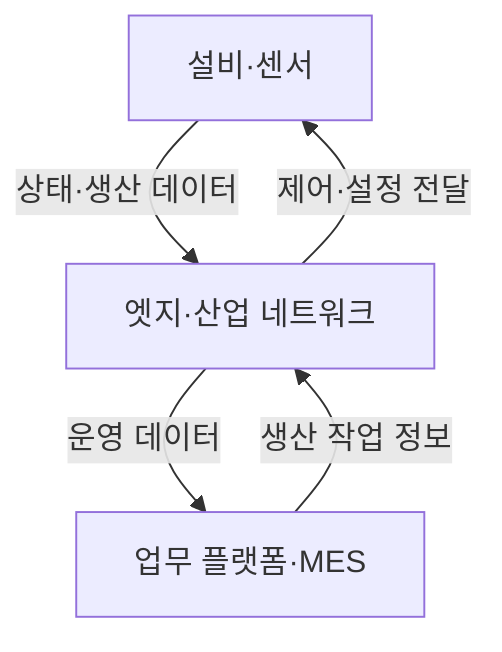

핵심 용어

- **스마트팩토리**: 생산 설비와 정보시스템을 연결해 제조 공정을 운영하는 환경이다.
- **산업용 사물인터넷(IIoT)**: 제조 현장 장비와 센서를 네트워크에 연결해 상태·공정 정보를 수집하거나 전달하는 기술이다.

## 30초 인출

- 본질: 스마트팩토리는 생산 설비와 정보시스템을 연결해 제조 공정을 운영하는 환경이다.
- 메커니즘: 디바이스·네트워크·플랫폼 경로를 보호하고 이상 행위에 대응해 생산 연속성을 지킨다.

---

## 1교시 예상문제 (10점)

> 스마트팩토리의 보안 위험과 주요 보호 영역을 설명하시오. (예상)

---

## 1교시 10점 답안

### 1. 정의·목적

정의: 스마트팩토리는 제조 설비와 정보시스템을 연결해 생산 공정을 자동화·운영하는 환경이다.

목적: 연결된 설비·네트워크·플랫폼의 보안을 유지하면서 생산의 연속성과 안전을 지킨다.

### 2. 보호 영역

| 영역 | 주요 자산·위험 |
|---|---|
| 디바이스 | 센서·로봇의 펌웨어 위변조 |
| 네트워크 | 5G·산업망 연결을 통한 침입 |
| 플랫폼 | MES·ERP 계정과 데이터 침해 |
| 운영 | 랜섬웨어로 인한 생산 중단 |

제안: 자산과 통신 경로를 식별하고 생산 안전을 고려해 탐지·복구 절차를 마련한다.

---

## 2~4교시 예상문제 (25점)

> 스마트팩토리의 보안 위협과 디바이스·네트워크·플랫폼별 보호대책을 설명하시오. (예상)

---

## 2~4교시 25점 답안

### Ⅰ. 구성과 보호 범위

스마트팩토리는 생산 설비와 정보시스템을 연결해 제조 공정을 운영한다. 보안 범위는 현장 디바이스부터 제어망·업무 플랫폼까지 이어진다. 위쪽 두 화살표는 설비 상태가 엣지를 거쳐 업무 플랫폼으로 전달되는 경로이며, 아래쪽 두 화살표는 작업 정보와 제어·설정이 현장으로 전달되는 경로다. 각 구간의 위험과 통제는 Ⅲ절 표에 정리했다.

### Ⅱ. 기존 제조 환경과 연결 확대

| 구분 | 기존 제조 환경 | 연결된 스마트팩토리 |
|---|---|---|
| 주요 자산 | 제어기·운영 단말 | 제어기와 IIoT·엣지·업무 플랫폼 |
| 연결 | 제한된 공정 통신 | 무선·원격·API 등 연결 경로 확대 |
| 보안 고려 | 안전·가용성·변경 통제 | 기존 고려사항과 계정·공급망·데이터 보호 병행 |

### Ⅲ. 위협과 보호대책

| 영역 | 위협 예 | 대응 |
|---|---|---|
| 디바이스 | 취약한 계정·펌웨어 변조 | 자산 등록, 인증된 업데이트, 기본 계정 변경 |
| 네트워크 | 불필요한 연결·비인가 명령 | 구간 분리, 통신 허용목록, 이상 통신 감시 |
| 플랫폼·데이터 | 계정 침해·정보 노출 | 강한 인증, 최소 권한, 데이터 접근·반출 통제 |
| 운영·공급망 | 협력사 접속·랜섬웨어 확산 | 시간 제한 원격접속, 백업·복구 훈련, 사고 대응 |

### Ⅳ. 생애주기별 운영

| 설계·구축 | 운영 | 개선·복구 |
|---|---|---|
| 자산·위험·보안 요구 식별 | 계정·변경·통신 감시 | 취약점 조치와 안전한 복구 시험 |

### Ⅴ. 기술사적 제언

| 문제 | 해결 방안 |
|---|---|
| IT망·공정망 연결과 현장 기기 증가로 공격 경로가 넓어질 수 있다. | 생산 셀과 업무 구간을 분리하고, 자산·통신 목록 및 협력사 접근을 관리하며 공정 안전을 반영한 복구 훈련을 정례화한다. |

## 출제 이력
- 제125회 1교시: 스마트팩토리 보안 가이드라인 및 주요 위협.
- 제120회 1교시: 스마트제조 보안 아키텍처.
