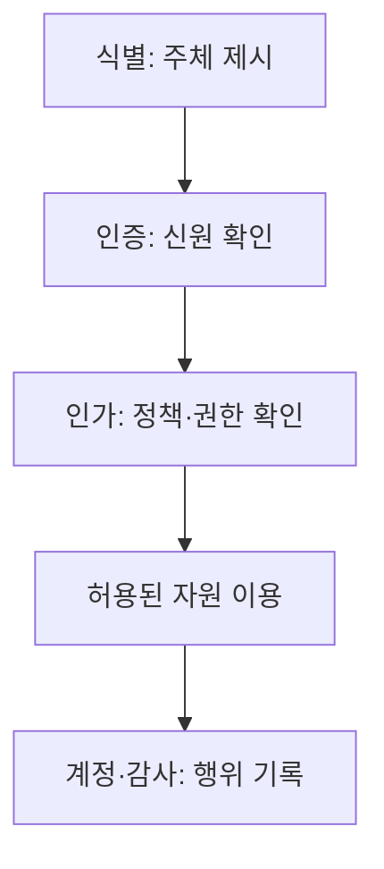

핵심 용어

- **3A 체계**: 식별·인증·인가와 계정·감사 기록을 통해 접근을 통제하고 이용 이력을 관리하는 구조다.
- **BOLA**: API 요청에서 객체별 권한 검사가 빠져 다른 사용자의 객체에 접근할 수 있는 취약점이다.

## 30초 인출

- 본질: 접근통제는 주체가 객체에 접근할 범위와 방식을 정책으로 제한한다.
- 메커니즘: 식별→인증→인가→감사로 권한을 확인하고 사용 이력을 추적한다.

---

## 1교시 예상문제 (10점)

> 접근통제의 목적과 식별·인증·인가·감사의 흐름을 설명하시오. (예상)

---

## 1교시 10점 답안

### 1. 정의·목적

정의: 접근통제는 주체가 객체에 접근할 수 있는 범위와 방식을 정책에 따라 제한하는 보안 기제다.

목적: 정당한 권한을 가진 사용자만 필요한 자원에 접근하게 하고 행위를 추적한다.

### 2. 접근통제 흐름

| 순서 | 기능 | 핵심 질문 |
|---|---|---|
| 식별 | 주체를 주장 | 누구인가? |
| 인증 | 신원을 확인 | 본인인가? |
| 인가 | 정책·권한 확인 | 허용된 행위인가? |
| 감사 | 기록·추적 | 어떤 행위를 했는가? |

제안: 최소 권한을 부여하고 권한 변경 및 사용 이력을 정기적으로 검토한다.

---

## 2~4교시 예상문제 (25점)

> 접근통제의 원칙과 식별·인증·인가·감사 구조를 설명하고 권한 상승 방지 방안을 제시하시오. (예상)

---

## 2~4교시 25점 답안

### Ⅰ. 접근통제와 3A 흐름

접근통제는 주체의 자원 접근을 정책으로 제한하는 보안 기제다.

### Ⅱ. 접근통제 정책

| 정책 | 권한 결정 기준 | 특징 |
|---|---|---|
| DAC | 자원 소유자의 재량 | 공유·위임이 유연 |
| MAC | 보안 등급·인가 | 중앙 정책으로 엄격히 통제 |
| RBAC | 직무 역할 | 역할에 권한을 묶어 관리 |
| ABAC | 주체·자원·환경 속성 | 상황별 세밀한 정책 표현 |

### Ⅲ. 권한 오용과 통제

| 위험 | 통제 |
|---|---|
| 로그인했지만 객체별 인가가 빠짐(BOLA 등) | 서버 측에서 매 요청의 객체 소유권·행위 권한 확인 |
| 과도하거나 오래된 권한 | 최소 권한, 직무 변경·퇴직 시 회수, 정기 검토 |
| 계정 탈취·세션 악용 | 다중 인증, 세션 보호, 위험에 비례한 추가 확인 |

### Ⅳ. 운영·감사

| 절차 | 확인 사항 |
|---|---|
| 계정 생명주기 | 발급·변경·회수의 승인과 기록 |
| 권한 검토 | 업무 필요성, 분리된 직무, 예외 권한 |
| 감사·대응 | 누가 언제 어떤 자원에 어떤 행위를 했는지 추적 |

### Ⅴ. 기술사적 제언

| 문제 | 해결 방안 |
|---|---|
| 인증 성공만으로 모든 요청을 신뢰하면 객체 단위 권한 누락과 권한 누적을 놓칠 수 있다. | API·서비스 계층에서 최소 권한의 정책 결정을 강제하고, 권한 변경과 접근 로그를 정기 검토한다. |

## 출제 이력
- 제133회 4교시 3번: 접근제어의 개념과 정책·절차·구현 메커니즘.
- 제129회 2교시: 접근제어 통제정책.
