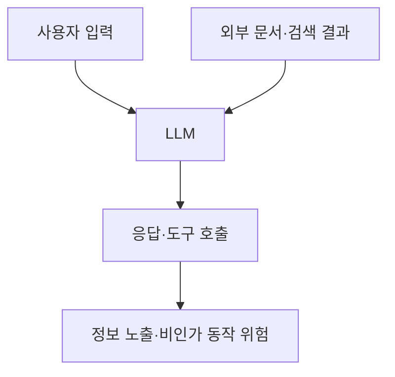

핵심 용어

- **프롬프트 인젝션**: 입력이나 외부 콘텐츠에 담긴 지시로 LLM의 동작을 의도와 다르게 유도하는 공격이다.
- **간접 프롬프트 인젝션**: 모델이 읽는 웹 문서·이메일·검색 자료 등에 삽입한 지시로 모델 동작을 유도하는 공격이다.

## 30초 인출

- 본질: 프롬프트 인젝션은 입력·외부 콘텐츠로 LLM 동작을 의도와 다르게 바꾸는 공격이다.
- 메커니즘: 직접·간접 입력이 지시를 오염시켜 정보 노출이나 비인가 행위를 유도한다.

---

## 1교시 예상문제 (10점)

> 프롬프트 인젝션의 원리와 직접·간접 공격의 차이를 설명하시오. (예상)

---

## 1교시 10점 답안

### 1. 정의·목적

정의: 프롬프트 인젝션은 악성 입력이나 외부 콘텐츠로 LLM의 동작·출력을 의도와 다르게 바꾸는 공격이다.

목적: 시스템 지시를 우회해 민감정보 노출이나 비인가 행위를 유도한다.

### 2. 공격 경로

| 유형 | 입력 경로 | 예시 |
|---|---|---|
| 직접 인젝션 | 사용자가 넣은 프롬프트 | 탈옥 지시로 안전 규칙 우회 시도 |
| 간접 인젝션 | 모델이 읽는 웹·문서·이메일 | 검색·RAG 자료에 숨긴 악성 지시 |

제안: 입력 경로를 신뢰하지 말고 도구 권한을 최소화하며 모델 출력과 실행을 별도로 검증한다.

---

## 2~4교시 예상문제 (25점)

> 프롬프트 인젝션의 발생 원리와 직접·간접 유형을 설명하고 RAG·도구 연동 서비스의 방어 방안을 제시하시오. (예상)

---

## 2~4교시 25점 답안

### Ⅰ. 원리와 공격 경로

프롬프트 인젝션은 입력이나 외부 콘텐츠에 담긴 지시로 모델의 동작을 의도와 다르게 유도하는 공격이다. 도해의 사용자 입력과 외부 문서는 모두 모델에 도달할 수 있는 입력 경로이며, 응답이나 도구 호출이 정보 노출·비인가 동작 위험으로 이어질 수 있다. 대응은 Ⅲ절의 데이터·모델·도구 통제로 나눈다.

### Ⅱ. 직접·간접 유형과 위험

| 유형 | 입력 경로 | 주요 위험 |
|---|---|---|
| 직접 인젝션 | 사용자가 제공한 프롬프트 | 안전 지시 우회 시도, 부적절한 응답 |
| 간접 인젝션 | 모델이 읽는 웹·문서·이메일·검색 자료 | 외부 지시가 요약·검색·도구 동작에 영향 |
| 도구 연동 위험 | 모델이 호출할 수 있는 도구 | 데이터 조회·전송·변경 등 권한 남용 가능성 |

### Ⅲ. 방어 계층

| 계층 | 대응 |
|---|---|
| 입력·검색 자료 | 비신뢰 콘텐츠 표시, 출처·범위 통제, 민감정보 최소화 |
| 모델·출력 | 정책 검사와 결과 검토를 적용하되 단일 프롬프트 방어에 의존하지 않음 |
| 도구·데이터 | 최소 권한, 허용된 함수만 제공, 중요 행위에 승인·검증 적용 |
| 운영 | 공격 테스트, 로그·사고 대응, 통제 효과의 지속 점검 |

### Ⅳ. 유사 위협과 구분

| 위협 | 조작 시점·대상 |
|---|---|
| 프롬프트 인젝션 | 추론 시 입력·외부 콘텐츠를 통해 모델 동작을 유도 |
| 데이터 중독 | 학습·미세조정 데이터에 악성 또는 편향된 자료를 주입 |

### Ⅴ. 기술사적 제언

| 문제 | 해결 방안 |
|---|---|
| 자연어 지시와 비신뢰 콘텐츠를 완전히 분리하기 어렵고, 프롬프트 문구만으로 공격을 모두 차단할 수 없다. | 모델이 접근할 데이터·도구 권한을 제한하고, 민감하거나 파괴적인 행위는 별도 검증과 사람의 승인을 거치게 설계한다. |

## 출제 이력
- 제138회 1교시 12번: 프롬프트 인젝션(Prompt Injection).

## 공식 참고
- [OWASP GenAI Security Project: LLM01 Prompt Injection](https://genai.owasp.org/llmrisk/llm01-prompt-injection/) — 직접·간접 프롬프트 인젝션과 방어 고려사항.

## 공식 참고
- [OWASP GenAI Security Project: LLM01 Prompt Injection](https://genai.owasp.org/llmrisk/llm01-prompt-injection/) — 직접·간접 프롬프트 인젝션과 방어 고려사항.
