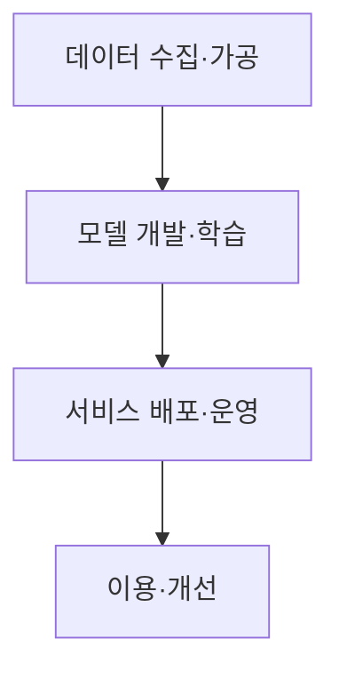

핵심 용어

- **AI 보안 안내서**: AI 서비스를 개발·운영할 때 고려할 보안 위협과 보호 조치를 안내하는 실무 지침이다.
- **AI 레드팀 점검**: 실제 사용 조건을 가정해 공격을 시도하고 취약점과 개선점을 찾는 보안 평가 활동이다.

## 30초 인출

- 본질: AI 보안 안내서는 AI 서비스 생애주기별 보안 위협과 대응을 안내하는 실무 지침이다.
- 메커니즘: 데이터 수집부터 모델 개발·배포·운영·활용까지 단계별 통제를 적용한다.

---

## 1교시 예상문제 (10점)

> AI 서비스 생애주기별 보안 점검 영역을 설명하시오. (예상)

---

## 1교시 10점 답안

### 1. 정의·목적

정의: AI 보안 안내서는 AI 서비스의 개발·운영 과정에서 고려할 보안 위협과 대응방안을 안내하는 문서다.

목적: 생애주기별 책임과 통제를 정해 데이터·모델·서비스 위험을 줄인다.

### 2. 생애주기 점검

| 단계 | 주요 점검 |
|---|---|
| 데이터 수집·가공 | 출처·권한·품질 및 오염 위험 |
| 모델 개발·학습 | 모델 무결성과 취약점 점검 |
| 배포·운영 | 레드팀 점검과 입출력 모니터링 |
| 사용자 활용 | 기밀정보 입력과 부적절한 사용 통제 |

제안: 조직 역할별 점검 책임을 정하고 위험 발견 시 개선 절차를 연결한다.

---

## 2~4교시 예상문제 (25점)

> AI 서비스의 생애주기별 보안 위협을 설명하고 데이터·모델·서비스 단계의 대응방안을 제시하시오. (예상)

---

## 2~4교시 25점 답안

### Ⅰ. 안내서의 목적과 범위

AI 보안 안내서는 AI 서비스를 개발·운영할 때 고려할 위협과 보호 조치를 안내하는 실무 지침이다. 세부 점검 항목은 적용하는 안내서 판본과 조직의 서비스 범위에 맞춰 확인한다.

화살표는 AI 서비스를 준비하고 운영하는 생애주기 순서를 나타낸다. 각 단계의 위협·점검 방향은 Ⅱ절에서 정리한다.

### Ⅱ. AI 서비스 생애주기

| 단계 | 자산·위험 | 점검 방향 |
|---|---|---|
| 데이터 수집·가공 | 권리·개인정보·품질·오염 | 출처와 이용 권한, 민감정보 처리 확인 |
| 모델 개발·학습 | 모델·학습 파이프라인 무결성 | 공급망·접근통제·검증 절차 점검 |
| 배포·운영 | 입력 악용·정보 노출·서비스 오용 | 인증·호출 제한·입출력 검사·모니터링 |
| 이용·개선 | 오용·오류·사고 반복 | 사용자 지침, 신고·대응, 개선 이력 관리 |

### Ⅲ. 위협과 대응 연결

| 위협 | 대응 예 |
|---|---|
| 데이터의 무단 사용·민감정보 포함 | 권한·목적 확인, 민감정보 보호, 최소 수집 |
| 모델·구성요소 변조 또는 취약점 | 출처 확인, 무결성·취약점 점검, 접근 제한 |
| 프롬프트 인젝션·부적절한 출력 | 입력·출력 검토, 도구 권한 제한, 중요 행위 승인 |
| 서비스 오용·장애 | 사용량·행위 감시, 사고 대응 및 복구 절차 |

### Ⅳ. 안내서와 위험관리 프레임워크

| 관점 | AI 보안 안내서 | NIST AI RMF |
|---|---|---|
| 초점 | AI 서비스 보안 위험과 실무 통제 참고 | AI 위험관리 기능과 조직 적용 구조 |
| 적용 | 생애주기별 보안 점검에 활용 | Govern·Map·Measure·Manage 기능으로 위험관리 |

### Ⅴ. 기술사적 제언

| 문제 | 해결 방안 |
|---|---|
| 안내서 내용을 조직의 책임·검증 절차와 연결하지 않으면 점검이 일회성에 그칠 수 있다. | 서비스별 위험과 담당자를 정하고 생애주기 점검 결과를 승인·개선·사고 대응 절차에 반영한다. |

## 출제 이력
- 공식 기출 확인 불가. 예상 문항: 과기정통부·KISA 생성형 AI 서비스 보안 안내서의 생애주기별 보안 위협과 대응.
