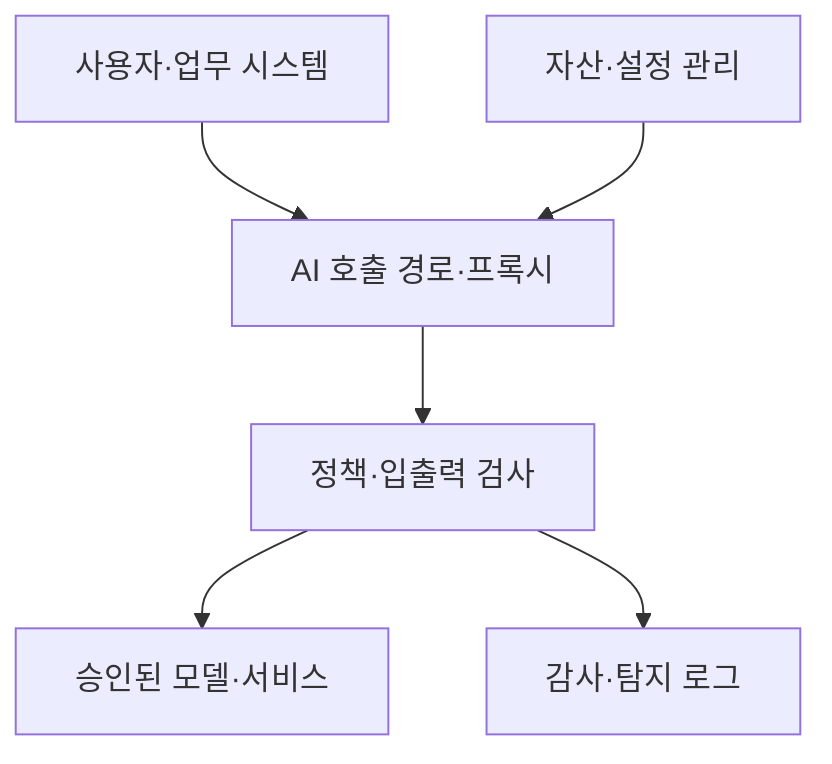

핵심 용어

- **AI 보안 플랫폼**: 조직의 AI 자산과 사용 경로를 파악하고 보안 정책을 적용하는 통제 체계다.
- **AI-SPM**: AI 모델·데이터·파이프라인의 구성과 위험을 지속 점검하는 보안 관리 기능이다.

## 30초 인출

- 본질: AI 보안 플랫폼은 조직의 AI 자산과 입출력 흐름에 보안 정책을 적용하는 체계다.
- 메커니즘: 자산을 발견하고 요청·응답을 검사해 정책 위반과 위협을 탐지한다.

---

## 1교시 예상문제 (10점)

> AI 보안 플랫폼의 주요 기능과 요청 처리 흐름을 설명하시오. (예상)

---

## 1교시 10점 답안

### 1. 정의·목적

정의: AI 보안 플랫폼은 조직의 AI 자산과 입출력 흐름을 관리하고 보안 정책을 적용하는 통제 체계다.

목적: 그림자 AI, 프롬프트 공격, 민감정보 유출 등 AI 사용 위험을 가시화하고 줄인다.

### 2. 주요 기능

| 기능 | 역할 |
|---|---|
| 자산 탐지 | 사용 중인 AI 모델·서비스 식별 |
| 게이트웨이·가드레일 | 입출력 정책 검사와 필터링 |
| 거버넌스 | 정책·감사·규제 요구 관리 |
| 위협 탐지 | 인젝션·정보노출 징후 점검 |

제안: 필요한 AI 자산부터 발견하고 업무 영향을 시험해 정책을 단계적으로 적용한다.

---

## 2~4교시 예상문제 (25점)

> AI 보안 플랫폼의 구성과 요청 처리 흐름을 설명하고 도입 시 성능·오탐·연동 고려사항을 제시하시오. (예상)

---

## 2~4교시 25점 답안

### Ⅰ. 플랫폼의 구성과 요청 흐름

AI 보안 플랫폼은 조직의 AI 자산과 사용 경로를 파악하고 보안 정책을 적용하는 통제 체계다. 도해의 실선은 AI 호출 경로, 자산 관리에서 호출 경로로 향하는 선은 정책에 필요한 자산 정보를, 로그로 향하는 선은 검사 결과의 기록을 뜻한다. 기능별 설명은 Ⅱ·Ⅳ절에 정리했다.

### Ⅱ. 핵심 기능

| 기능 | 역할 |
|---|---|
| 자산·사용 현황 파악 | 조직 내 모델·서비스와 연결 경로 식별 |
| 게이트웨이·정책 적용 | 승인 경로, 사용자·업무별 사용 조건 관리 |
| 입출력 보호 | 민감정보와 정책 위반 가능성을 검사·처리 |
| AI 보안 형상 관리 | 모델·데이터·파이프라인 설정과 위험 점검 |
| 감사·탐지 | 사용 기록과 정책 위반 징후를 추적 |

### Ⅲ. 유사 보안 체계와 구분

| 체계 | 중심 관리 대상 |
|---|---|
| CASB | 클라우드 서비스 사용·데이터 이동 통제 |
| AI 보안 플랫폼 | AI 자산·모델 사용·프롬프트와 응답 위험 관리 |

### Ⅳ. 도입 시 고려사항

| 고려사항 | 확인 항목 |
|---|---|
| 가시성 | 브라우저·API·업무 시스템의 AI 호출 범위 |
| 정책 정확도 | 민감정보 탐지 기준, 허용·차단 예외, 오탐 영향 |
| 성능·연동 | 지연·가용성, 기존 IAM·DLP·로그 체계와 연동 |
| 개인정보·감사 | 검사 데이터 보관·접근·삭제 정책 |

### Ⅴ. 기술사적 제언

| 문제 | 해결 방안 |
|---|---|
| 모든 AI 호출을 일괄 차단하거나 검사하면 업무 지연과 오탐이 발생할 수 있다. | 사용 사례와 데이터 민감도에 따라 정책 강도를 나누고, 성능·오탐을 시범 적용에서 측정해 단계적으로 확대한다. |

## 출제 이력
- 공식 기출 확인 불가. 예상 문항: 기업 AI 보안 플랫폼의 아키텍처·기능·도입 고려사항.
