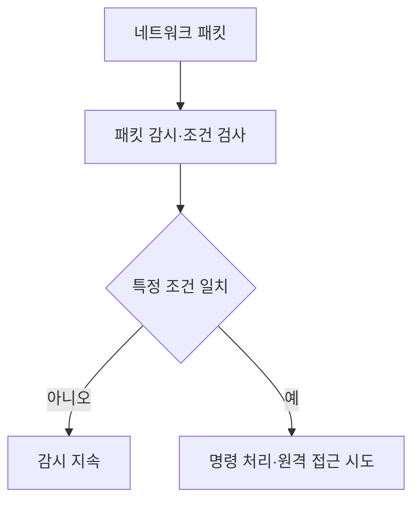

핵심 용어

- **BPFdoor**: 리눅스 패킷 감시 기능을 악용해 특정 패킷 조건에 반응하는 백도어 악성코드다.
- **BPF**: 리눅스 커널에서 패킷이나 이벤트를 필터링·관찰하는 기능이다.

## 30초 인출

- 본질: BPFdoor는 리눅스의 패킷 감시 기능을 악용하는 백도어 악성코드다.
- 메커니즘: 패킷 조건을 감시하고 일치할 때 명령 처리나 원격 접근을 시도할 수 있다.

---

## 1교시 예상문제 (10점)

> BPFdoor의 은닉 방식과 탐지 시 고려사항을 설명하시오. (예상)

---

## 1교시 10점 답안

### 1. 정의·목적

정의: BPFdoor는 리눅스의 BPF 기능을 악용해 은닉 상태로 대기하는 백도어 악성코드다.

목적: 열린 서비스 포트를 드러내지 않은 채 패킷을 감시하고 공격자의 명령으로 접근을 시도한다.

### 2. 공격 흐름과 단서

| 단계 | 동작·점검 단서 |
|---|---|
| 감시 | 원시 소켓·BPF 관련 비정상 동작 점검 |
| 활성화 | 매직 패킷 조건과 의심 트래픽 조사 |
| 접근 | 비정상 프로세스·외부 연결·메모리 흔적 분석 |

제안: 포트 목록만으로 정상 여부를 판단하지 말고 커널 이벤트와 패킷 흐름을 함께 조사한다.

---

## 2~4교시 예상문제 (25점)

> BPFdoor의 동작 원리와 은닉 특성을 설명하고 리눅스 시스템에서의 탐지·대응 방안을 제시하시오. (예상)

---

## 2~4교시 25점 답안

### Ⅰ. 동작 원리

BPFdoor는 리눅스 BPF·패킷 감시 기능을 악용하는 백도어 악성코드다. 공개된 분석에서는 프로세스가 특정 패킷 조건을 감지해 명령 실행이나 원격 접근을 시도하는 동작이 보고됐다.

### Ⅱ. 특성과 탐지 관점

| 관점 | 점검 내용 |
|---|---|
| 서비스 포트 | 전형적인 리스닝 포트가 보이지 않을 수 있어 포트 목록만으로 판단하지 않음 |
| 패킷 감시 | 비정상 원시 소켓·BPF 사용과 프로세스 권한·실행 경로 확인 |
| 활성화 동작 | 의심 패킷과 연결 시도, 프로세스·메모리 흔적을 함께 조사 |

### Ⅲ. 정상 도구와 악용 징후

| 항목 | 정상 운영에서의 사용 | 조사 시 확인 |
|---|---|---|
| BPF·패킷 캡처 | 진단·모니터링 도구가 패킷을 관찰 | 사용 주체·실행 파일·권한·필터 조건의 적정성 |
| 원시 소켓 | 네트워크 진단·보안 도구가 사용 가능 | 예상하지 않은 프로세스의 생성·실행 여부 |
| 외부 연결 | 관리·업무 통신 | 감시 프로세스와 시간·목적이 맞지 않는 연결 |

### Ⅳ. 탐지·대응 절차

| 단계 | 조치 |
|---|---|
| 식별 | 엔드포인트·커널 감사 로그와 네트워크 흐름을 대조 |
| 격리 | 증거를 보존하면서 감염 의심 시스템의 연결 제한 |
| 분석·복구 | 프로세스·계정·지속성 흔적과 초기 침투 경로 조사 후 신뢰 가능한 이미지로 복구 |
| 예방 | BPF·원시 소켓 권한을 최소화하고 허용된 관리 도구만 사용 |

### Ⅴ. 기술사적 제언

| 문제 | 해결 방안 |
|---|---|
| 열린 포트가 없다는 이유로 패킷 감시형 악성코드를 놓칠 수 있다. | 포트 스캔과 함께 커널 감사·프로세스 행위·네트워크 흐름을 상관 분석하고, BPF 사용 권한을 업무에 필요한 범위로 제한한다. |

## 출제 이력
- 제137회 4교시 1번: BPFdoor 악성코드의 개념·동작 원리·기존 백도어와의 차이 및 탐지.

## 공식 참고
- [Rapid7 Labs: BPFDoor analysis](https://github.com/rapid7/Rapid7-Labs/blob/main/BPFDoor/README.md) — 공개 분석 자료.
