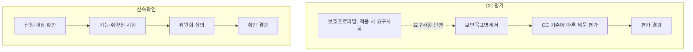

핵심 용어

- **공통평가기준(CC)**: 정보보호제품의 보안 기능과 평가 증거를 공통 기준에 따라 검토하는 기준이다.
- **신속확인**: 기존 평가 기준 적용이 어려운 정보보호제품을 별도 절차와 기준으로 확인하는 제도다.

## 30초 인출

- 본질: CC와 신속확인은 정보보호제품의 보안성을 평가·확인하는 제도다.
- 메커니즘: 제품의 대상·평가 범위와 적용 기준을 확인한 뒤 시험·심의 결과를 검토한다.

---

## 1교시 예상문제 (10점)

> CC 평가·인증과 정보보호제품 신속확인제도의 목적과 차이를 설명하시오. (예상)

---

## 1교시 10점 답안

### 1. 정의·목적

정의: CC 평가는 제품의 보안 기능과 평가 기준 충족 여부를 확인하는 제도이며, 신속확인은 기존 기준 적용이 어려운 제품의 보안성을 확인하는 제도다.

목적: 제품의 보안 수준과 공공 이용 적합성을 평가 결과에 따라 판단하도록 돕는다.

### 2. 제도 비교

| 구분 | CC 평가·인증 | 신속확인 |
|---|---|---|
| 기준 | 공통평가기준과 관련 보호프로파일 | 신기술 제품에 대한 별도 확인 절차 |
| 검토 내용 | 보안목표와 구현·평가 증적 | 기본 보안 기능과 취약점 점검 |
| 고려점 | 적용 기준·등급·평가 범위 확인 | 적용 대상·유효기간·사후 요건 확인 |

제안: 제품 특성과 적용 제도에 맞춰 최신 평가기관 안내와 절차를 확인한다.

---

## 2~4교시 예상문제 (25점)

> CC 평가·인증과 정보보호제품 신속확인제도의 목적·절차를 비교하고 제품 개발·운영 시 고려사항을 제시하시오. (예상)

---

## 2~4교시 25점 답안

### Ⅰ. 제도의 목적과 구조

CC 평가는 정해진 공통평가기준에 따라 제품의 보안 기능과 평가 증거를 검토한다. 신속확인은 기존 평가 기준을 적용하기 어려운 정보보호제품을 별도 절차로 확인하기 위한 제도다.

CC 쪽 실선은 제품의 보안목표를 평가하는 흐름이고, 점선은 보호프로파일을 적용하는 경우 그 요구사항을 보안목표에 반영하는 관계다. 신속확인은 신청·시험·심의 후 결과를 확인한다.

| 제도 | 판단에 쓰는 기준 | 답안에서 볼 항목 |
|---|---|---|
| CC 평가·인증 | CC와 적용 가능한 보호프로파일 | 제품·평가 범위, 보안목표, 평가 결과 |
| 신속확인 | 해당 제도의 대상·확인 기준과 절차 | 적용 대상, 시험·심의, 유효·사후 요건 |

### Ⅱ. CC 평가 구성요소

| 용어 | 역할 |
|---|---|
| 보호프로파일(PP) | 제품군에 요구되는 보안 요구사항을 정의 |
| 보안목표명세서(ST) | 특정 제품의 보안목표와 구현을 기술 |
| 평가보증등급(EAL) | 적용 평가 기준에 따른 보증 수준을 표현 |

### Ⅲ. 신속확인 절차

| 순서 | 확인 내용 |
|---|---|
| 대상 확인 | 제품과 적용 환경이 제도 대상인지 검토 |
| 신청·시험 | 요구자료를 제출하고 정해진 시험·취약점 점검 수행 |
| 심의·결과 | 평가 결과를 심의하고 확인 결과를 통보 |
| 사후 관리 | 변경·취약점·유효 요건을 최신 공식 절차에 따라 관리 |

### Ⅳ. 선택·운영 시 고려사항

| 고려사항 | 점검 내용 |
|---|---|
| 적용성 | 제품군·공공 도입 조건에 맞는 절차 확인 |
| 범위 | 확인 대상 제품 버전과 구성·시험 범위 명확화 |
| 변경 관리 | 배포 제품과 확인 당시 제품의 차이 추적 |
| 최신성 | 평가기관·KISA 안내에서 현재 절차와 효력 요건 재확인 |

### Ⅴ. 기술사적 제언

| 문제 | 해결 방안 |
|---|---|
| 간소화된 확인 결과를 제품의 모든 위험이 제거된 것으로 오해할 수 있다. | 확인 범위와 잔여 위험을 조달·운영 담당자에게 명시하고, 제품 변경·취약점 공지·사후관리 요건을 계약과 운영 절차에 반영한다. |

## 출제 이력
- 제136회 1교시 11번: CC와 정보보호제품 평가.
- 제129회 1교시 11번: 정보보호제품 신속확인 제도.

## 공식 참고
- [KISIA 정보보호제품 신속확인제도 안내](https://www.ksecurity.or.kr/kisis/subIndex/552.do) — 대상·절차·확인사항의 최신 안내.
