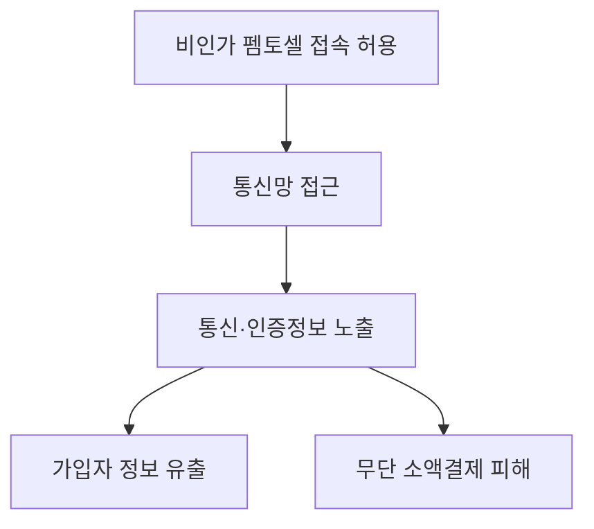

핵심 용어

- **펨토셀(Femtocell)**: 이용자 단말과 통신사 이동통신망을 연결하는 소형 기지국이다.
- **불법 펨토셀**: 통신사업자에 등록되거나 승인되지 않은 채 통신망에 접속한 펨토셀이다.
- **가입자 식별번호(IMSI)**: 이동통신망이 가입자를 식별하는 번호다.

## 30초 인출

- 본질: 이 사고는 불법 펨토셀의 내부망 접속을 허용해 가입자 정보 유출과 무단 소액결제로 이어진 침해사고다.
- 메커니즘: 펨토셀 인증·접속 관리가 미흡하면 비인가 장비가 망에 붙고, 통신·인증 정보가 노출될 수 있다.

---

## 1교시 예상문제 (10점)

> 불법 펨토셀을 이용한 KT 무단 소액결제 사고의 공격 흐름과 예방 통제를 설명하시오. (예상)

---

## 1교시 10점 답안

### 1. 정의·목적

정의: 불법 펨토셀 사고는 비인가 초소형 기지국을 이용해 이동통신 이용자와 망 사이의 통신을 악용한 침해사고다.

목적: 공격자는 비인가 기지국 접근을 통해 가입자 정보와 인증 흐름을 노려 무단 결제를 시도한다.

### 2. 공격 흐름과 통제

| 단계 | 통제 방향 |
|---|---|
| 비인가 펨토셀 접속 | 기지국 등록·인증 및 구성 검증 |
| 이용자 단말 연결 | 접속 위치·셀 식별자 이상 징후 감시 |
| 인증 정보 악용 | 결제 인증 경로 보호와 이상거래 탐지 |
| 사고 대응 | 피해자 통지·차단·조사 및 재발 방지 |

제안: 펨토셀 등록·인증과 결제 이상탐지를 통신망 운영 절차에 함께 적용한다.

---

## 2~4교시 예상문제 (25점)

> 불법 펨토셀을 이용한 KT 무단 소액결제 사고의 공격 메커니즘과 피해를 설명하고 통신사·금융기관의 재발 방지 대책을 제시하시오. (예상)

---

## 2~4교시 25점 답안

### Ⅰ. 확인된 사고 흐름

정부 조사에서 펨토셀 관리와 통신 암호화에 문제가 확인됐고, 가입자 정보 유출과 무단 소액결제가 발생했다.

도해는 정부 조사에서 확인된 접속·정보노출 문제와 보고된 피해 흐름을 나타낸다. 별도 증거가 없는 세부 공격 기법은 단정하지 않는다.

### Ⅱ. 조사 결과와 영향

| 항목 | 조사에서 확인된 내용 |
|---|---|
| 가입자 영향 | 22,227명의 IMSI·단말기 식별번호·전화번호 유출 |
| 결제 피해 | 368명, 약 2억 4,300만 원의 무단 소액결제 |
| 관리 문제 | 펨토셀 생산·납품 및 내부망 접속 인증 관리 미흡 |
| 정보 보호 문제 | 일부 통신의 암호화 해제로 평문 인증정보 노출 |

### Ⅲ. 원인과 통제

| 확인된 문제 | 대응 방안 |
|---|---|
| 펨토셀 등록·인증 및 공급망 관리 미흡 | 장비 신원·형상 검증, 등록 장비와 승인된 접속만 허용 |
| 통신 암호화 해제와 인증정보 노출 | 암호화 구간·설정 변경을 점검하고 인증정보 노출 시험 수행 |
| 비정상 접속·결제 탐지 미흡 | 펨토셀 접속·위치·트래픽과 결제 이상 징후를 상관 분석 |

### Ⅳ. 대응과 재발 방지

| 주체 | 핵심 조치 |
|---|---|
| 통신사 | 펨토셀 등록부터 폐기까지 인증·재고·접속 이력 관리 |
| 금융사 | 통신 채널과 독립된 거래 인증·이상거래 탐지 적용 |
| 공동 대응 | 피해 통지·차단·조사와 재발 방지 절차를 점검 |

### Ⅴ. 기술사적 제언

| 문제 | 해결 방안 |
|---|---|
| 통신 장비의 신원·구성 통제가 약하면 비인가 장비가 가입자 통신 경로에 들어올 수 있다. | 장비 등록·인증·형상 변경을 통제하고, 통신사와 금융사가 각각 독립된 인증·이상거래 통제를 운영한다. |

## 공식 참고
- [과학기술정보통신부 KT/LGU+ 침해사고 조사 결과 브리핑](https://www.korea.kr/news/policyNewsView.do?newsId=156737260) — 피해 규모, 펨토셀 관리 문제와 통신정보 노출 위험.

## 공식 참고
- [과학기술정보통신부 KT/LGU+ 침해사고 조사 결과 브리핑](https://www.korea.kr/news/policyNewsView.do?newsId=156737260) — 피해 규모, 펨토셀 관리 문제와 통신정보 노출 위험.
