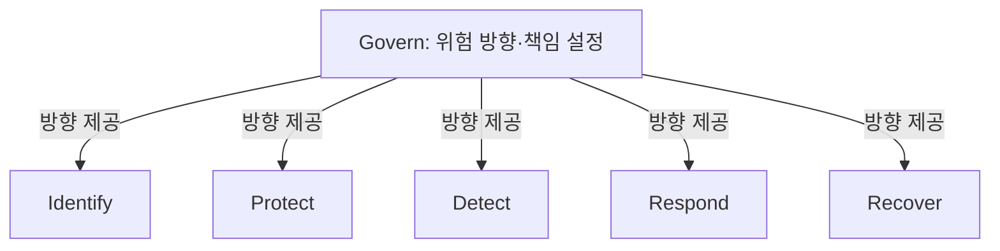

핵심 용어

- **Govern (GV)**: 조직의 사이버보안 위험관리 전략·정책·책임을 정하는 CSF 2.0 기능이다.
- **조직 프로파일**: CSF를 이용해 현재 상태와 목표 상태를 정리하는 도구다.

## 30초 인출

- 본질: NIST CSF 2.0은 조직의 사이버보안 위험관리를 위한 프레임워크다.
- 메커니즘: Govern을 포함한 여섯 기능으로 위험을 관리하고 목표·현재 상태를 비교한다.

---

## 1교시 예상문제 (10점)

> NIST CSF 2.0의 여섯 기능과 Govern 기능의 역할을 설명하시오. (예상)

---

## 1교시 10점 답안

### 1. 정의·목적

정의: NIST CSF 2.0은 조직이 사이버보안 위험을 이해·평가·우선순위화·소통하도록 돕는 프레임워크다.

목적: 조직의 위험 관리와 보안 활동을 경영 목표 및 책임 체계에 연결한다.

### 2. 핵심 기능

| 기능 | 역할 |
|---|---|
| Govern (GV) | 위험관리 전략·정책·책임 설정 |
| Identify (ID) | 자산과 위험 이해 |
| Protect (PR) | 위험 저감 통제 적용 |
| Detect (DE) | 이상 징후 발견 |
| Respond (RS) | 사고 대응 |
| Recover (RC) | 서비스 복구 |

제안: Govern을 통해 위험 수용 기준과 책임을 정하고 나머지 기능을 조직 목표에 맞춰 운영한다.

---

## 2~4교시 예상문제 (25점)

> NIST CSF 2.0의 개정 배경과 여섯 기능을 설명하고 Govern을 중심으로 한 적용 방안을 제시하시오. (예상)

---

## 2~4교시 25점 답안

### Ⅰ. 프레임워크 목적과 개정

NIST CSF는 조직이 사이버보안 위험을 이해·평가·우선순위화·소통하도록 돕는 프레임워크다. 2.0은 Govern을 핵심 기능에 포함해 위험관리 책임과 방향을 조직 차원에서 다룬다.

| 버전 | 주요 구성 |
|---|---|
| CSF 1.1 | Identify·Protect·Detect·Respond·Recover의 5개 기능 |
| CSF 2.0 | Govern을 더한 6개 기능 |

### Ⅱ. 여섯 핵심 기능

| 기능 | 역할 |
|---|---|
| Govern (GV) | 위험관리 전략·정책·책임 설정 |
| Identify (ID) | 자산과 위험 이해 |
| Protect (PR) | 위험 저감 통제 적용 |
| Detect (DE) | 이상 징후 발견 |
| Respond (RS) | 사고 대응 |
| Recover (RC) | 서비스 복구 |

### Ⅲ. Govern의 위치

`Govern`은 나머지 기능 앞에 놓이는 선형 단계가 아니라, 조직의 사이버보안 위험관리 방향을 정하고 다른 기능과 함께 운영되는 기능이다.

### Ⅳ. 적용 도구

| 도구 | 쓰임 |
|---|---|
| 조직 프로파일 | 현재 상태와 목표 상태를 비교·정리 |
| 구현 티어 | 위험관리 관행의 엄격성과 반복성을 설명 |
| 개선 계획 | 차이·우선순위·담당·진척을 관리 |

### Ⅴ. 기술사적 제언

| 문제 | 해결 방안 |
|---|---|
| 기술 통제만 점검하면 위험 수용·책임·공급망 관리의 공백을 놓칠 수 있다. | 경영진이 위험 기준과 책임을 승인하고, 프로파일의 차이와 개선 진행을 정기적으로 검토해 예산·업무 결정과 연결한다. |

## 출제 이력
- 공식 기출 확인 불가. 예상 문항: CSF 2.0의 개정 배경·6대 기능과 Govern 실무 적용.

## 공식 참고
- [NIST: NIST Releases Version 2.0 of Landmark Cybersecurity Framework](https://www.nist.gov/news-events/news/2024/02/nist-releases-version-20-landmark-cybersecurity-framework) — 여섯 기능과 CSF 2.0 개요.
