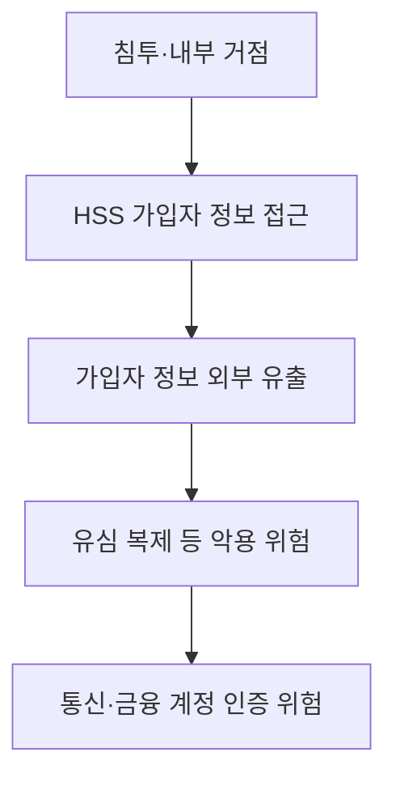

핵심 용어

- **IMSI(International Mobile Subscriber Identity)**: 이동통신망에서 가입자를 식별하는 번호다.
- **Ki·OPc**: USIM 인증에 쓰이는 비밀 인증정보다.
- **심 스와핑(SIM swapping)**: 전화번호를 새 USIM이나 단말로 옮겨 통신서비스를 탈취하는 공격이다.

## 30초 인출

- 본질: SKT 유심 정보 유출은 가입자 식별번호와 인증키 등이 외부로 유출된 개인정보 침해사고다.
- 메커니즘: 유출된 인증정보는 유심 복제에 악용될 위험이 있어 보호서비스와 통신·금융 이상 징후 대응이 필요하다.

---

## 1교시 예상문제 (10점)

> SKT 유심 정보 유출과 심 스와핑 위험의 관계 및 통신사·금융기관의 대응을 설명하시오. (예상)

---

## 1교시 10점 답안

### 1. 정의·목적

정의: USIM 정보 유출은 가입자 식별정보 등 이동통신 인증정보가 외부로 노출되는 사고다.

목적: 공격자는 이를 다른 개인정보·인증수단과 결합해 번호 탈취나 인증 우회를 시도할 수 있다.

### 2. 위험과 대응

| 위험 단계 | 대응 방향 |
|---|---|
| 가입자 정보 유출 | 접근권한·로그·협력사 단말 통제 |
| 유심 변경·번호 탈취 | 본인확인 강화와 변경 알림 |
| SMS 인증 악용 | 중요 거래에 독립된 인증수단 적용 |
| 피해 확산 | 이상 징후 신고·계정 보호·사고 통지 |

제안: 유심 변경 절차와 금융 인증을 함께 점검해 단일 SMS 의존을 줄인다.

---

## 2~4교시 예상문제 (25점)

> SKT 유심 정보 유출 사고의 영향과 심 스와핑 연계 위험을 설명하고 통신사·금융기관의 예방 및 피해 확산 방지 방안을 제시하시오. (예상)

---

## 2~4교시 25점 답안

### Ⅰ. 사고 경위와 영향

개인정보보호위원회는 SK텔레콤 사고에서 가입자 식별정보와 USIM 인증정보가 유출된 것으로 확인했다. 유출 인증정보가 심 스와핑으로 실제 악용됐다고 단정하지 않고, 악용 가능성과 실제 확인 사실을 구분한다.

도해는 조사된 HSS 접근·정보 유출과 이후 발생할 수 있는 위험을 나눠 나타낸다.

### Ⅱ. 유출 항목과 확인된 문제

| 항목 | 확인 내용 |
|---|---|
| 영향 범위 | LTE·5G 이용자 23,244,649명 |
| 유출 정보 | 전화번호·IMSI·Ki·OPc 등 25종 |
| 사고 시점 | 최초 침투 2021년 8월, HSS 데이터 외부 전송 2025년 4월 18일 |
| 보호조치 | Ki 평문 저장, 망 분리·접근통제 미흡 등 조사 결과 확인 |

### Ⅲ. 통신사·금융기관 대응

| 주체·위험 | 대응 |
|---|---|
| 통신사: 가입자 인증정보 노출 | 인증키 암호화 저장, 접근 최소화, 키 접근 감사 |
| 통신사: 장기 침해·계정 악용 | 망 경계와 계정 통제, 취약 서버·악성코드 점검, 로그 상시 분석 |
| 이용자: 유심 변경·번호 탈취 우려 | 본인확인 강화, 변경 알림, 사업자 보호서비스 이용 |
| 금융사: 통신 인증정보 악용 위험 | SMS 단독 인증을 줄이고 독립 인증·이상거래 탐지 적용 |

### Ⅳ. 사고 대응

| 단계 | 조치 |
|---|---|
| 차단 | 침해 계정·시스템과 유출 경로 제한 |
| 통지·보호 | 법정 절차에 따라 피해자에게 알리고 이용자 보호 조치 안내 |
| 조사·개선 | 유출 범위·원인을 확인하고 키·접근통제·망 분리 개선 |

### Ⅴ. 기술사적 제언

| 문제 | 해결 방안 |
|---|---|
| 장기 침해와 인증정보 보호 미흡이 결합하면 가입자 인증 기반 전반에 위험이 확산될 수 있다. | 통신사는 인증정보의 암호화·접근통제와 이상 행위 탐지를 강화하고, 금융기관은 통신 채널과 독립된 추가 인증을 적용한다. |

## 공식 참고
- [개인정보보호위원회 SK텔레콤 개인정보 유출사고 제재처분](https://pipc.go.kr/np/cop/bbs/selectBoardArticle.do?_sp=bb945836-ac3e-47e3-99b3-8c68c3c02b1c&bbsId=BS074&mCode=C020010000&nttId=11453) — 유출 규모·항목·경위·보호조치 위반.
- [과학기술정보통신부 유심 보호서비스 안내](https://www.korea.kr/news/policyNewsView.do?newsId=148942574) — 당시 유심 복제 악용 방지를 위한 서비스 안내.

## 공식 참고
- [개인정보보호위원회 SK텔레콤 개인정보 유출사고 제재처분](https://pipc.go.kr/np/cop/bbs/selectBoardArticle.do?_sp=bb945836-ac3e-47e3-99b3-8c68c3c02b1c&bbsId=BS074&mCode=C020010000&nttId=11453) — 유출 규모·항목·경위·보호조치 위반.
- [과학기술정보통신부 유심 보호서비스 안내](https://www.korea.kr/news/policyNewsView.do?newsId=148942574) — 유출 정보의 유심 복제 악용 방지를 위한 당시 서비스 안내.
