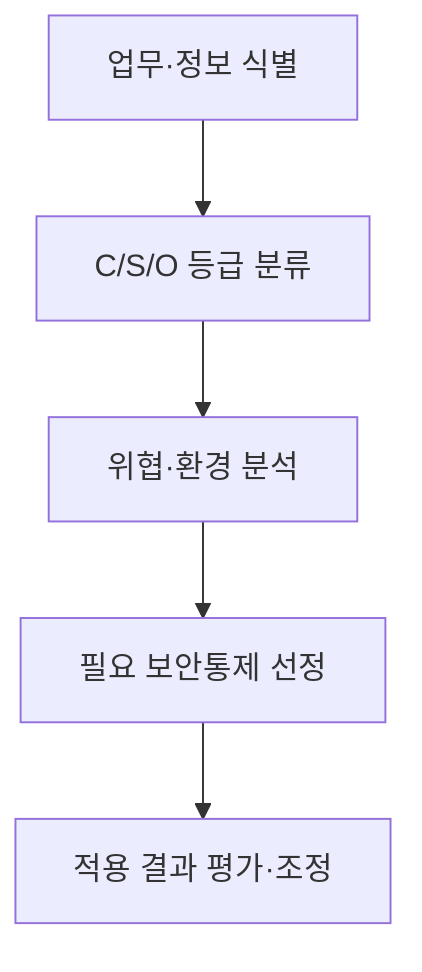
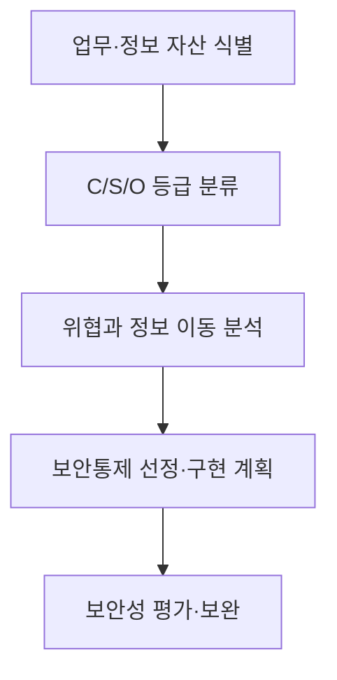

## 30초 인출

- 본질: N2SF는 공공 업무의 중요도에 맞춰 보안 수준을 달리 적용하는 국가 망 보안체계다.
- 메커니즘: 업무정보를 C/S/O로 분류하고, 위협과 적용 환경을 고려해 필요한 보안통제를 정한다.

핵심 용어

- **다층보안체계(MLS)**: 업무·정보의 중요도에 따라 보안 수준을 나누어 적용하는 방식이다.
- **C/S/O 등급**: N2SF에서 업무정보를 기밀(C)·민감(S)·공개(O)로 구분하는 등급이다.

---

## 1교시 예상문제 (10점)

> 국가 망 보안체계(N2SF)의 목적과 C/S/O 정보 등급, 적용 절차를 설명하시오. (예상)

---

## 1교시 10점 답안

### 1. 정의·목적

정의: N2SF는 공공 업무정보의 중요도와 위협에 따라 보안통제를 달리 적용하는 다층 보안체계다.

목적: 획일적인 망 분리만으로 해결하기 어려운 업무 활용성과 정보 보호를 함께 고려한다.

### 2. 등급과 적용

| 등급 | 구분 | 통제 적용 |
|---|---|---|
| C | 기밀 정보 | 중요도·위협에 맞는 보안통제 적용 |
| S | 민감 정보 | 업무상 접근과 이동을 고려한 보안통제 적용 |
| O | 공개 정보 | 공개·활용 목적과 무결성 보호를 고려 |

제안: 등급을 먼저 정한 뒤 업무 흐름과 위협을 확인해 필요한 통제를 적용한다.

---

## 2~4교시 예상문제 (25점)

> N2SF의 도입 취지와 C/S/O 분류, 적용 절차를 설명하고 업무 활용성과 정보 보호를 함께 확보할 방안을 제시하시오. (예상)

---

## 2~4교시 25점 답안

### Ⅰ. 다층보안 적용의 취지

N2SF는 업무 중요도에 따라 등급을 분류하고 그에 맞는 보안통제를 적용하는 국가 망 보안체계다. 국가정보원은 공공부문의 AI·클라우드 활용을 고려해 다층보안체계의 추진 방향과 보안정책을 논의해 왔다.

| 기존 접근의 한계 | N2SF에서 고려할 방향 |
|---|---|
| 망의 위치만으로 업무 활용을 제한 | 업무정보의 중요도와 위협을 기준으로 통제 검토 |
| 모든 업무에 같은 수준의 통제를 적용 | 업무·정보별 위험과 환경에 맞춰 통제 선정 |

### Ⅱ. C/S/O 정보 등급

| 등급 | 의미 | 분류 시 확인할 점 |
|---|---|---|
| C | 기밀 | 공개될 경우 국가·공공 업무에 미치는 영향 |
| S | 민감 | 공개 범위와 업무상 보호 필요성 |
| O | 공개 | 공개·활용 가능 여부와 무결성 요구 |

등급은 정보의 이름만으로 기계적으로 정하지 않고 업무 목적과 공개 영향, 관련 기준을 함께 살펴 정한다. 구체 분류 기준은 현행 N2SF 가이드라인과 기관 절차를 확인한다.

### Ⅲ. 적용 절차

도해의 선은 준비부터 평가까지의 적용 절차다. 평가에서 미흡 사항이 확인되면 보완한 뒤 다시 확인하며, 실제 절차와 승인 주체는 기관에 적용되는 가이드라인을 따른다.

### Ⅳ. 위협과 보안통제

| 위협 상황 | 검토할 통제 |
|---|---|
| 다른 등급의 정보가 한 서비스에서 함께 처리됨 | 정보의 저장·이동 경로와 접근권한을 분석하고 분리·연계 통제 검토 |
| 외부 서비스로 업무정보가 전달됨 | 이용 범위, 데이터 처리 조건, 접근통제·기록·반출 통제 확인 |
| 등급 분류나 시스템 구성이 바뀜 | 변경 영향과 보안통제 적합성을 재검토 |

### Ⅴ. 기술사적 제언

| 문제 | 해결 방안 |
|---|---|
| 등급 분류가 불명확하면 지나친 제한이나 필요한 보호조치의 누락이 생길 수 있다. | 업무 담당자가 분류 근거를 기록하고 보안 담당자가 통제 적정성을 검토하도록 역할과 재검토 절차를 둔다. |

## 출제 이력 및 공식 참고

- 제137회 3교시 6번: N2SF 보안 가이드라인.
- [국가사이버안보센터: 국가 망 보안체계(N2SF) 보안가이드라인 1.0 안내](https://www.ncsc.go.kr/PageLink.do) — 공식 가이드라인 목록과 최신 판본 확인.
- [국가정보원: 공공 클라우드 보안정책 간담회](https://www.nis.go.kr/CM/1_4/view.do?seq=302) — 다층보안체계와 업무 중요도에 따른 보안 차등화 설명.
