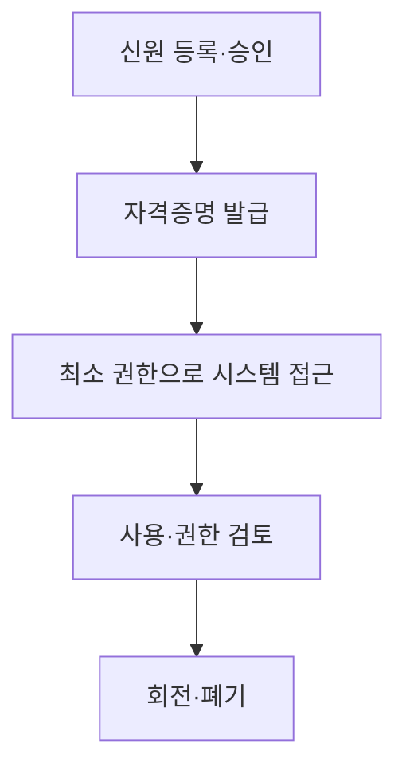

## 30초 인출

- 본질: 비인간 신원은 애플리케이션·서비스·워크로드가 시스템에 접근할 때 사용하는 디지털 신원이다.
- 메커니즘: 신원을 등록하고 필요한 권한만 부여한 뒤 자격증명을 보호·회전·폐기한다.

핵심 용어

- **비인간 신원(NHI)**: 사람 대신 애플리케이션·서비스·워크로드가 시스템에 접근할 때 사용하는 신원이다.
- **시크릿(Secret)**: 서비스 인증에 쓰이는 API 키·토큰·인증서 등 비밀 자격증명이다.

---

## 1교시 예상문제 (10점)

> 비인간 신원의 유형과 주요 보안 관리사항을 설명하시오. (예상)

---

## 1교시 10점 답안

### 1. 정의·목적

정의: 비인간 신원(NHI)은 애플리케이션·서비스·워크로드가 시스템에 접근할 때 사용하는 디지털 신원이다.

목적: 자동화된 서비스 접근을 필요한 범위로 제한하고 자격증명 오용을 줄인다.

### 2. 유형과 관리

| 유형 | 관리 핵심 |
|---|---|
| 서비스 계정 | 소유자·사용 목적·권한 관리 |
| API 키·토큰 | 저장소 보호, 권한 범위와 유효기간 관리 |
| 인증서·키 | 발급·갱신·폐기와 비밀키 보호 |

제안: NHI마다 담당자와 사용 목적을 기록하고 필요가 끝난 자격증명은 회수한다.

---

## 2~4교시 예상문제 (25점)

> 비인간 신원의 유형과 수명주기를 설명하고, 자격증명 유출·과도한 권한·유령 계정에 대한 보호대책을 제시하시오. (예상)

---

## 2~4교시 25점 답안

### Ⅰ. NHI와 주요 유형

NHI는 사람 대신 소프트웨어 구성요소가 시스템에 접근할 때 사용하는 신원이다.

| 유형 | 쓰임 | 주요 관리 대상 |
|---|---|---|
| 서비스 계정 | 애플리케이션 간 작업 | 계정 소유자·권한·사용 기록 |
| API 키·토큰 | API 인증 | 비밀 저장·범위·만료·회수 |
| 인증서·키 | 시스템·워크로드 인증 | 개인키 보호·발급·갱신 |

### Ⅱ. 수명주기 관리

발급할 때 목적·소유자·권한을 확인하고, 사용 중에는 시크릿 저장소와 기록을 관리한다. 업무가 끝나거나 자격증명이 노출되면 회전하거나 폐기한다.

### Ⅲ. 위협과 통제

| 위협 | 대응 |
|---|---|
| 시크릿을 코드·설정 파일에 저장 | 중앙 비밀 저장소, 코드 저장소 유출 검사 |
| 작업에 비해 권한이 넓음 | 최소 권한과 대상·행위 제한 적용 |
| 사용 종료 후 계정이 남음 | 소유자·업무 종료 이벤트에 따른 회수와 정기 검토 |
| 장기 자격증명 유출 | 가능한 경우 단기 자격증명, 자동 회전·폐기 적용 |

### Ⅳ. 사람 계정과 NHI 관리

| 구분 | 사람 계정 | NHI |
|---|---|---|
| 사용자 | 사람 | 서비스·애플리케이션·워크로드 |
| 생명주기 이벤트 | 입사·부서 이동·퇴사 | 배포·구성 변경·서비스 종료 |
| 관리 초점 | 인증·역할·사용자 권한 | 소유자·목적·자격증명·기계 간 권한 |

### Ⅴ. 기술사적 제언

| 문제 | 해결 방안 |
|---|---|
| 담당자와 사용 목적을 모르는 NHI가 쌓이면 과도한 권한과 미사용 자격증명을 찾기 어렵다. | NHI 인벤토리에 소유자·업무·권한·만료 정보를 기록하고, 배포·회수 절차와 연결해 정기 검토한다. |

## 출제 이력 및 공식 참고

- 제140회 1교시 11번: 비인간 신원의 보안 취약점.
- [CISA: Identity and Access Management Recommended Best Practices](https://www.cisa.gov/sites/default/files/2023-12/ESF%20IDENTITY%20AND%20ACCESS%20MANAGEMENT%20RECOMMENDED%20BEST%20PRACTICES%20FOR%20ADMINISTRATORS_508C.pdf) — 신원·자격증명 수명주기와 접근권한 관리.
