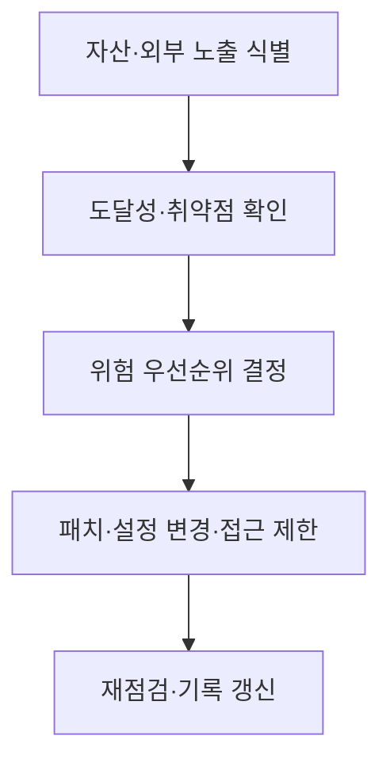

## 30초 인출

- 본질: 선제적 사이버보안은 공격 전에 도달 가능한 취약 경로를 찾아 위험을 줄이는 보안 활동이다.
- 메커니즘: 자산·노출·위협을 확인하고 위험을 우선순위화해 조치한 뒤 결과를 다시 점검한다.

핵심 용어

- **공격표면**: 외부 또는 내부 공격자가 접근해 악용을 시도할 수 있는 시스템·서비스·경로다.
- **위협 헌팅**: 위협 징후를 능동적으로 찾아 로그·단말·네트워크 자료를 조사하는 활동이다.

---

## 1교시 예상문제 (10점)

> 선제적 사이버보안의 개념과 사후 대응 방식과의 차이를 설명하시오. (예상)

---

## 1교시 10점 답안

### 1. 정의·목적

정의: 선제적 사이버보안은 공격 전에 노출된 자산과 악용 가능한 취약 경로를 찾아 위험을 줄이는 활동이다.

목적: 공격 기회를 줄이고 사고가 발생했을 때 피해 범위를 제한한다.

### 2. 대응 방식 비교

| 관점 | 사후 대응 | 선제적 활동 |
|---|---|---|
| 시점 | 사고 징후나 침해 확인 후 | 공격 전과 상시 점검 중 |
| 중심 활동 | 탐지·격리·조사·복구 | 자산 확인·위험 우선화·노출 감소 |

제안: 자산 목록과 실제 노출을 대조하고 위험이 큰 경로부터 조치한다.

---

## 2~4교시 예상문제 (25점)

> 선제적 사이버보안의 목적과 위험 관리 흐름을 설명하고, 공격표면·취약점·위협에 대한 적용 방안을 제시하시오. (예상)

---

## 2~4교시 25점 답안

### Ⅰ. 선제 활동의 범위

선제적 사이버보안은 사고 뒤의 탐지·복구와 함께 공격 전에 노출과 취약 경로를 줄이는 활동이다.

| 활동 | 확인 대상 |
|---|---|
| 자산 식별 | 인터넷 노출 서비스, 클라우드 자산, 외부 연결 |
| 노출 확인 | 설정 오류, 알려진 취약점, 접근 경로 |
| 위험 우선화 | 자산 중요도, 외부 도달성, 악용 가능성 |

### Ⅱ. 활용 기법

| 기법 | 역할 | 유의점 |
|---|---|---|
| 외부 공격표면 관리(EASM) | 외부에서 보이는 자산·서비스를 확인 | 탐지 결과의 소유자와 업무 중요도를 확인 |
| 취약점 관리 | 취약한 구성요소와 패치 상태 파악 | 노출·악용 가능성과 업무 영향을 함께 고려 |
| 침해·공격 시뮬레이션(BAS) | 통제의 탐지·차단 동작을 시험 | 승인된 범위에서 운영 영향을 통제 |
| 위협 헌팅 | 위협 징후를 가설 기반으로 조사 | 결과를 탐지 규칙과 대응 절차에 반영 |

### Ⅲ. 위험 저감 흐름

화살표는 자산 확인부터 위험 조치와 재점검까지의 운영 흐름을 나타낸다. 구체 조치는 자산의 업무 영향과 변경 위험을 함께 검토해 선택한다.

### Ⅳ. 선제 활동과 사고 대응의 연계

| 상황 | 우선 활동 |
|---|---|
| 사고 전 알려진 노출 발견 | 취약점 우선순위화와 패치·설정 개선 |
| 침해 징후 확인 | 격리·조사·복구와 피해 범위 확인 |
| 사고 분석 완료 | 재발 경로를 자산·취약점 관리에 반영 |

### Ⅴ. 기술사적 제언

| 문제 | 해결 방안 |
|---|---|
| 자산 수와 취약점 수만 집계하면 실제로 공격 가능한 경로를 놓칠 수 있다. | 자산 중요도·외부 도달성·악용 정황을 함께 살펴 조치 순위를 정하고, 변경 후 노출이 줄었는지 재확인한다. |

## 공식 참고

- [CISA Known Exploited Vulnerabilities Catalog](https://www.cisa.gov/known-exploited-vulnerabilities-catalog) — 실제 악용이 확인된 취약점을 우선 관리할 때 참고.
- [MITRE ATT&CK](https://attack.mitre.org/) — 공격자의 전술·기법을 점검 시나리오와 위협 헌팅에 활용.
