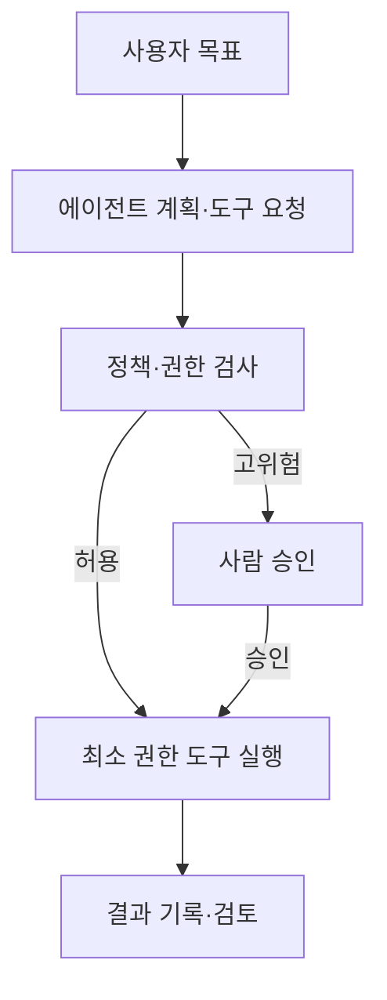

## 30초 인출

- 본질: 에이전틱 AI는 목표를 받아 도구를 사용해 여러 단계의 작업을 수행하는 AI 시스템이다.
- 메커니즘: 도구와 데이터 권한을 최소화하고 위험한 실행은 정책 검사와 사람의 승인으로 제한한다.

핵심 용어

- **에이전틱 AI**: 모델이 도구와 소프트웨어 기능을 사용해 목표에 따른 작업을 수행하는 AI 시스템이다.
- **사람 개입(Human-in-the-Loop, HITL)**: 고위험 작업 전에 사람이 내용을 확인하고 승인하는 통제다.
- **과도한 에이전시(Excessive Agency)**: 에이전트에 필요 이상의 기능·권한·자율성을 부여한 상태다.

---

## 1교시 예상문제 (10점)

> 에이전틱 AI의 주요 보안 위험과 안전한 도구 실행 통제 방안을 설명하시오. (예상)

---

## 1교시 10점 답안

### 1. 정의·목적

정의: 에이전틱 AI는 목표를 받아 도구를 사용해 여러 단계의 작업을 수행하는 AI 시스템이다.

목적: 자율 작업의 편의를 활용하면서 비인가 접근과 부적절한 실행을 제한한다.

### 2. 핵심 통제

| 위험 | 통제 |
|---|---|
| 과도한 도구 권한 | 필요한 기능만 제공하고 사용자 권한 범위에 맞춤 |
| 고위험 행위 오작동 | 실행 전 정책 검사와 사람 승인 적용 |
| 외부 지시의 악용 | 비신뢰 입력을 다루고 도구 호출을 별도 검증 |

제안: 읽기·쓰기 도구를 분리하고 외부 전송·삭제 등 영향이 큰 동작은 사전 승인 대상으로 둔다.

---

## 2~4교시 예상문제 (25점)

> 에이전틱 AI의 동작 구조와 주요 보안 위협을 설명하고, 도구 실행·데이터 접근·고위험 행위에 대한 감독 방안을 제시하시오. (예상)

---

## 2~4교시 25점 답안

### Ⅰ. 에이전트 동작과 감독 경계

에이전틱 AI는 모델의 출력을 도구 실행과 연결해 목표 작업을 수행하므로, 실행 권한과 정책 검사를 모델 바깥에서도 관리해야 한다.

### Ⅱ. 주요 위협

| 위협 | 발생 원인 | 영향 |
|---|---|---|
| 과도한 기능·권한 | 목적보다 넓은 도구와 권한 부여 | 데이터 조회·변경 범위 확대 |
| 간접 프롬프트 인젝션 | 검색·문서에 포함된 비신뢰 지시 | 원치 않는 도구 호출 가능성 |
| 잘못된 자율 실행 | 계획·도구 결과 검토 부족 | 데이터 변경·외부 전송·업무 장애 |

### Ⅲ. 실행 통제

| 통제 지점 | 보호 조치 |
|---|---|
| 신원·권한 | 에이전트와 사용자를 구분하고 최소 권한 적용 |
| 도구 호출 | 허용 목록·입력 검증·행위별 정책 검사 |
| 실행 환경 | 업무에 맞는 샌드박스와 네트워크·파일 접근 제한 |
| 승인·감사 | 영향이 큰 작업의 승인과 실행 이력 기록 |

### Ⅳ. 작업 위험별 감독

| 작업 | 감독 방식 |
|---|---|
| 조회·요약 | 읽기 전용 권한과 자료 출처 기록 |
| 일반 변경 | 변경 범위 제한과 실행 후 결과 확인 |
| 삭제·외부 전송 등 고영향 작업 | 실행 전 사람 승인과 재확인 |

### Ⅴ. 기술사적 제언

| 문제 | 해결 방안 |
|---|---|
| 도구 권한이 넓고 실행 기록이 부족하면 에이전트의 오작동이나 외부 지시에 따른 피해를 통제하기 어렵다. | 도구를 최소 권한으로 나누고 고영향 작업에는 사람 승인을 요구하며 호출·결과를 감사 가능하게 기록한다. |

## 출제 이력 및 공식 참고

- 공식 기출 확인 불가. 예상 문항: 에이전틱 AI의 보안 위험과 보안 감독 체계.
- [OWASP GenAI Security Project: LLM06 Excessive Agency](https://genai.owasp.org/llmrisk/llm062025-excessive-agency/) — 과도한 기능·권한·자율성과 최소 권한·사람 승인 권고.
- [NIST: Identity and Authority of Software Agents](https://www.nist.gov/news-events/news/2026/02/new-concept-paper-identity-and-authority-software-agents) — 에이전트 신원·인가·감사·프롬프트 인젝션 통제 연구 방향.
