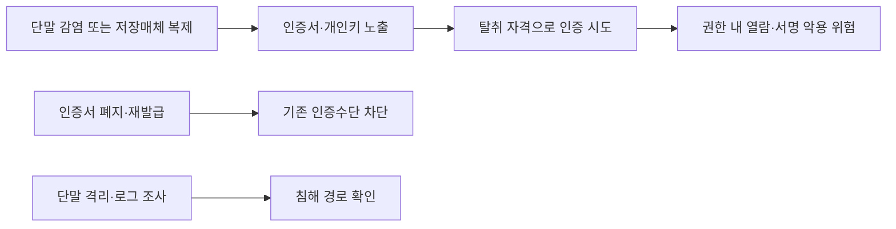
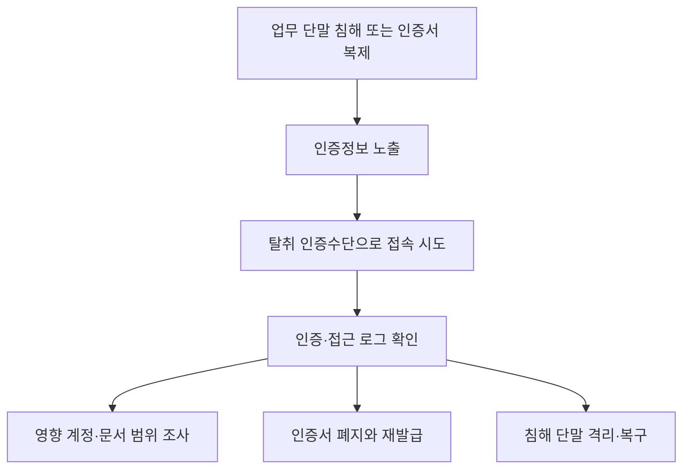

## 30초 인출
- **본질:** GPKI 인증서 유출은 전자서명에 쓰는 개인키와 인증수단이 함께 탈취되어 업무 권한으로 악용될 수 있는 사고다.
- **메커니즘:** 단말 감염·복제 → 인증서와 비밀번호 노출 → 유효한 사용자로 오인증 → 권한 범위 내 문서 열람·서명 시도
- **핵심 대응:** 키 복제 가능성을 줄이고, 인증서 폐지·재발급과 계정·단말 조사로 악용 경로를 끊는다.

핵심 용어

- **GPKI**: 행정기관의 전자서명과 인증을 지원하는 공개키 기반 인증체계다.
- **인증서 폐지**: 더 이상 신뢰할 수 없는 인증서의 유효성을 취소해 검증 과정에서 거부되도록 하는 조치다.
- **보안토큰**: 개인키를 보호된 장치 안에서 사용하도록 지원하는 저장·연산 수단이다. 적용 방식은 기관 정책과 시스템 지원을 확인한다.

---

## 1교시 예상문제 (10점)

---

> 온나라시스템과 GPKI 인증서 유출의 위험 및 핵심 대응을 설명하시오.

---

## 1교시 10점 답안

### 1. 정의·목적

정의: GPKI 인증서 유출은 인증서 또는 개인키와 인증정보가 허가 없이 노출되는 사고다.

목적: 인증수단의 악용을 막고 전자문서의 기밀성·무결성과 사용자 신뢰를 지킨다.

### 2. 유출 위험과 대응

| 위험 | 핵심 대응 |
|---|---|
| 파일형 개인키가 단말에서 복제됨 | 저장·반출을 기관 정책으로 제한하고 보안 저장 수단 적용 여부를 검토 |
| 인증서와 비밀번호가 함께 유출됨 | 인증서 폐지·재발급, 계정 비밀번호 변경, 추가 인증 적용 여부 확인 |
| 탈취 인증으로 문서 업무가 시도됨 | 관련 단말 격리, 인증·전자결재 로그 보존 및 조사 |

---

## 2~4교시 예상문제 (25점)

---

> 온나라시스템 및 GPKI 인증서 유출 사고의 공격 경로를 분석하고, 인증서·계정·업무시스템 관점의 기술적·관리적 대응 방안을 제시하시오. (예상)

---

## 2~4교시 25점 답안

### Ⅰ. 사고의 본질과 영향

GPKI는 행정기관 전자서명에 쓰이는 인증체계다. 인증서 파일이나 개인키가 노출되면 공격자가 정당한 사용자인 것처럼 인증을 시도할 수 있으므로, 유출 확인과 업무기록 조사를 함께 해야 한다.

| 보호 대상 | 침해 시 우려 |
|---|---|
| 개인키·인증정보 | 사용자 사칭 및 무단 인증 시도 |
| 전자결재 권한 | 권한 범위 내 문서 열람·서명 시도 |
| 업무 단말 | 악성코드·원격접속 등 추가 침해 경로 |

### Ⅱ. 공격 경로와 사고 대응

| 조사 항목 | 확인 내용 |
|---|---|
| 인증 기록 | 비정상 시간·단말·접속 위치에서의 인증 시도 |
| 전자결재 기록 | 유출 의심 기간의 문서 조회·기안·승인 흔적 |
| 단말 흔적 | 악성코드, 원격접속, 인증서 파일 접근 흔적 |

### Ⅲ. 인증수단과 단말 보호

| 통제 | 적용 방향 |
|---|---|
| 개인키 저장 | 기관 정책과 업무환경에 따라 보안토큰 등 보호 저장 수단 검토 |
| 접근 인증 | 인증서 외 추가 인증을 적용할 수 있는지 시스템별 검토 |
| 단말 보안 | 업무 단말의 악성코드 방지, 패치, 관리자 권한 통제 |
| 인증서 생명주기 | 발급·갱신·폐지 이력을 관리하고 담당자 절차를 문서화 |

GPKI 운영기관의 인증서 관리 기능에는 인증서 발급, 갱신, 폐지 절차가 제공된다. 사고가 확인되면 인증서 폐지·재발급 절차와 기관의 계정·업무시스템 대응 절차를 함께 적용한다.

### Ⅳ. 관리·검증 체계

| 관리 항목 | 확인 기준 |
|---|---|
| 소유자·권한 | 퇴직·전보·업무변경 시 인증서와 관련 권한의 회수 여부 |
| 저장·반출 | 인증서 저장 위치와 이동·복제 허용 기준 |
| 기록·점검 | 인증·전자결재 로그 보존과 이상 징후 조사 절차 |
| 훈련 | 분실·유출 신고부터 폐지·재발급·영향 확인까지의 역할 분담 |

### Ⅴ. 기술사적 제언

| 문제 | 해결 방안 |
|---|---|
| 인증서가 단말에 복제되면 비밀번호 변경만으로는 키 유출을 해소할 수 없음 | 인증서 폐지·재발급을 우선하고, 키 저장방식과 단말 침해 여부를 함께 점검 |
| 인증 성공 여부만 확인하면 실제 업무 악용 범위를 놓칠 수 있음 | 인증 로그와 전자결재 기록을 연계해 영향 문서·계정·기간을 확인 |

## 출제 이력 및 참고자료

- 기존 노트의 예상문제 취지를 유지해 10점·25점 문항을 정리했다.
- [행정전자서명 인증관리센터: 인증서 관리](https://www.gpki.go.kr/jsp/certManage/manage/searchManage_1.jsp)
- [행정전자서명 인증관리센터: 인증서 종류 및 용도](https://www.gpki.go.kr/jsp/certInfo/certIntro/certKind/searchCertkind.jsp)
- [GPKI 인증서 보호 및 알고리즘 프로파일](https://www.gpki.go.kr/upload/download/1.3-GPKI-CPS%20Profile%20and%20Algorithm.pdf)
