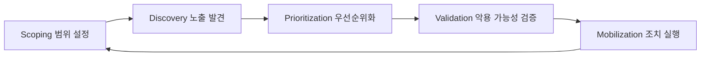
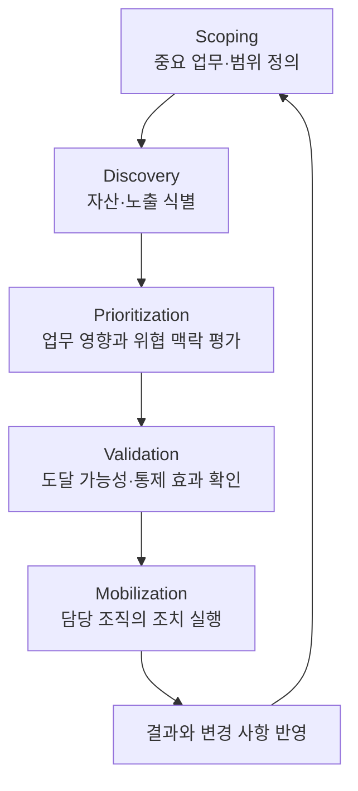
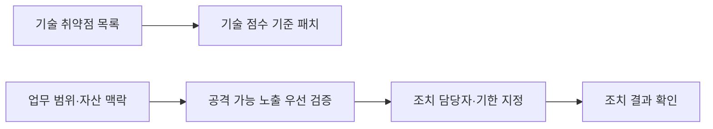

## 30초 인출
- **본질:** CTEM은 조직의 중요한 자산에 영향을 줄 수 있는 보안 노출을 반복해서 찾고, 검증하고, 조치하는 운영 프레임워크다.
- **메커니즘:** 범위 설정 → 노출 발견 → 위험 우선순위화 → 실제 악용 가능성 검증 → 담당 조직의 조치와 재평가
- **핵심:** 취약점 점수만으로 순위를 정하지 않고, 자산 중요도와 노출·위협 맥락을 함께 본다.

핵심 용어

- **CTEM**: Scoping, Discovery, Prioritization, Validation, Mobilization의 다섯 단계로 보안 노출을 지속 관리하는 프레임워크다.
- **EPSS**: 공개된 CVE가 다음 30일 안에 실제 악용될 확률을 추정하는 점수다. 조직의 업무 영향도 자체를 뜻하지는 않는다.
- **BAS**: 공격 기법을 모의 실행해 보안 통제가 의도한 대로 작동하는지 확인하는 검증 방식이다.

---

## 1교시 예상문제 (10점)

---

> CTEM의 개념과 5단계 및 취약점 관리와의 차이를 설명하시오.

---

## 1교시 10점 답안

### 1. 정의·목적

정의: CTEM은 조직의 업무 맥락에 맞춰 보안 노출을 찾고 조치까지 연결하는 지속 관리 프레임워크다.

목적: 공격자가 이용할 수 있는 노출 중 사업에 큰 영향을 주는 항목부터 줄인다.

### 2. 5단계

| CTEM | 전통적 취약점 관리와 구분 |
|---|---|
| 중요 자산과 업무 영향을 범위로 삼음 | 시스템 취약점 목록을 중심으로 관리하기 쉬움 |
| 노출을 발견한 뒤 우선순위·검증·조치까지 연계 | 스캔 결과와 기술 점수 중심으로 끝날 수 있음 |
| 반복 주기로 개선 | 정기 점검·패치 일정으로 운영할 수 있음 |

## 출제 이력 및 참고자료

- 기존 노트에 기록된 제139회 1교시 11번 CTEM 문항 취지를 25점 답안에 반영했다.
- [Gartner: Strategic Roadmap for Continuous Threat Exposure Management](https://www.gartner.com/en/documents/6884566)
- [FIRST: Exploit Prediction Scoring System](https://www.first.org/epss/)

---

## 2~4교시 예상문제 (25점)

---

> CTEM(Continuous Threat Exposure Management)의 개념을 설명하고, 5단계 프레임워크와 기존 취약점 관리와의 차이를 서술하시오. (제139회 1교시 11번 취지를 확장)

---

## 2~4교시 25점 답안

### Ⅰ. 도입 배경과 관리 대상

CTEM은 취약점 목록을 빠짐없이 만드는 데 그치지 않고, 조직의 핵심 업무에 실제 영향을 줄 수 있는 노출을 찾아 조치하는 운영 방식이다. 노출에는 취약점 외에도 잘못된 설정이나 외부에 드러난 자산처럼 공격에 이용될 수 있는 조건이 포함될 수 있다.

| 관리 관점 | 확인 질문 |
|---|---|
| 업무 범위 | 어떤 업무 서비스가 중단되거나 침해되면 영향이 큰가? |
| 자산·노출 | 해당 업무에 연결된 자산과 공격 가능한 조건은 무엇인가? |
| 조치 역량 | 어느 팀이 언제까지 조치하고 결과를 확인할 수 있는가? |

### Ⅱ. CTEM 5단계

| 단계 | 산출·판단 |
|---|---|
| Scoping | 보호할 업무, 자산 범위와 성공 기준 정의 |
| Discovery | 범위 내 자산·취약점·설정 노출 식별 |
| Prioritization | 업무 영향, 도달 가능성, 위협 정보를 고려해 조치 순위 결정 |
| Validation | 공격 경로가 실제로 성립하는지, 기존 통제가 막는지 안전하게 검증 |
| Mobilization | 담당팀·기한·조치 상태를 정하고 개선 결과 기록 |

### Ⅲ. 위험 우선순위화와 검증

CVSS는 취약점의 기술적 심각도를 나타내는 지표이며, EPSS는 특정 CVE의 향후 30일 내 실제 악용 확률을 추정한다. 둘 중 하나만 조직의 업무 위험 전체를 대신하지 않으므로 자산 중요도와 실제 노출 맥락을 함께 판단한다.

| 입력 정보 | 쓰임 | 한계 |
|---|---|---|
| CVSS | 취약점의 기술적 심각도 참고 | 업무 중요도·실제 공격 가능성을 단독으로 확정하지 않음 |
| EPSS | 실제 악용 가능성 추정 참고 | 개별 조직의 자산 노출·업무 영향을 직접 측정하지 않음 |
| 자산 중요도·도달성 | 조치 우선순위에 업무 맥락 반영 | 자산 관계와 네트워크 정보를 최신으로 유지해야 함 |
| BAS 등 검증 결과 | 통제 효과 또는 공격 경로 점검 | 안전한 범위와 승인 절차를 갖춰야 함 |

### Ⅳ. 기존 취약점 관리와 운영 차이

| 구분 | 취약점 관리 | CTEM |
|---|---|---|
| 시작점 | 취약점 스캔 결과 | 중요 업무와 공격 노출 범위 |
| 우선순위 | 기술 심각도·조직 기준 | 업무 영향·노출 맥락·위협 신호를 종합 |
| 실행 범위 | 패치·취약점 완화 중심 | 발견·검증·조직 간 조치 연계 |
| 개선 방법 | 점검 주기와 패치 이행 관리 | 반복 주기에서 범위와 조치 결과를 갱신 |

### Ⅴ. 기술사적 제언

| 문제 | 해결 방안 |
|---|---|
| 점수 상위 취약점만 처리하면 실제 노출과 업무 영향이 반영되지 않을 수 있음 | 중요 업무·자산 관계를 먼저 정리하고 CVSS·EPSS·도달성 정보를 보조 근거로 사용 |
| 발견 결과가 보안팀 목록에 머물면 실제 조치로 이어지지 않음 | IT·개발·업무 담당자별 책임과 기한을 정하고 검증 결과를 다음 주기에 반영 |
| 공격 검증이 운영 시스템에 영향을 줄 수 있음 | 사전 승인, 범위 제한, 안전한 테스트 환경과 중단 절차를 마련 |
