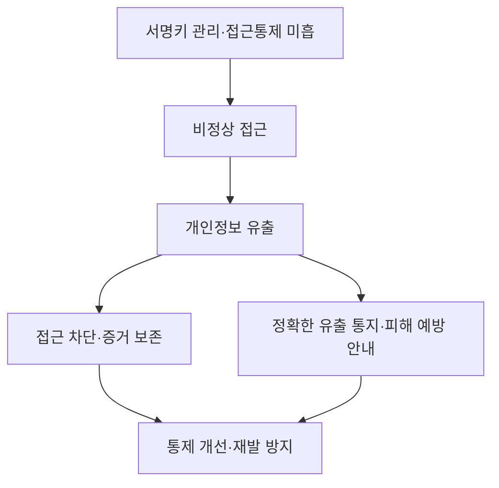
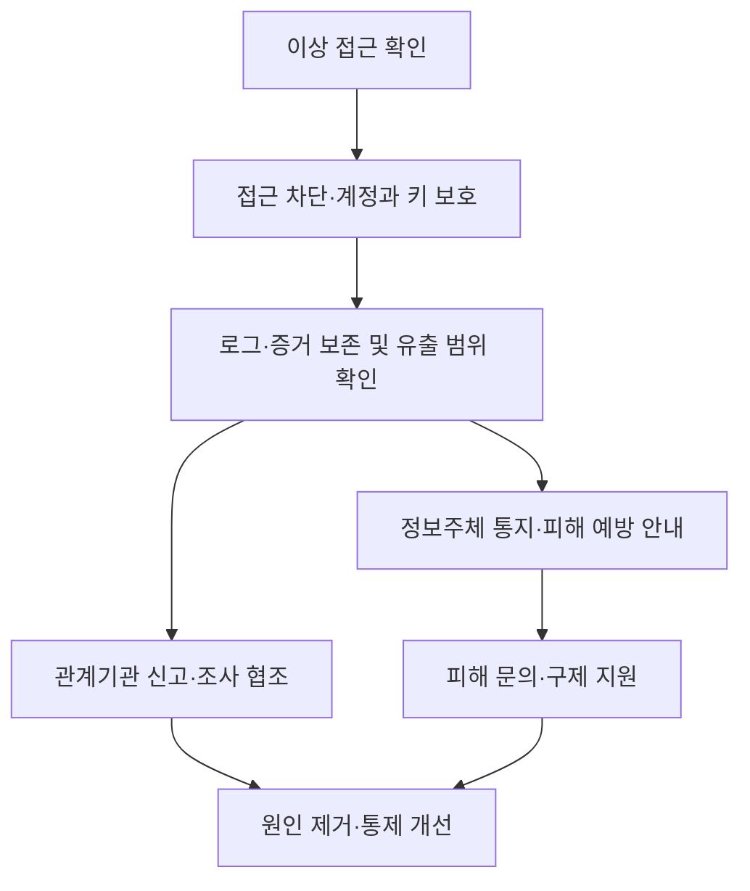
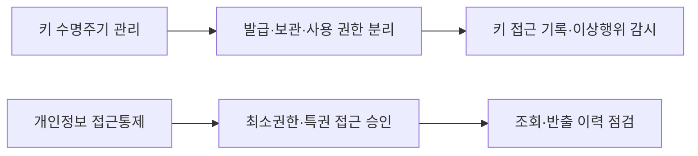

## 30초 인출
- **본질:** 쿠팡 사고는 인증 서명키 관리와 접근통제 등 기본 안전관리의 미흡으로 다수 정보주체의 개인정보가 유출된 사례다.
- **메커니즘:** 서명키·접근통제 취약 → 비정상 접근 → 개인정보 유출 → 통지·확산방지·재발방지 조치
- **핵심:** 침해 차단뿐 아니라 유출 사실·항목의 정확한 통지, 피해 예방 안내, 책임자와 통제 개선이 함께 필요하다.

핵심 용어

- **개인정보 유출**: 개인정보가 개인정보처리자의 관리 범위를 벗어나 제3자가 알 수 있는 상태가 되는 사고다.
- **인증 서명키**: 인증 또는 전자서명 과정에서 신원·요청의 진위를 확인하는 데 쓰이는 키다.
- **CPO**: 개인정보 보호 업무를 총괄하고 조직 내 보호 체계가 작동하도록 관리하는 개인정보 보호책임자다.

---

## 1교시 예상문제 (10점)

---

> 쿠팡 개인정보 유출 사고의 원인과 기업의 핵심 대응 방안을 설명하시오.

---

## 1교시 10점 답안

### 1. 정의·목적

정의: 개인정보 유출은 개인정보가 허가되지 않은 자에게 노출되거나 이용 가능해진 사고다.

목적: 사고를 신속히 차단하고 정보주체의 피해를 줄이며 같은 유형의 재발을 막는다.

### 2. 사고와 대응

개인정보보호위원회는 2026년 6월 의결에서 인증 서명키 관리와 접근통제 미흡 등으로 약 3,755만 명의 개인정보가 유출된 것으로 판단하고 시정명령 등을 의결했다.

| 대응 관점 | 핵심 조치 |
|---|---|
| 기술 | 키 관리와 접근통제를 재점검하고 침해 경로 차단 |
| 정보주체 | 유출 사실·항목을 정확히 알리고 필요한 피해 예방 방법 안내 |
| 거버넌스 | CPO의 독립성과 실질적 역할을 보장하고 이행 여부 점검 |

---

## 2~4교시 예상문제 (25점)

---

> 대규모 온라인 플랫폼 개인정보 유출 사고의 공격·관리 원인을 분석하고, 사고 대응과 재발 방지를 위한 기술적·관리적·법적 대책을 제시하시오. (예상)

---

## 2~4교시 25점 답안

### Ⅰ. 사고 개요와 영향

개인정보보호위원회는 2026년 6월 쿠팡 사고와 관련해 인증 서명키 관리 및 접근통제 소홀 등 안전관리 체계 미흡으로 약 3,755만 명의 개인정보가 유출된 것으로 판단했다. 유출 통지·파기 의무와 CPO 독립성 보장 위반 등도 확인했다고 발표했다.

| 공식 발표 내용 | 보안상 의미 |
|---|---|
| 약 3,755만 명 유출 판단 | 대규모 정보주체 통지와 피해 예방 조치가 필요 |
| 서명키 관리·접근통제 미흡 | 인증 신뢰와 개인정보처리시스템 보호를 함께 점검해야 함 |
| 통지·파기·CPO 관련 위반 확인 | 침해 후 대응과 개인정보 거버넌스가 기술통제와 연결됨 |

### Ⅱ. 침해 원인과 보호 경계

| 보호 경계 | 점검 항목 |
|---|---|
| 인증·서명키 | 키 발급·보관·접근·회전·폐기 권한과 감사기록 |
| 계정·관리자 접근 | 강한 인증, 최소권한, 특권계정 사용기록 |
| 개인정보처리시스템 | 접근통제, 비정상 접근 탐지, 데이터 조회·반출 기록 |
| 외부 연계·위탁 | 연계 계정과 협력사 접근 범위, 책임과 점검 기록 |

### Ⅲ. 사고 대응과 정보주체 보호

개인정보 보호법 시행령은 개인정보처리자가 유출 사실을 알게 된 때 정보주체에게 72시간 이내 통지하도록 정한다. 1천 명 이상 유출, 민감정보·고유식별정보 유출, 개인정보처리시스템에 대한 외부 불법 접근으로 인한 유출 등은 72시간 이내 신고 요건에 해당한다. 구체적인 적용은 현행 법령과 사고 사실관계를 확인한다.

| 대응 단계 | 실무 조치 |
|---|---|
| 확산 차단 | 노출된 키·계정·접근경로를 통제하고 추가 접근을 제한 |
| 사실 확인 | 로그를 보존하고 대상·항목·기간·접근 여부를 조사 |
| 통지·신고 | 확인된 사실을 우선 알리고 미확인 항목은 확인 즉시 보완 |
| 피해 지원 | 비밀번호 변경 등 실제 위험에 맞는 예방 방법과 문의 창구 제공 |

### Ⅳ. 기술·관리 재발 방지

| 통제 영역 | 개선 방향 |
|---|---|
| 키 관리 | 키의 접근권한과 사용 목적을 제한하고 발급·폐기 과정을 기록 |
| 접근통제 | 업무상 필요한 권한만 부여하고 관리자 접근을 별도 승인·감사 |
| 탐지·대응 | 대량 조회·비정상 위치·시간의 접근을 탐지하고 대응훈련 수행 |
| 보유·파기 | 보유 목적과 기간을 점검해 목적 달성 개인정보를 적법하게 파기 |
| 책임·감독 | CPO가 보고·조정·개선 권한을 행사하도록 독립성과 자원 보장 |

### Ⅴ. 기술사적 제언

| 문제 | 해결 방안 |
|---|---|
| 침해 사실을 늦게 알거나 유출 항목을 축소·누락해 통지하면 정보주체가 위험에 대응하기 어려움 | 사고 대응계획에 사실 확인, 통지 승인, 추가 확인사항 보완 절차를 명시하고 모의훈련 |
| 인증키 관리와 개인정보 접근통제가 서로 다른 조직에 분산될 수 있음 | 키 관리자·시스템 운영자·개인정보 책임자의 역할을 분리하고 통합 감사기록으로 점검 |
| 형식적인 CPO 지정만으로는 경영진 의사결정에 보호 요구가 반영되지 않을 수 있음 | CPO에게 독립적 보고 경로와 개선 이행 확인 권한을 보장하고 경영진이 정기 검토 |

## 출제 이력 및 참고자료

- 본 문항은 현재 공개된 사고 조사·처분 내용을 반영해 작성한 예상문제다.
- [개인정보보호위원회: 쿠팡 및 계열사 개인정보 유출·침해 제재처분 의결](https://pipc.go.kr/np/cop/bbs/selectBoardArticle.do?bbsId=BS074&mCode=&nttId=12171)
- [개인정보 보호법 시행령: 현행 제39조 통지·제40조 신고](https://law.go.kr/lsLinkCommonInfo.do?lspttninfSeq=67070)
