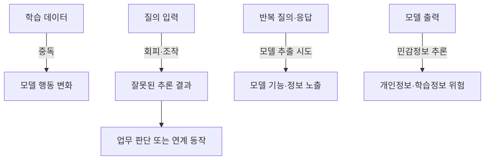
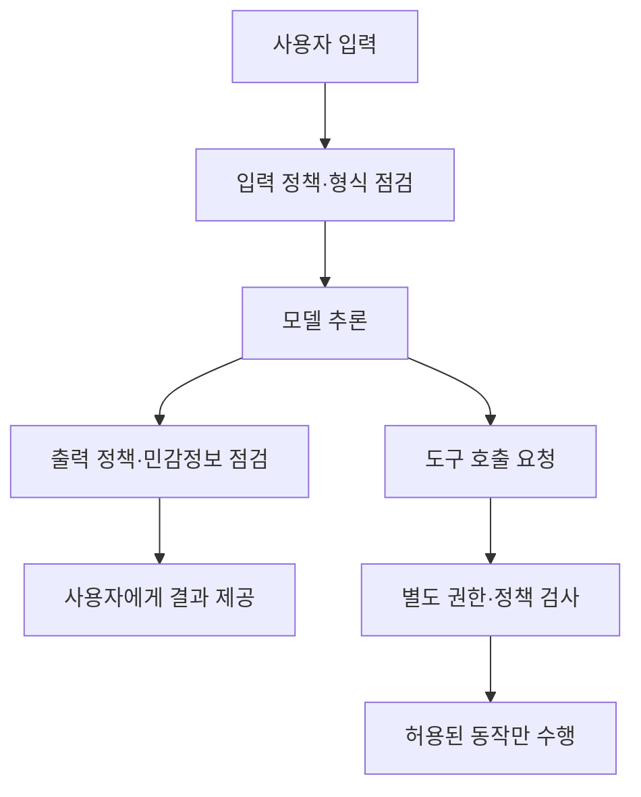

## 30초 인출
- **본질:** AI 보안은 학습부터 배포·운영까지 데이터와 모델, 입출력 경로, 연계 기능을 공격과 오작동으로부터 보호하는 활동이다.
- **메커니즘:** 생애주기별 자산·위협 식별 → 위험 측정 → 통제 적용 → 운영 중 감시와 재평가
- **핵심:** 입력 검증, 데이터·모델 보호, 권한 제한, 평가와 모니터링을 위험에 맞게 조합한다.

핵심 용어

- **데이터 중독**: 공격자가 학습 데이터에 악의적 표본을 넣어 모델 행동을 바꾸려는 공격이다.
- **회피 공격**: 추론 입력을 조작해 모델의 정상적인 예측을 틀리게 만드는 공격이다.
- **모델 추출**: 반복 질의와 출력을 이용해 원래 모델의 기능이나 파라미터를 근사하려는 공격이다.
- **AI RMF**: AI의 신뢰성·보안 등 위험을 거버넌스, 맵핑, 측정, 관리의 관점에서 다루는 NIST 프레임워크다.

---

## 1교시 예상문제 (10점)

---

> AI 보안의 개념과 생애주기별 주요 위협 및 대응 방안을 설명하시오.

---

## 1교시 10점 답안

### 1. 정의·목적

정의: AI 보안은 데이터·모델·추론 경로와 AI 연계 기능의 기밀성·무결성·가용성을 보호하는 활동이다.

목적: 모델의 오용·조작과 데이터 노출을 줄이고, 시스템이 의도한 권한 안에서 안전하게 작동하도록 한다.

### 2. 생애주기별 위협과 통제

| 단계 | 위협 예 | 대응 방향 |
|---|---|---|
| 데이터·학습 | 중독, 데이터 노출 | 출처·무결성 점검, 민감정보 최소화 |
| 검증·배포 | 회피 입력, 취약한 연계 | 적대적 평가, 안전한 배포 검토 |
| 운영 | 모델 추출, 권한 오용 | 접근·호출 제한, 로그와 이상행위 감시 |

---

## 2~4교시 예상문제 (25점)

---

> AI 활용 확산에 따른 주요 보안 위협을 생애주기와 공격 유형별로 설명하고, 기술적·관리적 보호대책을 제시하시오. (예상)

---

## 2~4교시 25점 답안

### Ⅰ. AI 보안의 범위와 특성

AI 보안은 일반 정보시스템 보호에 더해 학습 데이터, 모델, 추론 입력·출력, 모델이 호출하는 도구와 연계시스템을 함께 다룬다. NIST는 AI 위험관리를 설계·개발·배포·사용·평가 등 생애주기에 걸쳐 적용하도록 안내한다.

| 보호 자산 | 주요 보안 질문 |
|---|---|
| 데이터 | 출처·동의·무결성·민감정보 포함 여부를 관리하는가? |
| 모델 | 승인된 모델인지, 변경·복제·추출을 통제하는가? |
| 입출력 | 악의적 입력과 민감정보 출력 위험을 평가하는가? |
| 도구·연계 | 모델의 호출 권한과 외부 동작을 제한하는가? |

### Ⅱ. 위협 분류와 공격 경로

| 공격 유형 | 노리는 지점 | 예시 결과 |
|---|---|---|
| 중독 | 학습·미세조정 데이터 | 특정 조건에서 의도된 오답·행동 유도 |
| 회피 | 추론 입력 | 분류·탐지 오류 유도 |
| 프라이버시 공격 | 모델 출력·질의 인터페이스 | 학습 정보 추론 또는 민감정보 노출 |
| 오용 | 모델·연계 도구 | 권한 범위를 벗어난 기능 수행 |

### Ⅲ. 데이터·모델 공급망 보호

| 통제 | 적용 내용 |
|---|---|
| 데이터 출처 | 수집 근거, 라이선스, 처리 목적과 출처를 기록 |
| 데이터 무결성 | 접근권한과 변경 이력을 관리하고 학습 데이터 변화를 검토 |
| 모델 계보 | 모델 버전, 학습자료, 평가 결과, 승인자를 추적 |
| 구성요소 검증 | 외부 모델·라이브러리·가중치의 출처와 무결성을 확인 |
| 정보 최소화 | 학습·평가 자료에 불필요한 개인정보가 남지 않도록 점검 |

### Ⅳ. 추론·운영 단계 보호

| 운영 통제 | 목적 |
|---|---|
| 최소 권한 | 모델과 에이전트가 필요한 데이터·도구만 사용하도록 제한 |
| 입력·출력 정책 | 악성 입력과 민감·위험 출력의 탐지·처리 기준 적용 |
| 호출 제한 | 반복 질의·대량 수집을 제한해 추출·오용 가능성 축소 |
| 모니터링 | 프롬프트·응답·도구 호출 기록을 정책에 따라 보존·점검 |
| 안전한 변경 | 모델·데이터·정책 변경 후 회귀 및 적대적 평가 수행 |

### Ⅴ. 기술사적 제언

| 문제 | 해결 방안 |
|---|---|
| 모델 성능시험만으로는 공격 상황에서의 취약점을 찾기 어려움 | 데이터 중독·회피·프라이버시·오용 시나리오를 위험기반으로 시험하고 잔여위험 기록 |
| 출력 필터 하나에 의존하면 도구 호출과 연계시스템의 권한 오용을 막기 어려움 | 모델 밖에서 권한검사와 실행정책을 적용하고 민감·고위험 동작은 사람 승인 절차로 제한 |
| 모델·데이터 변경이 보안 평가 결과를 빠르게 낡게 만듦 | 변경 이력과 평가 근거를 연결하고 배포 전후 재평가·모니터링 체계를 운영 |

## 출제 이력 및 참고자료

- 본 문항은 AI 위험과 공격 유형을 반영해 작성한 예상문제다.
- [NIST AI RMF](https://www.nist.gov/itl/ai-risk-management-framework)
- [NIST AI 600-1: Generative AI Profile](https://nvlpubs.nist.gov/nistpubs/ai/NIST.AI.600-1.pdf)
- [NIST AI 100-2e2025: Adversarial Machine Learning](https://www.nist.gov/news-events/news/2025/03/nist-trustworthy-and-responsible-ai-report-adversarial-machine-learning)
