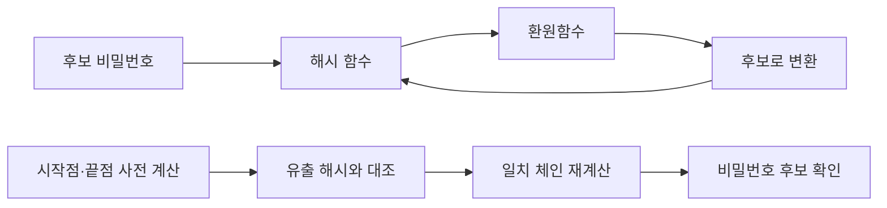
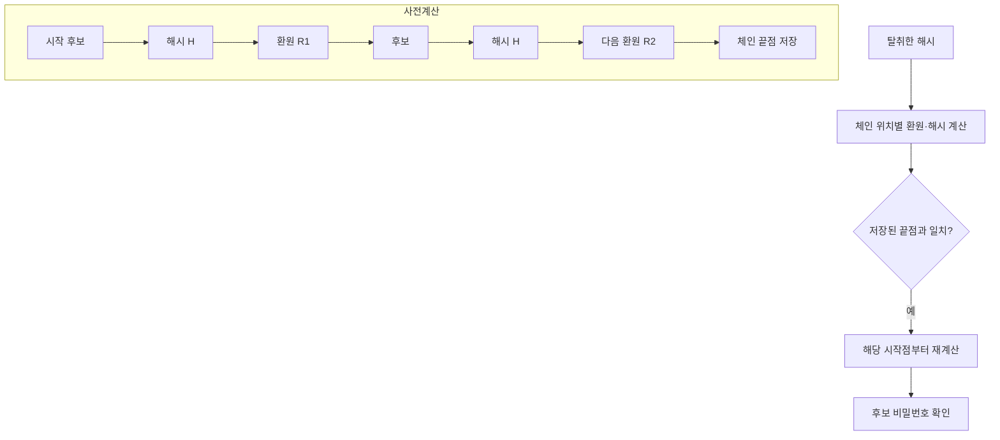

## 30초 인출
- **본질:** 레인보우 테이블은 해시값에서 원래 비밀번호 후보를 찾기 위해 해시·환원 연쇄를 미리 계산해 저장하는 시간·메모리 절충 공격 기법이다.
- **메커니즘:** 비밀번호 후보 → 해시 → 환원함수 반복 → 시작점·끝점 저장 → 탈취 해시와 대조해 후보 복원
- **핵심 방어:** 계정마다 고유한 salt를 적용하고, 비용이 큰 비밀번호 해싱을 사용해 사전 계산 결과의 재사용과 대량 추측 속도를 낮춘다.

핵심 용어

- **레인보우 테이블**: 해시 사전 계산 결과를 체인 시작점과 끝점으로 압축 저장해 해시값을 역으로 찾는 데 쓰는 자료구조다.
- **환원함수**: 해시값을 비밀번호 후보 공간의 값으로 바꾸는 함수다. 해시 역함수는 아니다.
- **Salt**: 비밀번호마다 다르게 적용하는 임의 값으로, 같은 비밀번호의 해시가 서로 달라지고 사전 계산 테이블 재사용이 어려워진다.
- **비밀번호 해싱**: 비밀번호를 salt와 비용 인자에 넣어 저장용 검증값을 계산하는 처리다.

---

## 1교시 예상문제 (10점)

---

> 레인보우 테이블 공격의 원리와 비밀번호 저장 시 방어대책을 설명하시오.

---

## 1교시 10점 답안

### 1. 정의·목적

정의: 레인보우 테이블은 해시 연쇄를 사전 계산해 해시값에 대응하는 비밀번호 후보를 찾는 공격 기법이다.

목적: 유출된 비밀번호 해시를 대량으로 추측할 때 사전 계산 결과를 재사용해 공격 계산을 줄인다.

### 2. 공격 흐름과 방어

| 공격을 어렵게 하는 통제 | 이유 |
|---|---|
| 계정별 고유 salt | 같은 비밀번호라도 저장 해시를 다르게 해 미리 계산한 표의 재사용을 어렵게 함 |
| 비용 인자가 있는 비밀번호 해싱 | 각 추측의 계산비용을 높여 오프라인 대입 속도를 낮춤 |
| 저장소·키 보호 | 해시 파일과 별도 비밀키의 동시 탈취 가능성을 낮춤 |

## 출제 이력 및 참고자료

- 기존 노트의 제138회 4교시 2번 해시함수 문항과 레인보우 테이블 취지를 보존해 정리했다.
- [NIST SP 800-63B-4: Memorized Secret Verifiers](https://pages.nist.gov/800-63-4/sp800-63b/authenticators/)
- [NIST SP 800-63B-4: Digital Identity Guidelines](https://pages.nist.gov/800-63-4/sp800-63b.html)

---

## 2~4교시 예상문제 (25점)

---

> 단방향 해시함수의 특성과 레인보우 테이블 공격의 원리를 설명하고, 비밀번호 해시 유출에 대비한 안전한 저장 방안을 제시하시오. (제138회 4교시 2번 취지 확장)

---

## 2~4교시 25점 답안

### Ⅰ. 해시와 비밀번호 검증값

해시함수는 임의 길이 입력을 고정 길이 출력으로 변환하는 함수이며, 보안 해시의 설계 목표는 입력을 출력에서 역산하기 어렵게 하는 것이다. 비밀번호 저장에는 일반 용도의 빠른 해시 하나를 그대로 적용하는 방식이 적절하지 않다. 공격자는 해시 저장소를 얻으면 온라인 로그인 제한과 관계없이 오프라인 추측을 반복할 수 있기 때문이다.

| 개념 | 핵심 |
|---|---|
| 단방향 해시 | 입력을 고정 길이 해시값으로 변환 |
| 충돌 | 서로 다른 입력이 같은 해시값을 만드는 경우 |
| 오프라인 추측 | 탈취한 검증값을 후보 비밀번호 계산 결과와 직접 비교 |

### Ⅱ. 레인보우 테이블 생성과 검색

공격자는 모든 중간값을 저장하는 대신 체인의 시작점과 끝점만 저장해 메모리를 줄인다. 해시함수와 환원함수를 반복하므로 끝점 일치만으로 원 비밀번호가 바로 결정되는 것은 아니며, 후보 체인을 다시 계산해 확인한다. 체인 병합과 미리 계산한 테이블의 범위 때문에 복구가 항상 성공하는 것도 아니다.

### Ⅲ. 시간·메모리 절충과 한계

| 방식 | 저장량 | 검색 계산 | 주요 특성 |
|---|---|---|---|
| 완전 사전 | 후보별 해시값 저장 | 비교가 빠름 | 저장 공간이 큼 |
| 레인보우 테이블 | 체인 시작점·끝점 저장 | 일치 후보 체인 재계산 필요 | 저장 공간과 계산량을 절충 |
| 무작위 온라인 추측 | 사전 계산 결과 없음 | 매번 새 계산 | 계정별 로그인 제한의 영향을 받음 |

같은 해시함수와 환원 체계에 대해 준비된 테이블은 반복 사용할 수 있지만, salt를 적용하면 salt별로 별도 계산이 필요해져 미리 계산한 결과의 재사용성이 크게 낮아진다.

### Ⅳ. 비밀번호 저장 방안

| 저장 원칙 | 설명 |
|---|---|
| 고유 salt | 계정별 무작위 salt를 함께 저장해 사전 계산 테이블의 재사용을 방해 |
| 비용 인자 | 성능에 무리가 없는 범위에서 해싱 비용을 높이고 환경 변화에 맞춰 재조정 |
| 알고리즘·버전 기록 | 검증값과 함께 방식·비용 정보를 보관해 마이그레이션 가능하게 함 |
| 별도 keyed hash 검토 | NIST 지침은 추가 keyed hash를 권고하며, 키는 검증값과 분리된 보호영역에 저장 |
| 온라인 방어 | 로그인 시도 제한과 유출 비밀번호 차단 등 온라인 추측 통제 병행 |

NIST SP 800-63B-4는 중앙 검증 비밀번호를 salt와 비용 인자를 사용하는 적절한 비밀번호 해싱 방식으로 저장하고, 비용을 가능한 범위에서 높이며 추후 증가시키도록 안내한다. 해시만으로 비밀번호 저장을 안전하게 만들 수 있다고 가정해서는 안 된다.

### Ⅴ. 기술사적 제언

| 문제 | 해결 방안 |
|---|---|
| 빠른 범용 해시와 고정 salt는 대량 오프라인 추측과 테이블 재사용에 취약함 | 최신 지침에 맞는 비밀번호 전용 해싱, 계정별 고유 salt와 적정 비용 인자를 적용 |
| 해시 저장소와 추가 키가 함께 유출되면 방어 효과가 약화될 수 있음 | keyed hash를 쓰는 경우 비밀키를 저장소와 분리된 HSM·보호 실행환경에 두고 접근을 감사 |
| 해싱 비용을 한 번 정한 뒤 유지하면 하드웨어 발전에 따라 추측 비용이 낮아질 수 있음 | 서비스 성능과 위협을 정기 평가하고 비용 인자를 상향하며 기존 해시를 로그인 시 안전하게 갱신 |
