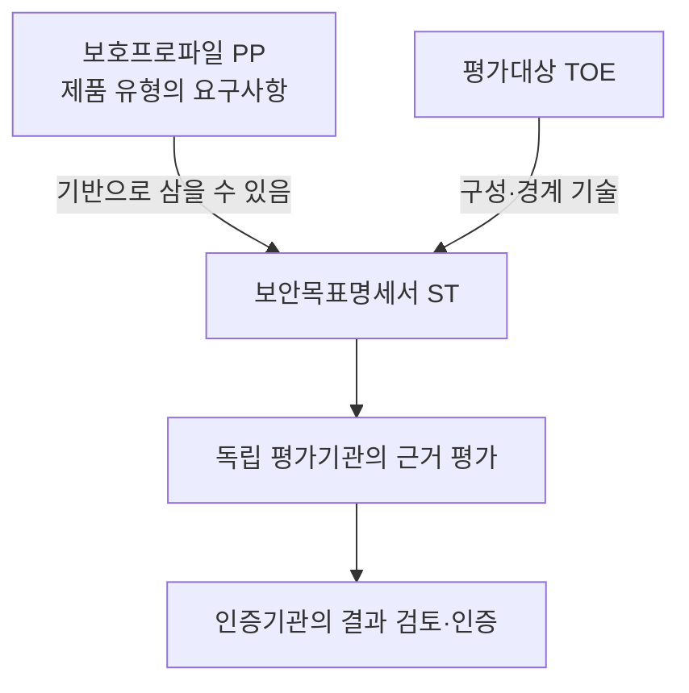
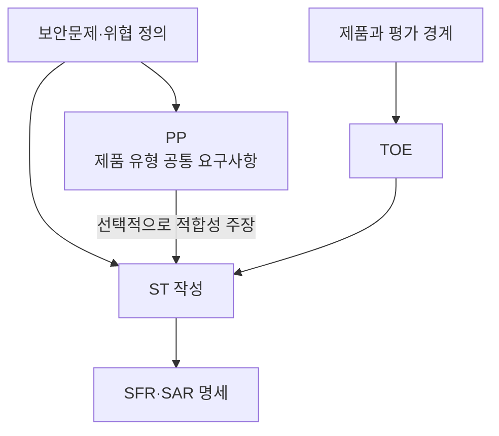
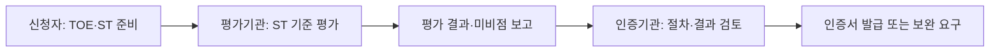

## 30초 인출
- **본질:** Common Criteria(CC)는 정보기술제품의 보안 기능과 평가 근거를 공통 기준으로 평가하는 국제 표준이다.
- **메커니즘:** 보호프로파일(PP)이 요구사항의 틀을 제시하고, 보안목표명세서(ST)가 평가대상(TOE)의 보안목표·요구사항을 정하며, 평가기관이 근거를 확인한다.
- **핵심:** 인증은 평가 범위와 명세된 요구사항에 대한 결과이며 모든 환경에서 완전한 보안을 보장하지 않는다.

핵심 용어

- **PP(Protection Profile)**: 특정 제품 유형에 필요한 보안문제를 정의하고 보안요구사항을 제시하는 문서다.
- **ST(Security Target)**: 평가대상 제품의 보안문제·목표·요구사항과 PP 적합성 주장을 기술하는 문서다.
- **TOE(Target of Evaluation)**: CC 평가 범위에 포함되는 제품 또는 제품의 일부다.
- **EAL(Evaluation Assurance Level)**: 평가 보증 요구사항의 묶음으로, 제품의 절대적 안전등급을 뜻하지 않는다.

---

## 1교시 예상문제 (10점)

---

> CC(Common Criteria)의 개념과 PP, ST, TOE, EAL의 관계를 설명하시오.

---

## 1교시 10점 답안

### 1. 정의·목적

정의: CC는 정보기술제품의 보안 기능과 평가 근거를 공통 기준으로 평가하는 기준이다.

목적: 제조사·평가기관·구매자가 제품 보안 주장과 평가 범위를 같은 기준으로 이해하게 한다.

### 2. 평가 문서와 범위

| 용어 | 의미 |
|---|---|
| PP | 제품 유형의 공통 보안요구사항 |
| ST | 특정 TOE에 대한 보안 명세 |
| TOE | 평가를 받는 제품·범위 |
| EAL | 보증 구성요소를 묶은 평가 보증 수준 |

---

## 2~4교시 예상문제 (25점)

---

> CC(Common Criteria)의 평가 개념을 설명하고, PP·ST·TOE·SFR·SAR·EAL의 역할과 평가·인증 절차 및 적용상 유의점을 서술하시오. (제136회 1교시 11번 취지 확장)

---

## 2~4교시 25점 답안

### Ⅰ. CC의 목적과 평가 한계

CC는 제품의 보안기능과 평가 보증요구사항을 정형화해 평가 결과를 이해할 공통 기준을 제공한다. 인증은 명세된 TOE 경계와 평가 기준에 한정되므로 제품의 모든 취약점 부재나 실제 운영환경의 안전을 보증하지 않는다.

| 평가가 확인하는 내용 | 인증만으로 단정할 수 없는 내용 |
|---|---|
| ST에 선언된 보안기능과 평가 근거 | 모든 공격에 대한 무결점 |
| 평가 범위와 보증요구사항의 충족 여부 | 인증 이후 변경된 제품·운영환경의 안전 |

### Ⅱ. PP·ST·TOE의 관계

PP는 제품 유형에 필요한 요구사항의 기준이 될 수 있고, ST는 특정 제품의 TOE 범위와 보안 목표·요구사항을 구체화한다. PP가 없는 평가도 가능하며, 제품이 PP 적합성을 주장하는 경우 ST에 그 근거를 명시한다.

### Ⅲ. 보안요구사항과 보증수준

| 요소 | 역할 |
|---|---|
| SFR(Security Functional Requirements) | 접근통제·식별·감사 등 TOE가 제공할 보안기능 요구 |
| SAR(Security Assurance Requirements) | 설계·개발·시험·취약성 분석 등에 대한 평가 보증 요구 |
| EAL | SAR 구성요소를 미리 정한 패키지로 묶은 보증 수준 |

EAL 숫자는 기능의 강도나 모든 제품 간 보안 우열을 직접 나타내지 않는다. 서로 다른 TOE·ST와 평가 범위를 확인하지 않고 EAL만으로 제품을 비교하면 오해가 생길 수 있다.

### Ⅳ. 평가·인증 절차

평가기관은 ST와 평가기준에 따라 제출 증거와 TOE를 평가하고 결과를 보고한다. 인증기관은 평가결과와 인증 절차를 검토한다. 인증서의 범위, 버전, 유효조건과 PP 적합성 주장을 확인해야 한다.

### Ⅴ. 기술사적 제언

| 문제 | 해결 방안 |
|---|---|
| 구매자가 인증 등급만 보고 운영 적합성을 판단할 수 있음 | ST와 인증서의 TOE 범위·버전·환경조건을 실제 조달 요구와 대조 |
| 제품이 인증 후 변경되면 평가 결과가 변경분을 포괄하지 않을 수 있음 | 인증 제품의 구성·업데이트 관리 절차와 변경 시 재평가 조건을 계약·운영에 반영 |
| CC 평가가 CI/CD의 빠른 변경주기를 모두 다루기 어려움 | 제품 인증은 보안 기준선으로 활용하고, 개발·배포 파이프라인에서는 별도의 지속 검증을 병행 |

## 출제 이력 및 참고자료

- 기존 노트에 기록된 제136회 1교시 11번 CC 문항을 25점 문항의 출제 기반으로 보존했다.
- [Common Criteria Portal: CC:2022 Publications](https://www.commoncriteriaportal.org/cc/index.cfm)
- [Common Criteria: CC:2022 Part 1](https://www.commoncriteriaportal.org/files/ccfiles/CC2022PART1R1.pdf)
