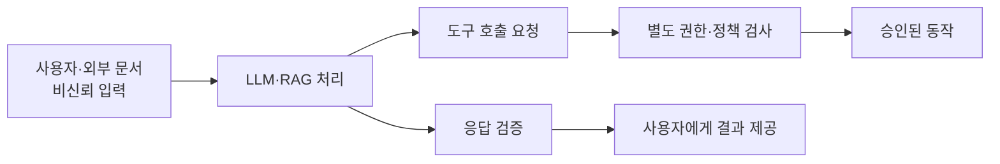
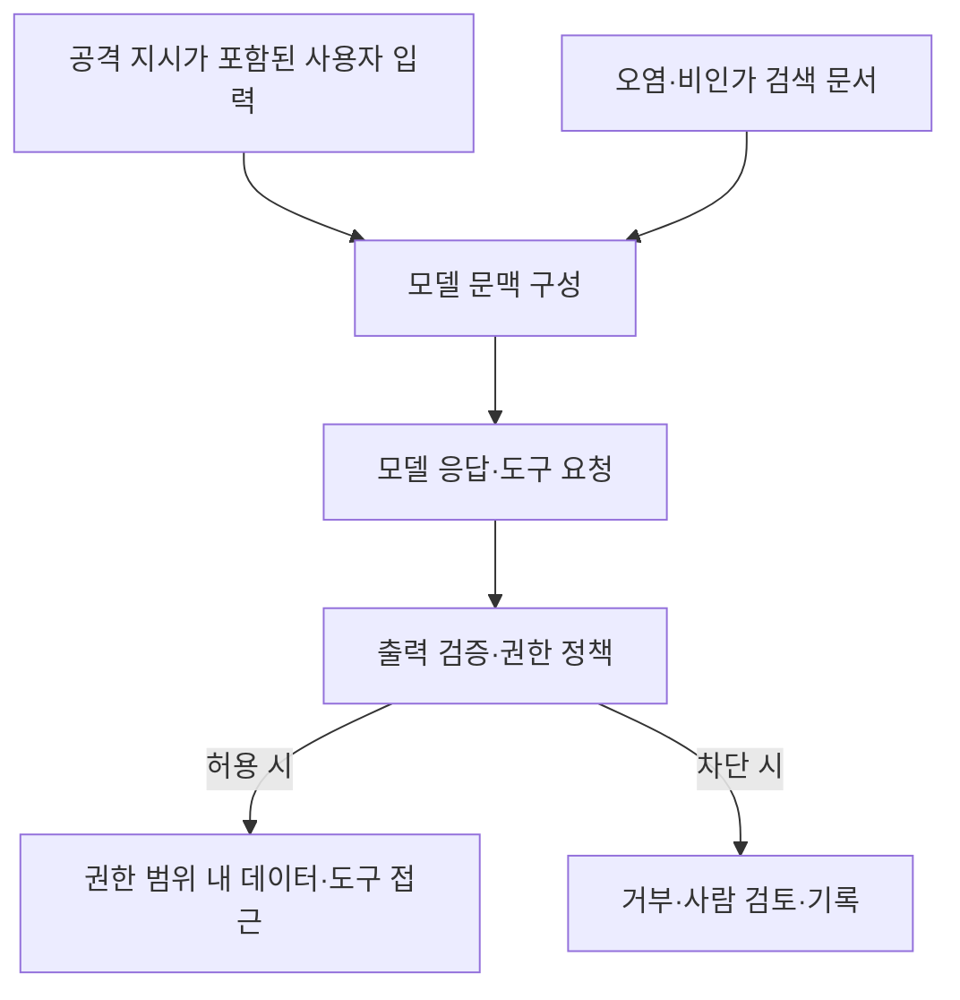

## 30초 인출
- **본질:** OWASP Top 10 for LLM Applications는 LLM·생성형 AI 애플리케이션의 주요 보안위험을 식별하고 대응을 돕는 위험 목록이다.
- **메커니즘:** 비신뢰 입력과 데이터 → 모델·RAG 처리 → 출력·도구 동작 → 권한·정보·서비스 영향
- **핵심:** 프롬프트 지시만 믿지 말고 데이터 경계, 출력 검증, 최소 권한, 비용 통제를 애플리케이션 계층에 둔다.

핵심 용어

- **Prompt Injection**: 직접 또는 외부 자료를 통해 입력된 지시가 모델의 예상 행동을 바꾸는 취약점이다.
- **Excessive Agency**: LLM 애플리케이션에 기능·권한·자율성이 과도하게 주어져 예기치 않은 동작이 가능해지는 위험이다.
- **RAG**: 검색된 외부 문맥을 모델 입력에 더해 응답을 생성하는 구조다. 검색 자료의 지시를 신뢰해서는 안 된다.

---

## 1교시 예상문제 (10점)

---

> OWASP Top 10 for LLM Applications의 목적과 주요 위험 및 대응 원칙을 설명하시오.

---

## 1교시 10점 답안

### 1. 정의·목적

정의: OWASP Top 10 for LLM Applications는 LLM 애플리케이션의 주요 보안위험을 분류하고 완화방안을 안내하는 목록이다.

목적: 개발·배포·운영 단계에서 놓치기 쉬운 LLM 특유의 위험을 설계와 점검에 반영한다.

### 2. 핵심 위험 경계

| 위험 | 기본 대응 |
|---|---|
| Prompt Injection | 외부 입력을 비신뢰 데이터로 취급하고 권한 경계 적용 |
| Sensitive Information Disclosure | 입력·검색·출력에서 정보 접근권한과 노출을 통제 |
| Excessive Agency | 최소 권한과 코드 측 정책검사, 중요 동작 승인 |

---

## 2~4교시 예상문제 (25점)

---

> OWASP Top 10 for LLM Applications의 2025년 주요 위험을 설명하고, RAG·외부 도구를 포함하는 LLM 애플리케이션의 안전한 설계·운영 대책을 제시하시오. (제136회 4교시 5번 취지 반영)

---

## 2~4교시 25점 답안

### Ⅰ. 개요와 적용 범위

OWASP의 2025 목록은 LLM 애플리케이션과 생성형 AI 시스템에서 개발·배포·관리 전반에 걸친 위험을 다룬다. 이는 전체 보안 기준이나 완전한 위험 목록이 아니라, 위협 모델링과 보안시험을 시작할 분류체계로 활용한다.

| 적용 대상 | 점검 범위 |
|---|---|
| 모델·데이터 | 학습·검색자료, 모델 공급망, 민감정보 |
| 애플리케이션 | 프롬프트 처리, 출력 사용, 인증·권한 |
| 외부 연계 | 플러그인·API·도구 호출과 비용·자원 사용 |

### Ⅱ. OWASP 2025 위험 항목

| 순위·위험 | 핵심 의미 |
|---|---|
| LLM01 Prompt Injection | 직접·간접 입력이 모델 행동을 의도와 다르게 바꿈 |
| LLM02 Sensitive Information Disclosure | 모델·애플리케이션이 민감정보를 노출 |
| LLM03 Supply Chain | 모델·데이터·구성요소 공급망 위험 |
| LLM04 Data and Model Poisoning | 학습·미세조정·임베딩 데이터나 모델을 오염 |
| LLM05 Improper Output Handling | 모델 출력을 검증하지 않고 후속 시스템에서 사용 |
| LLM06 Excessive Agency | 과도한 기능·권한·자율성으로 예기치 않은 작업 수행 |
| LLM07 System Prompt Leakage | 시스템 프롬프트의 민감한 내용 노출 |
| LLM08 Vector and Embedding Weaknesses | 벡터·임베딩·검색 경계의 취약점 악용 |
| LLM09 Misinformation | 부정확한 생성 결과가 의사결정·후속 처리에 영향 |
| LLM10 Unbounded Consumption | 무제한 자원 사용으로 비용 증가·서비스 저하 |

### Ⅲ. RAG와 도구 연계 공격 경로

RAG와 미세조정은 프롬프트 인젝션을 완전히 막지 못한다. 검색 문서도 비신뢰 입력으로 취급하고, 모델 출력을 명령으로 바로 실행하지 않으며, 도구 권한을 모델과 분리해 검사한다.

### Ⅳ. 설계·운영 통제

| 통제영역 | 적용 대책 |
|---|---|
| 데이터·검색 | 출처와 권한을 검증하고 검색 단계에서 사용자별 접근제어 적용 |
| 입력·프롬프트 | 신뢰 경계를 구분하고 악의적·예상 밖 입력 시험 |
| 출력 | 스키마·형식 검증, 인코딩·명령 처리 시 안전한 후속 처리 |
| 도구·권한 | 최소 권한, 허용 목록, 중요 동작에 별도 승인 |
| 공급망 | 모델·임베딩·라이브러리 출처와 버전·변경 이력 관리 |
| 자원·운영 | 질의·토큰·호출 한도, 모니터링, 중단·롤백 절차 |

### Ⅴ. 기술사적 제언

| 문제 | 해결 방안 |
|---|---|
| RAG 검색 권한과 시스템 권한이 분리되지 않으면 다른 사용자의 문맥이 검색될 수 있음 | 검색 계층에 사용자 권한 필터를 강제하고 회수·삭제 후 색인 갱신까지 시험 |
| 모델 출력을 신뢰해 명령·쿼리에 바로 연결하면 출력 조작이 실행으로 이어질 수 있음 | 모델 응답을 비신뢰 데이터로 처리하고 코드 기반 검증·권한검사 후 제한적으로 실행 |
| 프롬프트 인젝션을 모델 자체 필터만으로 완전히 차단하기 어려움 | 탐지에만 의존하지 말고 권한 분리, 최소 접근, 중요 작업 승인으로 피해 범위를 제한 |

## 출제 이력 및 참고자료

- 기존 노트의 제136회 4교시 5번 OWASP LLM Top 10 문항을 출제 기반으로 보존했다.
- [OWASP Gen AI Security Project: 2025 Top 10](https://genai.owasp.org/llm-top-10/)
- [OWASP LLM01:2025 Prompt Injection](https://genai.owasp.org/llmrisk/llm01-prompt-injection/)
