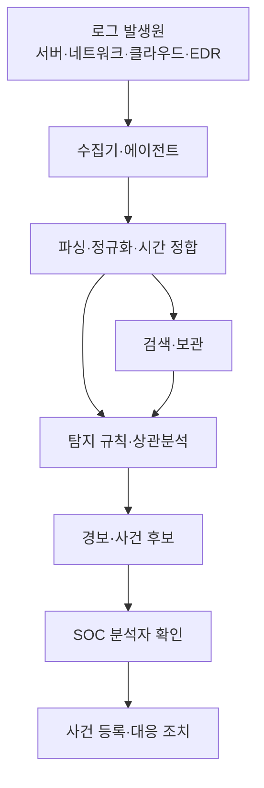

## 30초 인출
- **본질:** SIEM은 여러 정보시스템의 보안 로그를 모아 정규화·분석하고 관련 이벤트를 탐지·조사하는 플랫폼이다.
- **메커니즘:** 로그 수집 → 필드 정규화·보관 → 상관분석·탐지 → 경보·조사 → 필요 시 대응 도구와 연계
- **핵심:** 로그를 모으는 일만으로는 탐지가 되지 않으며, 사용 가능한 데이터·탐지 규칙·관제 절차를 함께 관리해야 한다.

핵심 용어

- **정규화**: 장비마다 다른 로그 필드와 표현을 분석 가능한 공통 형식으로 맞추는 처리다.
- **상관분석**: 둘 이상의 로그 기록 사이 관계를 찾아 의미 있는 이벤트를 식별하는 분석이다.
- **경보 피로**: 과다하거나 품질이 낮은 경보로 분석자의 주의가 약화되어 중요한 경보를 놓칠 위험이다.
- **SOAR**: 보안 경보·도구·절차를 플레이북으로 연계해 대응을 조정하고 자동화하는 체계다.

---

## 1교시 예상문제 (10점)

---

> SIEM의 개념과 로그 처리 흐름, 관제 운영 시 유의사항을 설명하시오.

---

## 1교시 10점 답안

### 1. 정의·목적

정의: SIEM은 다양한 보안 로그를 중앙에서 수집·분석해 침해 징후 탐지와 조사를 지원하는 플랫폼이다.

목적: 분산된 이벤트를 연결해 분석 가능한 보안 가시성과 조사 근거를 제공한다.

### 2. 처리 흐름

| 운영 핵심 | 점검 사항 |
|---|---|
| 로그 품질 | 시각 동기화, 필수 필드, 수집 누락 여부 |
| 탐지 품질 | 실제 위협에 맞는 규칙과 오탐 조정 |
| 조사 가능성 | 보존기간·접근권한·검색 성능과 무결성 |

---

## 2~4교시 예상문제 (25점)

---

> SIEM(Security Information & Event Management)와 SOAR(Security Orchestration, Automation & Response) 비교. 침해 탐지·대응을 위한 연계 방안을 설명하시오. (제135회 1교시 5번 취지 확장)

---

## 2~4교시 25점 답안

### Ⅰ. 도입 배경과 역할

방화벽·서버·클라우드 등 여러 시스템은 각자 다른 형식의 로그를 만든다. SIEM은 이 로그를 중앙에서 관리해 보안 이벤트의 관계를 분석하고 조사할 수 있게 한다. NIST는 로그 관리의 정책·절차·기반구조를 조직 차원에서 계획해야 함을 안내한다.

| 분산 로그만 보유할 때 | SIEM 적용 목적 |
|---|---|
| 서로 다른 형식과 시각으로 사건 연계가 어려움 | 정규화·검색·상관분석으로 조사 단서 연결 |
| 장비별 경보를 따로 살펴야 함 | 다중 데이터의 탐지 규칙과 관제 경보 구성 |
| 보존·접근 기준이 제각각일 수 있음 | 보존기간·무결성·접근권한을 정책으로 관리 |

### Ⅱ. SIEM 구성과 이벤트 흐름

### Ⅲ. 탐지와 운영 품질

| 운영 영역 | 적용 원칙 |
|---|---|
| 데이터 수집 | 자산·위협모델에 필요한 로그를 선정하고 누락·지연 감시 |
| 시간·필드 정합 | 시간 동기화와 주요 필드 매핑으로 로그 비교 가능성 확보 |
| 탐지 규칙 | 위협 시나리오·로그 가시성을 확인해 상관 규칙을 작성·검증 |
| 경보 운영 | 중요도·맥락을 붙이고 분석 결과를 규칙 튜닝에 환류 |
| 로그 보호 | 보존·조회 권한, 전송·저장 보호, 무결성 관리 적용 |

UEBA는 사용자·개체의 행위 맥락을 이용하는 분석 방식으로 SIEM에 연계될 수 있지만 필수 구성은 아니다. 탐지 품질과 입력 데이터에 따라 결과가 달라지므로 운영환경에서 검증한다.

### Ⅳ. SIEM과 SOAR의 연계

| 구분 | SIEM | SOAR |
|---|---|---|
| 중심 기능 | 로그 수집·정규화·탐지·조사 | 경보와 도구·절차의 조정 및 대응 자동화 |
| 입력 | 보안 이벤트·로그 | SIEM 경보·위협정보·사건 맥락 |
| 결과 | 탐지·사건 후보와 조사 정보 | 승인된 플레이북 실행·조치 기록 |
| 사람의 역할 | 경보 분류·조사·판단 | 플레이북 설계, 승인, 예외 처리와 결과 검토 |

SIEM 제품이 자동 대응을 지원할 수도 있으나, 자동 차단이 모든 SIEM에 필수이거나 SIEM만으로 대응이 불가능하다고 단정할 수 없다. 자동화 범위는 연계 기능과 조직의 승인·안전 기준에 따라 결정한다.

### Ⅴ. 기술사적 제언

| 문제 | 해결 방안 |
|---|---|
| 로그를 무차별 수집하면 비용·검색부하가 커지고 분석에 필요한 자료를 가리기 쉬움 | 위협·사고대응 요구에 따라 로그를 선정하고 보존·저장 계층과 접근 기준을 차등화 |
| 낮은 품질의 경보가 누적되면 실제 위협을 놓칠 수 있음 | 경보별 조사 결과를 기록하고 오탐·중복·누락을 주기적으로 검토해 규칙 개선 |
| 대응 자동화가 오탐에 따라 계정·서비스를 차단할 위험 | 영향이 큰 조치는 사람 승인·범위 제한·롤백 절차를 두고, 검증된 반복 작업부터 자동화 |

## 출제 이력 및 참고자료

- 기존 노트의 제135회 1교시 5번 SIEM·SOAR 비교 문항을 보존했다.
- [NIST SP 800-92: Guide to Computer Security Log Management](https://csrc.nist.gov/pubs/sp/800/92/final)
- [NIST SP 800-92 Rev. 1 status: initial public draft](https://csrc.nist.gov/projects/log-management)
