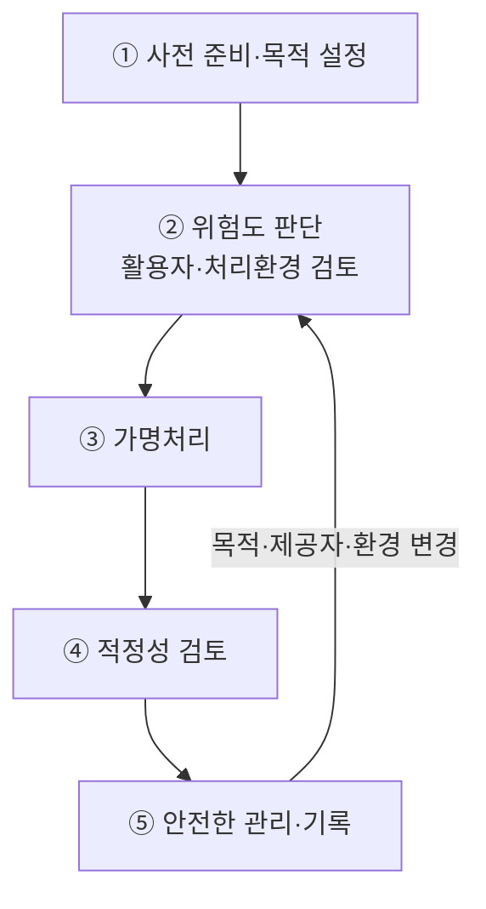

## 30초 인출
- **본질:** 가명처리는 추가정보 없이는 특정 개인을 알아볼 수 없도록 개인정보를 처리해 통계·과학적 연구·공익적 기록보존 등에 활용하는 법적 처리 방식이다.
- **메커니즘:** 목적·환경 검토 → 위험도 판단 → 가명처리 → 적정성 검토 → 안전한 관리
- **핵심:** 처리 후에도 가명정보는 개인정보다. 재식별 목적의 처리는 금지되고, 추가정보 분리·접근통제 등 안전조치를 해야 한다.

핵심 용어

- **가명정보**: 추가정보를 사용·결합하지 않고는 특정 개인을 알아볼 수 없도록 처리한 개인정보다.
- **가명처리**: 개인정보의 일부를 삭제하거나 대체하는 등 추가정보 없이는 개인을 식별할 수 없도록 하는 처리다.
- **익명정보**: 시간·비용·기술 등을 합리적으로 고려해도 더 이상 개인을 알아볼 수 없는 정보다.
- **추가정보**: 가명정보를 원래 상태로 복원하거나 특정 개인을 알아보는 데 쓰일 수 있는 정보다.

---

## 1교시 예상문제 (10점)

---

> 개인정보 비식별화에서 가명정보의 개념과 처리 절차 및 안전조치를 설명하시오.

---

## 1교시 10점 답안

### 1. 정의·목적

정의: 가명처리는 추가정보 없이는 특정 개인을 알아볼 수 없도록 개인정보를 처리하는 방식이다.

목적: 법이 허용한 범위에서 개인정보 침해 위험을 낮추면서 통계·연구 등에 데이터를 활용한다.

### 2. 처리 절차와 보호

| 구분 | 핵심 |
|---|---|
| 허용 목적 | 통계작성, 과학적 연구, 공익적 기록보존 등 법정 목적 |
| 추가정보 관리 | 가명정보와 별도로 분리해 접근·관리 |
| 금지·사고 대응 | 재식별 목적 처리 금지, 재식별 정보 생성 시 처리 중지·회수·파기 |

제언: 목적과 위험도를 먼저 확인한 뒤 필요한 가명처리와 안전조치를 선택한다.

---

## 2~4교시 예상문제 (25점)

---

> 개인정보 비식별 조치 가이드라인과 프라이버시 보호 모델을 설명하고, 가명정보의 안전한 처리·결합·활용 절차를 제시하시오. (제120회 기출 취지)

---

## 2~4교시 25점 답안

### Ⅰ. 개념과 법적 구분

‘비식별화’는 여러 기술적 처리를 통칭해 부르는 말로 사용되지만, 현행 개인정보 보호법의 핵심 제도는 가명정보 처리다. 가명정보는 여전히 개인정보이며, 익명정보와 달리 법의 보호·안전조치 규율을 받는다.

| 구분 | 식별성·법적 성격 | 활용 유의점 |
|---|---|---|
| 개인정보 | 개인을 알아볼 수 있거나 다른 정보와 쉽게 결합해 알아볼 수 있음 | 법적 처리 근거와 목적·안전조치 필요 |
| 가명정보 | 추가정보 없이는 개인을 알아보기 어렵도록 처리한 개인정보 | 법정 목적, 안전조치, 재식별 금지 준수 |
| 익명정보 | 합리적으로 고려 가능한 시간·비용·기술로도 개인을 알아볼 수 없음 | 익명성 판단이 유지되는지 환경 변화에 유의 |

### Ⅱ. 처리 절차와 위험도 판단

개인정보보호위원회의 2026년 가이드라인은 활용자와 처리환경을 중심으로 위험도를 구분하고 검토 절차·서류를 위험에 맞게 차등화한다. 내부 활용은 저위험 사례가 될 수 있고, 제3자 제공은 처리환경 통제 여부에 따라 위험도가 달라진다. 개별 상황에 따라 위험도를 조정해야 한다.

### Ⅲ. 처리 방법과 프라이버시 보호

| 처리·평가 방법 | 역할과 유의점 |
|---|---|
| 가명처리 | 식별자 대체·삭제 등으로 추가정보 없이 개인을 알아보기 어렵게 함 |
| 범주화·총계처리 | 세부값을 구간·집계값으로 바꾸어 식별 가능성을 낮춤 |
| 데이터 삭제·마스킹 | 필요 없는 항목 또는 일부 값을 제거·가림. 단독 적용이 충분한지는 위험 검토 필요 |
| k-익명성 | 준식별자 조합의 동질집단 크기를 이용해 연결 위험을 살피는 모델 |
| l-다양성·t-근접성 | 동질집단 안의 민감정보 다양성·분포를 추가 평가하는 모델 |

k·l·t 모델은 위험을 살필 수 있는 분석 방법이지 모든 데이터에 일률적으로 적용하는 법정 절대기준은 아니다. 데이터의 상세도, 외부 공개자료, 활용환경 등을 함께 고려하고 필요한 경우 차분 프라이버시 등 다른 기법도 목적에 맞게 검토한다.

### Ⅳ. 결합·활용과 안전조치

| 통제 지점 | 적용 사항 |
|---|---|
| 처리 목적 | 통계작성·과학적 연구·공익적 기록보존 등 법정 목적을 구체화 |
| 서로 다른 처리자 간 결합 | 지정 전문기관이 수행하며, 반출 시 가명·익명 처리 및 전문기관 승인 절차 준수 |
| 추가정보 | 가명정보와 분리 보관·관리하고 접근권한 최소화 |
| 재식별 금지 | 특정 개인을 알아보기 위한 처리 금지; 식별정보 생성 시 처리 중지·회수·파기 |
| 기록·파기 | 목적·제공자·처리기간 등 관련 기록을 관리하고 파기 후 법정 기간 보관 |
| 환경 변화 | 제공 대상·처리 장소·결합 가능성이 바뀌면 위험도와 적정성을 재검토 |

### Ⅴ. 기술사적 제언

| 문제 | 해결 방안 |
|---|---|
| 이름·주민번호만 지우면 충분하다고 판단하면 준식별자 결합으로 재식별될 수 있음 | 외부 보조정보와 처리환경까지 포함해 위험을 검토하고 데이터 최소화·범주화·접근통제를 결합 |
| k-익명성 같은 한 지표만 충족해도 안전하다고 오해할 수 있음 | 사용 목적·공격자 정보·민감속성을 반영한 복수 위험평가를 수행하고 잔여위험을 기록 |
| 가명처리 이후 목적·제공자·처리환경이 바뀌면 기존 평가가 맞지 않을 수 있음 | 목적·환경 변경 시 위험도와 검토 수준을 갱신하고, 처리·결합·파기 기록을 연결 관리 |

## 출제 이력 및 참고자료

- 기존 노트의 제120회 기출 취지를 보존했다: “개인정보 비식별화 기법과 프라이버시 보호 모델(k-익명성, l-다양성, t-근접성)에 대하여 설명하시오.”
- [개인정보보호위원회: 2026 가명정보 처리 가이드라인 전면 개정](https://pipc.go.kr/np/cop/bbs/selectBoardArticle.do?bbsId=BS074&mCode=C020010000&nttId=11928)
- [국가법령정보센터: 현행 개인정보 보호법 제28조의2~제28조의5](https://law.go.kr/LSW/lsLinkCommonInfo.do?lsJoLnkSeq=1020398635)
- [개인정보보호위원회: 가명정보 정의·절차·결합제도](https://pipc.go.kr/np/default/page.do?mCode=D040010000)
