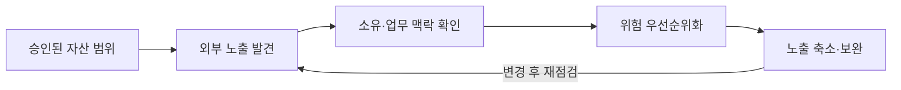
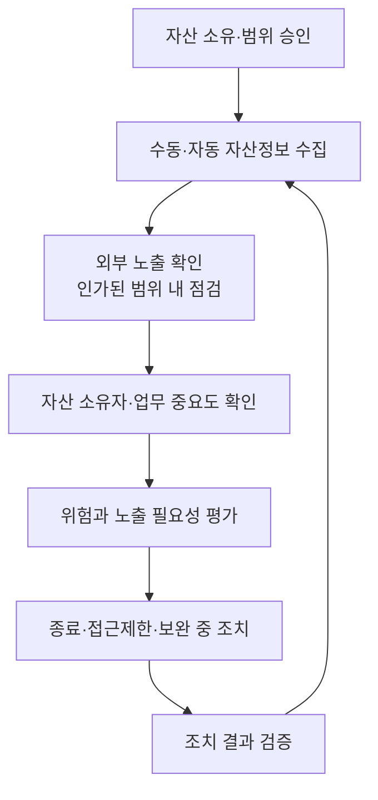

## 30초 인출
- **본질:** 공격표면관리는 조직의 인터넷 노출 자산과 취약 조건을 지속적으로 파악하고 위험을 줄이는 관리활동이다.
- **메커니즘:** 승인된 범위 정의 → 외부 노출 자산 발견 → 소유자·업무 맥락 확인 → 위험 우선순위화 → 조치와 재점검
- **핵심:** 발견된 자산이 실제 조직 소유인지 검증하고, 업무상 필요한 노출은 통제하며 불필요한 노출은 제거한다.

핵심 용어

- **ASM**: 자산과 노출 상태를 파악하고 관리해 조직의 공격 가능한 표면을 줄이는 활동이다.
- **EASM**: 인터넷 관점에서 조직의 도메인·서비스 등 외부 노출 자산을 찾아 위험을 관리하는 활동이다.
- **CAASM**: 여러 내부 자산·보안 도구의 정보를 연계해 자산 가시성과 관리 공백을 찾는 접근이다.
- **Shadow IT**: 조직의 승인·자산관리 절차를 벗어나 사용되거나 관리되는 정보기술 자산이다.

---

## 1교시 예상문제 (10점)

---

> 공격표면관리의 개념과 운영 절차 및 조치 시 유의사항을 설명하시오.

---

## 1교시 10점 답안

### 1. 정의·목적

정의: 공격표면관리는 조직이 운영·보유하는 외부 노출 자산과 위험을 지속적으로 찾아 관리하는 활동이다.

목적: 미관리 자산과 불필요한 노출을 줄이고 필요한 외부 서비스를 안전하게 유지한다.

### 2. 운영 흐름

| 발견 결과 | 조치 방향 |
|---|---|
| 소유자가 확인되지 않은 자산 | 소유 부서와 정당한 업무 용도 확인 |
| 업무상 필요 없는 공개 서비스 | 서비스 종료 또는 외부 접근 제한 |
| 계속 공개해야 하는 서비스 | 패치·인증·접근통제·모니터링 강화 |

제언: 자동 발견 결과는 소유권과 업무 필요성을 확인한 뒤 통제 변경으로 연결한다.

---

## 2~4교시 예상문제 (25점)

---

> 클라우드·원격근무 환경에서 침해 경로를 선제적으로 줄이기 위한 공격표면관리(ASM)의 개념, 기술 요소와 운영 절차를 설명하시오. (예상)

---

## 2~4교시 25점 답안

### Ⅰ. 개념과 관리 범위

조직의 자산은 클라우드·외주·개발환경의 변화로 빠르게 생기고 사라진다. 공격표면관리는 자산 목록과 외부에서 관찰되는 노출 사이의 차이를 찾아, 소유자·업무 중요도에 따라 관리하는 지속 활동이다.

| 관점 | 관리 내용 |
|---|---|
| 외부 노출 | 도메인, 공개 서비스, 인증서, 클라우드 자산 등 인터넷에서 확인 가능한 정보 |
| 내부 자산 가시성 | CMDB·클라우드·IAM·EDR 등 내부 원천 간 인벤토리 차이 |
| 업무 맥락 | 자산 소유자, 중요 서비스, 외부 접근의 필요성과 의존성 |

### Ⅱ. 발견·조치의 운영 흐름

외부 스캔은 승인된 자산 범위와 방법에 따라 수행한다. 발견 결과가 회사 소유라고 자동 단정하거나, 열린 포트만으로 취약하다고 판단하지 않는다.

### Ⅲ. 핵심 기술 요소

| 요소 | 기능·운영상 유의점 |
|---|---|
| 자산 발견 | 도메인·DNS·인증서·클라우드 인벤토리 등 허가된 정보를 이용해 후보 자산 식별 |
| 외부 노출 점검 | 공개 서비스·설정·패치 상태 등 관찰 가능한 위험 확인 |
| 자산 소유 확인 | CMDB·클라우드 계정·담당부서 정보를 대조해 자산 귀속 확인 |
| 위험 우선순위 | 중요도·노출도·취약성·업무 필요성을 함께 고려 |
| 조치 연계 | 담당자 티켓·서비스 종료·접근정책 변경 후 결과 검증 |

### Ⅳ. EASM·CAASM과 취약점 관리

| 구분 | 중심 범위 | 강점·한계 |
|---|---|---|
| EASM | 외부에서 관찰되는 도메인·서비스·디지털 자산 | 외부 노출과 미등록 자산 후보를 찾지만 소유 확인이 필요 |
| CAASM | 내부 도구·인벤토리의 자산 정보 | 여러 시스템의 관리 공백을 줄이나 원천 데이터 품질에 좌우 |
| 취약점 관리 | 알려진 자산·제품의 취약점 식별·조치 | 자산 범위가 누락되면 스캐너도 대상 자산을 놓칠 수 있음 |

### Ⅴ. 기술사적 제언

| 문제 | 해결 방안 |
|---|---|
| 미관리 자산을 발견해도 실제 소유자와 업무 의존성을 확인하지 않으면 조치가 지연됨 | 자산 발견 데이터를 CMDB·클라우드 계정·서비스 소유자 정보와 연결하고 책임자를 지정 |
| 자동 차단은 정상 서비스까지 중단시킬 수 있음 | 업무 영향과 노출 필요성을 검토한 뒤 서비스 종료·접근제한을 승인하고 롤백 절차 마련 |
| 자산이 빠르게 바뀌면 일회성 스캔 결과가 금방 낡음 | 변경·발급·종료 이벤트와 정기 외부 점검을 연계해 반복 발견·조치·재검증 |

## 출제 이력 및 참고자료

- 기존 노트의 미출제 예상문제 취지를 유지했다.
- [CISA: Internet Exposure Reduction Guidance](https://www.cisa.gov/resources-tools/resources/exposure-reduction)
- [CISA: Cyber Hygiene Services](https://www.cisa.gov/cyber-hygiene-services)
