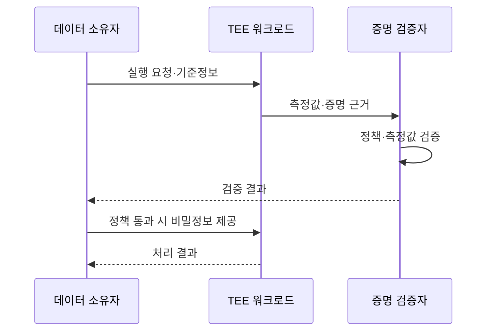
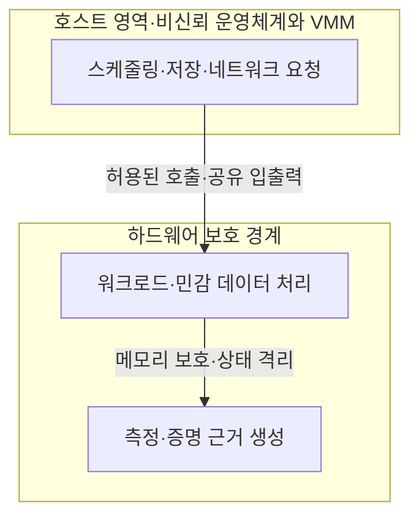

## 30초 인출
- **본질:** 기밀 컴퓨팅은 하드웨어 기반의 증명 가능한 신뢰 실행환경(TEE)에서 계산해 사용 중인 데이터와 코드를 보호하는 방식이다.
- **메커니즘:** 신뢰 경계 안에서 워크로드 실행 → 플랫폼 증거 생성 → 데이터 소유자가 정책에 따라 원격 증명 검증 → 검증된 실행환경에 비밀정보 제공
- **핵심:** TEE는 호스트 접근 위험을 줄이지만 입출력, 코드 결함, 측면채널, 플랫폼 취약성까지 모두 없애지는 않는다.

핵심 용어

- **기밀 컴퓨팅**: 하드웨어 기반의 증명 가능한 TEE에서 계산해 사용 중인 데이터를 보호하는 방식이다.
- **TEE(Trusted Execution Environment)**: 하드웨어가 정한 보안 경계 안에서 데이터·코드를 격리해 실행하는 환경이다.
- **원격 증명(Remote Attestation)**: 원격 실행환경이 제시한 암호학적 측정·상태 증거를 검증자가 정책과 비교하는 절차다.
- **기밀 VM(CVM)**: 가상머신 전체의 메모리·상태를 격리해 사용 중 보호를 제공하는 TEE 방식 중 하나다.

---

## 1교시 예상문제 (10점)

---

> 기밀 컴퓨팅의 개념과 TEE·원격 증명의 역할 및 적용상 한계를 설명하시오.

---

## 1교시 10점 답안

### 1. 정의·목적

정의: 기밀 컴퓨팅은 하드웨어 기반의 증명 가능한 TEE에서 계산해 처리 중 데이터를 보호하는 방식이다.

목적: 비신뢰 호스트나 클라우드 인프라에 워크로드를 맡길 때 사용 중 데이터·코드의 노출 위험을 줄인다.

### 2. 실행과 신뢰 확인

| 보호 요소 | 설명 |
|---|---|
| TEE | 하드웨어 보안 경계로 워크로드의 메모리·상태 접근을 제한 |
| 원격 증명 | 워크로드·플랫폼 상태가 정책에 맞는지 데이터 제공 전에 확인 |
| 한계 | 공유 입출력, 취약한 코드·플랫폼, 측면채널과 서비스 거부 위험은 별도 관리 |

제언: 증명 결과를 확인한 뒤 필요한 최소 비밀정보만 TEE에 제공한다.

---

## 2~4교시 예상문제 (25점)

---

> 클라우드 환경에서 처리 중인 데이터(Data In-Use) 보호를 위한 기밀 컴퓨팅의 개념, TEE 구조, 원격 증명 절차 및 활용상 한계를 설명하시오. (예상)

---

## 2~4교시 25점 답안

### Ⅰ. 개념과 보호 대상

기밀 컴퓨팅은 사용 중 데이터에 대한 위협을 줄이기 위해 하드웨어 기반 TEE에서 계산을 수행한다. 저장 데이터 암호화와 전송 암호화에 더해 런타임의 호스트 접근 위험을 줄이는 보호층이다.

| 데이터 상태 | 대표 보호 | 남는 고려사항 |
|---|---|---|
| 저장 중 | 저장장치·데이터베이스 암호화 | 키 관리·권한·백업 보호 |
| 전송 중 | TLS 등 채널 보호 | 종단 인증·키 검증·단말 보안 |
| 사용 중 | 하드웨어 격리 TEE·기밀 VM | TEE 밖의 입출력·코드·플랫폼 위험 |

### Ⅱ. TEE의 신뢰 경계

TEE 내부에서 연산하는 동안 민감 값은 사용을 위해 평문으로 처리될 수 있다. 하드웨어 보호는 플랫폼과 TEE 설계가 규정한 범위에 적용되며, 외부와 공유하는 입출력이나 호스트에 맡긴 서비스는 별도 위협 경계로 본다.

### Ⅲ. 원격 증명과 비밀 제공

| 단계 | 처리 | 확인 사항 |
|---|---|---|
| 1. 실행 준비 | 데이터 소유자가 워크로드·정책·비밀 제공 조건 정의 | 허용 소프트웨어 버전·보안 상태 |
| 2. 증거 생성 | 하드웨어·TEE가 측정값과 서명된 증거를 제공 | 증거의 출처와 무결성 |
| 3. 검증 | 검증자가 측정값·인증서·정책을 비교 | 신뢰할 수 있는 플랫폼·상태인지 여부 |
| 4. 비밀 전달 | 정책을 통과한 환경에 한해 키·데이터 제공 | 최소한의 비밀과 세션 보호 |
| 5. 실행·감사 | 워크로드 실행과 결과·상태를 관리 | 갱신·철회·사고 대응 가능성 |

증명은 정책 판단에 필요한 근거를 제공하지만, 소스코드가 안전하거나 전체 운영환경이 취약하지 않다는 것을 자동 보증하지 않는다.

### Ⅳ. 적용 효과와 위험 관리

| 구분 | 기밀 컴퓨팅에서의 접근 |
|---|---|
| 호스트 관리자 접근 | 지원되는 TEE의 격리 범위 안에서 메모리·상태 열람을 제한 |
| 측면채널 | 캐시·실행시간·공유자원 관찰 위험에 대해 코드·플랫폼별 완화 적용 |
| 플랫폼 취약점 | 마이크로코드·펌웨어·TEE 모듈 업데이트와 취약성 대응 필요 |
| 입출력·연계 | TEE 밖으로 나가는 값·공유 버퍼·네트워크 구간을 별도 보호 |
| 가용성 | 호스트가 실행·통신을 중단시키는 서비스 거부 위험 고려 |
| 성능·이식성 | 하드웨어 지원과 워크로드 특성을 평가하고 적용 범위 결정 |

### Ⅴ. 기술사적 제언

| 문제 | 해결 방안 |
|---|---|
| 원격 증명 성공만으로 애플리케이션 안전까지 확인했다고 오해할 수 있음 | 측정 기준에 승인된 워크로드·구성을 연결하고 코드 보안검토·취약점 관리와 병행 |
| TEE 보호범위를 벗어나는 입력·출력과 공유 서비스에서 정보가 노출될 수 있음 | 데이터 흐름과 신뢰 경계를 문서화하고 비밀 최소화·출력 검증·전송 보호 적용 |
| 특정 하드웨어 기능을 적용해도 측면채널·플랫폼 결함은 남을 수 있음 | 제조사 보안 권고와 패치 상태를 지속 점검하고 잔여위험·운영 중단 계획 관리 |

## 출제 이력 및 참고자료

- 기존 노트의 미출제 예상문제 취지를 유지했다.
- [Confidential Computing Consortium: Common Terminology](https://confidentialcomputing.io/wp-content/uploads/sites/10/2023/03/Common-Terminology-for-Confidential-Computing.pdf)
- [Intel: What Is Intel TDX?](https://www.intel.com/content/www/us/en/support/articles/000097227/processors/intel-xeon-processors.html)
- [Intel: TDX side-channel considerations](https://www.intel.com/content/www/us/en/developer/articles/technical/software-security-guidance/best-practices/mktme-side-channel-impact-on-intel-tdx.html)
