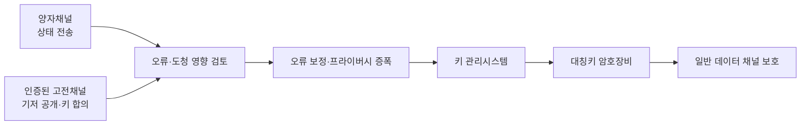
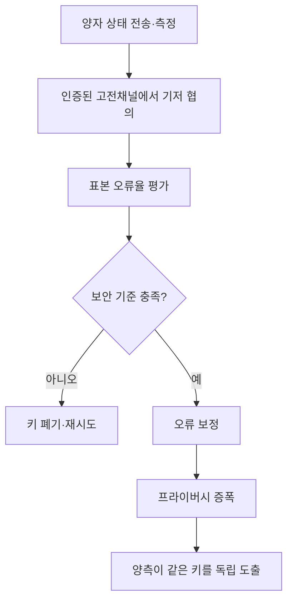

## 30초 인출
- **본질:** 양자암호통신은 QKD로 대칭키를 분배하고, 키 관리와 기존 암호화 장비를 결합해 데이터를 보호하는 통신체계다.
- **메커니즘:** 양자채널로 상태 전송 → 공개 고전채널에서 기저·오류 보정 → 키 정제·검증 → 키 관리시스템이 암호장비에 키 제공
- **핵심:** QKD는 키 분배기술이며 데이터 암호화 전체를 대신하지 않는다. 구현·인증·신뢰노드 등 시스템 보안을 별도로 확보해야 한다.

핵심 용어

- **QKD(Quantum Key Distribution)**: 양자 상태와 고전 통신 절차를 이용해 공유 대칭키를 만드는 키 분배기술이다.
- **QKDN**: QKD 노드와 키 관리기능을 연결해 암호응용에 키를 제공하는 네트워크다.
- **신뢰노드(Trusted Node)**: QKD 링크 사이에서 키를 중계하는 보호 대상 노드다. 노드 자체가 침해되면 키 보안이 약화될 수 있다.
- **QRNG**: 양자현상을 이용해 난수를 만드는 난수발생기다. QKD 자체와는 구분되는 구성요소다.

---

## 1교시 예상문제 (10점)

---

> 양자암호통신에서 QKD의 역할과 구성요소, 기존 데이터 암호화와의 관계를 설명하시오.

---

## 1교시 10점 답안

### 1. 정의·목적

정의: 양자암호통신은 QKD로 대칭키를 분배하고 그 키를 데이터 암호화에 사용하는 통신체계다.

목적: 도청 시도가 키 합의 과정에 미치는 영향을 검출·평가하고 안전한 키 재료를 암호응용에 제공한다.

### 2. 키 분배와 데이터 보호

| 구성요소 | 역할 |
|---|---|
| QKD 송수신기·양자채널 | 양자 상태를 보내고 측정해 키 재료 생성 |
| 인증된 고전채널 | 기저 공개·오류 검출·키 정제 절차 수행 |
| 키 관리시스템 | 생성된 키를 정책에 따라 보관·공급 |
| 데이터 암호장비 | QKD가 제공한 키로 일반 데이터를 암호화 |

제언: QKD 링크와 키 관리 노드뿐 아니라 고전채널 인증·운영절차도 함께 보호한다.

---

## 2~4교시 예상문제 (25점)

---

> 양자암호통신의 원리와 구성요소 및 기존 통신망과의 연동 방안에 대하여 설명하시오. (KPC 제128회)

---

## 2~4교시 25점 답안

### Ⅰ. 개념과 적용 범위

양자암호통신은 QKD로 키를 분배하고, 키관리·암호응용·통신망을 연결하는 체계다. QKD가 데이터 자체를 전송하거나 암호화하는 것은 아니며, 실제 데이터는 통상 대칭키 암호 등 고전 암호로 보호한다.

| 구분 | 역할 | 한계·유의점 |
|---|---|---|
| QKD | 물리적 양자 상태 측정 결과를 이용해 공유키 생성 | 구현·장비·채널 보안 가정 검토 필요 |
| 키 관리 | 생성키의 정책·수명·공급 관리 | 키 저장·접근·중계 노드 보호 필요 |
| 암호응용 | 키를 사용해 데이터를 암호화 | 별도 데이터 채널과 암호장비 연동 필요 |

### Ⅱ. QKD 동작 원리와 절차

양자 상태 일부를 비교해 오류 수준을 추정하고, 허용 조건을 만족할 때만 오류 보정과 프라이버시 증폭 등을 거쳐 키를 확정한다. 절차에는 송수신자 확인을 위한 인증된 고전채널이 필요하다.

### Ⅲ. 네트워크 구성과 신뢰 경계

| 구성요소 | 보안 책임 |
|---|---|
| QKD 모듈·양자링크 | 장비 무결성·물리 접근·채널 품질 관리 |
| 고전 제어채널 | 메시지 인증·무결성·접근통제 |
| 키관리시스템 | 키 생성·분배·폐기 정책과 감사로그 관리 |
| 신뢰노드 | 키 중계 노드의 물리·논리 보안과 관리자 통제 |
| 암호 응용망 | 키 공급 인터페이스 보호와 데이터 암호화 적용 |

### Ⅳ. 기존 통신망과의 연동·대안

| 방식 | 보안 원리 | 적용 관점 |
|---|---|---|
| QKD | 양자통신·측정과 키 합의에 기반한 키 생성 | 전용 장비·채널·노드·운영 보안 검토 필요 |
| PQC | 양자컴퓨터 공격을 고려해 설계된 고전적 수학 알고리즘 | 기존 네트워크·소프트웨어의 암호 프로토콜 갱신에 적용 가능 |
| 하이브리드 | 기존 암호와 PQC 또는 QKD 기반 키를 함께 활용 | 상호운용·키관리·성능·전환계획을 검증 |

QKD의 보안은 프로토콜뿐 아니라 장비 구현·측면채널·인증·신뢰노드 등 조건에 좌우된다. NIST는 현실 장비의 기술적·이론적 취약성을 지적하며, QKD가 인증과 구현 보안을 대신하지 않는다는 점을 강조한다.

### Ⅴ. 기술사적 제언

| 문제 | 해결 방안 |
|---|---|
| QKD가 키를 만들면 통신 전체가 무조건 안전하다고 오해할 수 있음 | 데이터 암호화, 키 관리, 인증된 고전채널과 단말까지 포함해 종단 간 위협모델을 수립 |
| 신뢰노드·장비·고전채널이 침해되면 QKD 키 보안이 깨질 수 있음 | 노드 물리보안·접근통제·장비 무결성·키 수명주기와 사고 대응을 설계 |
| 기존망에 연동할 때 장비·키 인터페이스·운영절차가 맞지 않을 수 있음 | 제한된 구간에서 상호운용·성능·장애전환을 실증한 뒤 단계적으로 확대하고 PQC 전환계획과 연계 |

## 출제 이력 및 참고자료

- 기존 노트의 KPC 제128회 기출 문항을 원문 취지대로 보존했다.
- [ITU-T X.1710: QKD Network Security Framework](https://www.itu.int/epublications/en/publication/itu-t-x-1710-2020-10-security-framework-for-quantum-key-distribution-networks/en)
- [ITU-T Y.3800: Overview on Networks Supporting QKD](https://www.itu.int/epublications/publication/itu-t-y-3800-2019-10-overview-on-networks-supporting-quantum-key-distribution)
- [NIST: What Is Quantum Cryptography?](https://www.nist.gov/cybersecurity-and-privacy/what-quantum-cryptography)
