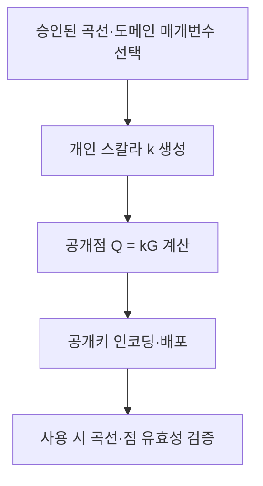

## 30초 인출

- **본질:** ECC는 타원곡선 군의 점 연산과 타원곡선 이산로그 문제(ECDLP)를 바탕으로 공개키 암호 기능을 제공하는 암호 방식이다.
- **메커니즘:** 개인 스칼라 `k`와 공개 기준점 `G`로 공개점 `Q = kG`를 계산한다. `k`에서 `Q`를 구하기는 쉽지만, 적절한 곡선과 매개변수에서 `Q`와 `G`만으로 `k`를 찾는 일은 계산상 어렵다고 가정한다.
- **핵심 용어:** ECDH는 키 합의, ECDSA는 전자서명에 쓰인다. ECC 자체를 일반 데이터 암호화로 부르지 않으며, 합의한 키는 대칭키 암호에 사용한다.

핵심 용어

- **유한체:** 곡선의 좌표와 연산을 정해진 유한 집합 안에서 계산하게 하는 대수 구조다.
- **ECDLP:** 기준점 `G`와 공개점 `Q = kG`에서 비밀 스칼라 `k`를 찾는 문제다.
- **ECDH:** 각자의 개인키와 상대 공개키를 이용해 같은 공유 비밀을 계산하는 키 합의 방식이다.
- **ECDSA:** ECC 기반 디지털 서명 방식이다. 서명마다 고유한 비밀 난수가 필요하며, 이를 재사용하면 개인키가 노출될 수 있다.

---
## 1교시 예상문제 (10점)

> 타원곡선암호(ECC)의 개념과 키 생성 원리, 주요 특징을 설명하시오.

---
## 1교시 10점 답안

### 1. 정의·목적

- **정의:** ECC는 유한체 위 타원곡선 군에서의 점 연산과 ECDLP의 계산 난도를 이용하는 공개키 암호 방식이다.
- **목적:** RSA와 비슷한 보안 강도를 더 작은 공개키로 구현해 전송·저장 부담을 줄일 수 있다.

### 2. 공개키 생성 메커니즘

개인키 `k`와 공개 기준점 `G`를 사용해 공개키 `Q = kG`를 계산한다.

적절한 매개변수에서 공개점 `Q`와 기준점 `G`만으로 개인 스칼라 `k`를 구하기는 계산상 어렵다고 가정한다.

### 3. 암호 기능과 적용 구분

| 기능 | ECC 기반 방식 | 역할 |
|---|---|---|
| 키 합의 | ECDH | 통신 당사자들이 공유 비밀 계산 |
| 전자서명 | ECDSA | 메시지의 출처와 무결성 검증 |
| 데이터 암호화 | 대칭키 암호 | 합의·유도한 키로 실제 데이터를 암호화 |

**제언:** 검증된 곡선·구현과 용도별 표준을 선택하고 개인키 보호 및 부채널 방어를 함께 적용한다.

---
## 2~4교시 예상문제 (25점)

> 제136회 1교시 12번 「타원곡선 암호(ECC, Elliptic Curve Cryptography)」를 바탕으로, 타원곡선암호의 수학적 원리와 공개키 생성 과정을 설명하고 RSA와 비교하여 특징 및 적용 시 유의사항을 논하시오. *(25점 예상문제)*

---
## 2~4교시 25점 답안

### Ⅰ. 개념과 수학적 기반

타원곡선암호는 유한체 위의 타원곡선 점들이 이루는 군 연산과 ECDLP의 계산 난도를 이용하는 공개키 암호 방식이다. 통상 곡선은 `y² = x³ + ax + b` 형태로 표현되며, 실제 암호 연산은 지정된 유한체와 표준 도메인 매개변수 안에서 수행한다.

| 수학 요소 | 역할 |
|---|---|
| 유한체 | 좌표와 연산의 범위를 정함 |
| 곡선 점의 군 연산 | 점 덧셈과 스칼라 곱을 정의 |
| 기준점 `G` | 공개키 생성 및 암호 연산의 출발점 |
| ECDLP | `G`, `Q = kG`로부터 `k`를 구하기 어렵다고 보는 보안 가정 |

### Ⅱ. 키 생성과 공개키 검증

개인 스칼라 `k`를 안전하게 생성한 뒤 지정 기준점 `G`의 스칼라 곱 `Q = kG`를 계산한다. 개인키는 비밀로 관리하고 공개점은 사용 프로토콜의 형식에 따라 검증해야 한다.

계산 방향은 `k`에서 `Q`로 쉽지만, 공개된 `G`와 `Q`에서 `k`를 구하는 역산은 적절한 매개변수에서 계산상 어렵다는 가정이 ECC의 기반이다.

### Ⅲ. 키 합의와 서명 기능

ECC 계열의 알고리즘은 프로토콜에 따라 키 합의나 전자서명에 사용된다. 일반 메시지 암호화는 보통 합의한 비밀에서 키를 유도한 뒤 대칭키 알고리즘으로 수행한다.

| 연산 | 입력 및 결과 | 보안 목적 |
|---|---|---|
| ECDH | 자신의 개인키와 상대 공개키로 공유 비밀 계산 | 키 합의 |
| ECDSA | 개인키로 서명, 공개키로 검증 | 출처 인증·무결성 |
| 대칭키 암호 | 유도된 세션 키로 데이터 처리 | 기밀성 |

ECDSA에서는 서명마다 고유한 비밀 난수를 사용해야 한다. 반복·편향된 난수는 개인키를 노출할 수 있으므로, 적합한 난수 생성과 검증된 결정론적 서명 절차 등 표준 구현을 따른다.

### Ⅳ. 보안 강도와 RSA 비교

ECC의 주요 장점은 유사한 고전 보안 강도에서 공개키 크기를 줄일 수 있다는 점이다. 다만 성능 우위는 연산 종류, 구현, 하드웨어와 프로토콜에 따라 달라지므로 모든 환경에서 ECC가 더 빠르다고 단정하지 않는다.

| 비교 항목 | ECC | RSA |
|---|---|---|
| 기반 문제 | 타원곡선 이산로그 | 정수 인수분해 관련 문제 |
| 128비트 수준의 대표 매개변수 크기 | 군 차수 약 256비트 | 모듈러스 약 3072비트 |
| 대표 사용 | ECDH, ECDSA | 키 수송·키 설정, RSA 서명 |
| 실무 고려 | 작은 공개키·서명, 곡선·점 검증 | 큰 키 자료, 패딩과 구현 방식 |

NIST 보안 강도 환산은 대표 크기를 비교하기 위한 기준이며 알고리즘 간 직접적인 비트 단위 동등성을 뜻하지 않는다.

### Ⅴ. 구현 위험과 기술사적 제언

| 문제 | 해결 방안 |
|---|---|
| 비밀 스칼라 처리 시간·전력 누출 | 상수 시간 연산과 부채널 대응을 갖춘 검증된 구현 사용 |
| 잘못된 곡선점 입력·매개변수 오용 | 프로토콜 규격에 따른 매개변수 선택 및 공개키·점 유효성 검증 |
| ECDSA 난수 재사용·편향 | 안전한 nonce 생성 또는 표준이 허용하는 검증된 결정론적 절차 적용 |
| 장기 기밀성의 양자 위협 | 데이터 보존기간과 전환 비용을 평가하고 표준화된 양자내성암호로의 전환 계획 수립 |

양자컴퓨터가 충분히 큰 규모로 구현되면 Shor 알고리즘은 ECC와 RSA 모두에 위협이 되므로, 현재 사용되는 ECC의 보안 가정을 장기 보존 데이터까지 그대로 연장하지 말고 암호 민첩성과 전환 계획을 마련한다.

---
## 출제 이력 및 참고자료

- **기출 이력:** 제136회 1교시 12번 「타원곡선 암호(ECC, Elliptic Curve Cryptography)」.
- NIST, [SP 800-57 Part 1 Rev. 5: Recommendation for Key Management](https://csrc.nist.gov/pubs/sp/800/57/pt1/r5/final) — 보안 강도 비교.
- NIST, [SP 800-186: Recommendations for Discrete Logarithm-Based Cryptography](https://csrc.nist.gov/pubs/sp/800/186/final) — 타원곡선 도메인 매개변수.
- NIST, [FIPS 186-5: Digital Signature Standard](https://csrc.nist.gov/pubs/fips/186/5/final) — ECDSA와 전자서명.
