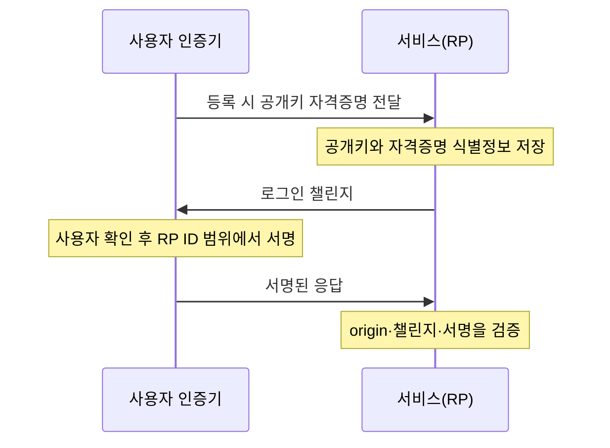
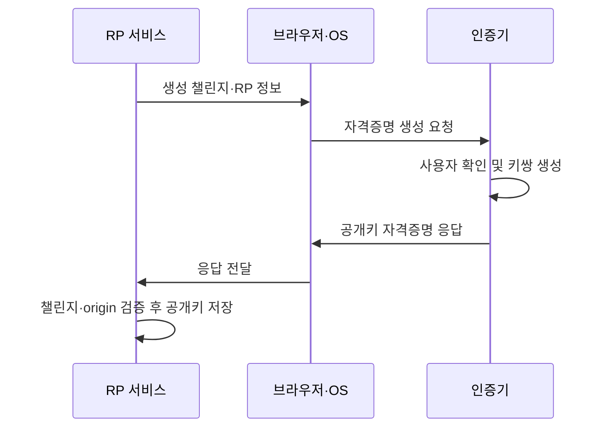

## 30초 인출

- **본질:** 패스키는 웹·앱 로그인을 위한 피싱 저항성 공개키 자격증명이다.
- **메커니즘:** 등록 때 인증기가 공개키 자격증명을 만들고 서비스는 공개키를 저장한다. 로그인 때 서비스의 무작위 챌린지를 인증기가 서명하며, 서비스는 저장한 공개키로 검증한다. RP ID와 origin 검증이 다른 사이트에서의 자격증명 사용을 막는다.
- **구분:** 패스키는 기기 종속형 또는 동기화형일 수 있다. 동기화와 복구는 패스키 제공자·플랫폼의 보호 방식에 달려 있다.

핵심 용어

- **패스키:** 비밀번호 대신 사용하는 FIDO 발견형 공개키 자격증명이다.
- **WebAuthn:** 웹 서비스와 인증기 사이의 공개키 자격증명 생성·인증을 위한 W3C 웹 API 표준이다.
- **RP ID:** 자격증명의 사용 범위를 지정하는 의존 당사자 식별자다.
- **챌린지:** 재전송 공격을 막기 위해 서비스가 인증 요청마다 생성하는 무작위 값이다.
- **동기화형 패스키:** 제공자 계정·서비스를 통해 여러 기기에서 사용할 수 있도록 동기화되는 자격증명이다.

---
## 1교시 예상문제 (10점)

> 패스키의 개념과 등록·인증 원리, 기존 비밀번호 인증과 비교한 특징을 설명하시오.

---
## 1교시 10점 답안

### 1. 정의·목적

- **정의:** 패스키는 비밀번호 대신 공개키 기반으로 웹·앱 로그인에 사용하는 FIDO 자격증명이다.
- **목적:** 공유 비밀인 비밀번호의 재사용·피싱·서버 유출 위험을 줄이고 사용자의 로그인을 간편하게 한다.

### 2. 등록과 로그인

### 3. 비밀번호 방식과의 차이

| 구분 | 비밀번호 | 패스키 |
|---|---|---|
| 서비스가 보관 | 비밀번호 검증값 | 공개키·자격증명 정보 |
| 로그인 증거 | 사용자가 입력한 문자열 | 챌린지에 대한 개인키 서명 |
| 피싱 대응 | 사용자가 가짜 사이트에 입력할 수 있음 | RP ID 범위가 자격증명 사용을 제한 |

**제언:** 패스키를 도입할 때 계정 복구와 대체 인증 수단도 함께 설계한다.

---
## 2~4교시 예상문제 (25점)

> 패스워드 인증의 한계를 보완하는 패스키의 구성과 등록·인증 절차를 설명하고, 피싱 저항성 및 동기화 방식의 보안상 고려사항과 도입 대책을 논하시오. *(예상문제)*

---
## 2~4교시 25점 답안

### Ⅰ. 개념 및 구성 요소

패스키는 비밀번호를 대체하는 발견형 FIDO 공개키 자격증명이다. 브라우저·운영체제의 WebAuthn API가 인증기와 의존 당사자(RP) 사이의 등록·인증 절차를 매개한다.

| 구성 요소 | 역할 |
|---|---|
| RP(서비스) | 자격증명 식별정보·공개키 저장, 챌린지 발급, 응답 검증 |
| 클라이언트 | RP 요청을 인증기에 전달하고 응답을 RP로 전달 |
| 인증기 | 공개키 자격증명 생성 및 개인키를 사용한 응답 서명 |
| 사용자 확인 | 로컬 PIN·생체인식 등으로 인증기 사용을 승인 |

### Ⅱ. 등록 절차

등록 때 인증기는 RP의 요청에 따라 공개키 자격증명을 생성한다. 서비스는 응답을 검증하고 자격증명 식별정보와 공개키를 계정에 연결한다. 개인키는 인증기 측에서 사용하며 서비스에 등록하지 않는다.

### Ⅲ. 인증 및 피싱 저항성

로그인 때 RP가 새 챌린지를 발급하고, 인증기는 자격증명 범위와 사용자 확인을 적용해 응답에 서명한다. RP는 챌린지, origin, 자격증명과 서명을 검증해 인증을 완료한다.

| 검증 요소 | 목적 |
|---|---|
| 무작위 챌린지 | 이전 응답 재사용 방지 |
| RP ID와 origin | 다른 사이트에서의 인증 응답 사용 방지 |
| 서명과 등록 공개키 | 개인키 보유 여부 확인 |
| 사용자 확인 결과 | 로컬 인증기 사용 승인 확인 |

도메인 범위와 origin 검증이 올바르게 구현되면 사용자는 가짜 도메인에 비밀번호를 입력하는 방식의 피싱에 노출되지 않는다. 서비스도 응답의 origin을 검증해야 하며, 이를 생체인증 자체가 피싱을 막는 것으로 오해하면 안 된다.

### Ⅳ. 패스키 유형과 계정 복구

패스키는 저장·이용 가능한 범위에 따라 기기 종속형과 동기화형으로 나뉜다. 동기화형은 제공자 계정을 통해 여러 기기에서 쓸 수 있어 사용 편의가 높지만, 동기화·복구 보안은 제공자 설계와 사용자의 계정 보호에 달려 있다.

| 유형 | 사용 범위 | 운영 고려사항 |
|---|---|---|
| 기기 종속형 | 등록한 기기 또는 보안키 | 분실·고장 시 복구 경로와 대체 자격증명 필요 |
| 동기화형 | 제공자의 동기화된 기기 | 제공자 계정 보호, 복구 절차, 기기 간 정책 확인 |
| 다른 기기 인증 | 근거리 통신 등을 통해 별도 기기의 인증기 이용 | 사용자 의도 확인과 실제 지원 환경 점검 |

### Ⅴ. 도입 위험과 기술사적 제언

| 문제 | 해결 방안 |
|---|---|
| 기기 분실·교체로 로그인 불가 | 복수 자격증명 등록, 복구 절차와 헬프데스크 본인확인 설계 |
| 동기화 계정 탈취·복구 절차 악용 | 제공자 계정에 강한 인증 적용, 복구 이벤트 모니터링 |
| 서비스 구현의 origin·챌린지 검증 오류 | WebAuthn 규격과 보안 지침을 따르고 구현·운영 시험 수행 |
| 조직 시스템과의 호환성 차이 | 브라우저·OS·인증기 조합을 사전 검증하고 단계적으로 전환 |

도입 시 피싱 저항성과 사용 편의뿐 아니라 계정 복구의 강도, 기기 변경 흐름, 조직의 인증 정책을 함께 검증한다.

---
## 출제 이력 및 참고자료

- **출제 이력:** 기존 기출이 아닌 예상 주제.
- W3C, [Web Authentication: An API for accessing Public Key Credentials, Level 2](https://www.w3.org/TR/webauthn-2/) — 챌린지·RP ID·인증 절차.
- FIDO Alliance, [Passkeys](https://fidoalliance.org/passkeys/) — 패스키 및 기기 종속형·동기화형 설명.
- FIDO Alliance, [Credential Exchange specifications](https://fidoalliance.org/specifications-credential-exchange-specifications/) — CXP/CXF 문서의 현재 상태 확인. 교환 사양은 공개 목록에서 검토 단계로 표시되므로 확정된 보편 구현처럼 서술하지 않는다.
