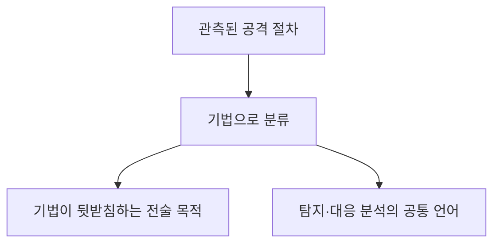
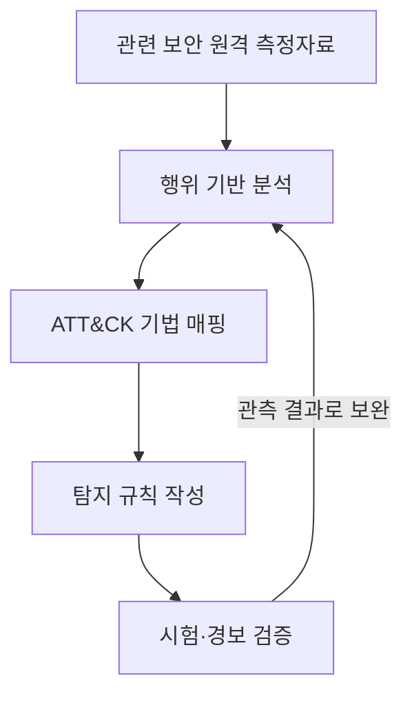

## 30초 인출

- **본질:** TTPs는 공격자의 전술·기법·절차를 행동 관점에서 설명하는 위협 분석 용어다.
- **메커니즘:** 전술은 공격자가 이루려는 목적(why), 기법은 그 목적을 달성하는 행동(how), 절차는 실제 관측된 구체적 구현이다. MITRE ATT&CK는 실제 공격 관측에 근거한 행위 지식베이스로 이를 정리한다.
- **활용:** 행위 중심 분석은 쉽게 바뀌는 해시·IP 같은 침해지표를 보완하지만, ATT&CK 매핑 자체가 탐지나 차단을 보장하지는 않는다.

핵심 용어

- **전술(Tactic):** 공격자가 행위로 이루려는 목적이다.
- **기법(Technique):** 공격자가 전술적 목적을 달성하는 행동 방식이다.
- **절차(Procedure):** 공격자가 특정 기법을 실제 환경에서 구현한 관측 사례다.
- **침해지표(IoC):** 침해와 연관된 IP 주소, 도메인, 파일 해시 등 관측 가능한 식별 정보다.

---
## 1교시 예상문제 (10점)

> TTPs의 개념을 설명하고 전술·기법·절차의 차이와 위협 분석에서의 활용을 서술하시오.

---
## 1교시 10점 답안

### 1. 정의·목적

- **정의:** TTPs는 공격 목적, 행동 방식, 실제 구현을 전술·기법·절차로 설명하는 위협 분석 용어다.
- **목적:** 개별 파일이나 네트워크 지표를 넘어 공격 행동을 분석해 탐지와 방어를 개선한다.

### 2. 세 요소의 관계

| 요소 | 핵심 질문 | 설명 |
|---|---|---|
| 전술 | 왜 하는가 | 공격자의 목적 |
| 기법 | 어떻게 하는가 | 목적 달성을 위한 행동 방식 |
| 절차 | 실제로 어떻게 수행했나 | 기법을 구현한 구체적 관측 사례 |

ATT&CK는 기법과 전술을 체계화하고, 각 기법에 실제 절차 사례를 연결하는 지식베이스다.

**제언:** ATT&CK 매핑을 완료로 여기지 말고 조직의 위협과 원격 측정자료에 맞춰 탐지·대응을 검증한다.

---
## 2~4교시 예상문제 (25점)

> 제138회 1교시 10번 「TTPs(Tactics, Techniques and Procedures)」를 바탕으로, TTPs의 구성과 MITRE ATT&CK 활용 방법을 설명하고 침해지표 중심 방어와 비교하여 운영상 유의사항을 논하시오. *(25점 예상문제)*

---
## 2~4교시 25점 답안

### Ⅰ. 개념과 분석 수준

TTPs는 공격 행위를 목적·방식·구체적 구현으로 나누어 설명하는 위협 분석 개념이다. MITRE ATT&CK는 실제 관측된 적대 행위에 기반한 지식베이스로, 전술·기법·하위기법과 절차 사례를 연결한다.

| 분석 요소 | 뜻 | 예시 질문 |
|---|---|---|
| 전술 | 공격자의 전반적 목적 | 공격자가 무엇을 이루려 하나? |
| 기법 | 목적을 이루는 행동 방식 | 어떤 행동으로 그 목적을 달성하나? |
| 절차 | 관측된 구체적 구현 | 실제 사례에서 어떻게 실행했나? |

### Ⅱ. 관측 행위의 ATT&CK 매핑

매핑은 로그 한 건에 이름표를 붙이는 작업이 아니라, 관측 증거가 어떤 행동을 뒷받침하는지 분석하고 적절한 기법·전술과 연결하는 과정이다.

ATT&CK 자체도 모든 조직에 모든 기법이 적용되는 것은 아니며, 관측되지 않은 행동이 지식베이스에 아직 기록되지 않았을 수 있음을 강조한다. 따라서 내부 관측과 위협 정보를 함께 고려한다.

### Ⅲ. 탐지 분석과 운영

조직은 관련 로그와 엔드포인트 원격 측정자료를 수집하고, 사건을 조사해 반복되는 행동을 찾아 분석·탐지 규칙으로 만든다. 경보를 ATT&CK 기법에 연결하면 탐지 범위와 공백을 설명하는 공통 언어를 마련할 수 있다.

매핑 결과는 분석 우선순위 설정에 도움을 주지만, 실제 탐지율은 센서의 가시성·분석 규칙·운영 검증에 좌우된다.

### Ⅳ. IoC와 TTPs의 보완 관계

IoC와 TTPs는 서로 대체재가 아니다. 구체적인 침해 지표는 빠른 차단에 유용하고, 행동 분석은 변형된 도구나 인프라에서 유사한 행위를 찾는 데 보탬이 된다.

| 비교 | IoC 중심 | TTPs 중심 |
|---|---|---|
| 분석 대상 | IP·도메인·파일 해시 등 지표 | 공격 목적과 행동 방식·구현 |
| 강점 | 구체적 지표를 신속히 탐지·차단 | 도구·지표가 바뀌어도 행동 분석을 이어갈 수 있음 |
| 한계 | 지표 변경·재사용 여부에 영향 | 높은 데이터 가시성과 분석·검증 역량 필요 |
| 권장 활용 | 사건 대응의 식별·차단 신호 | 행위 분석과 탐지 설계의 구조화 |

### Ⅴ. 운영상 위험과 기술사적 제언

| 문제 | 해결 방안 |
|---|---|
| 근거가 약한 ATT&CK 분류 | 관측 이벤트와 기법 설명의 대응 근거를 기록하고 검토 |
| 매트릭스의 단순 색칠을 탐지 완료로 오인 | 관련 데이터가 실제 수집되는지 확인하고 시나리오로 탐지 검증 |
| 모든 ATT&CK 기법을 동일 우선순위로 취급 | 조직의 자산·위협·가시성에 맞춰 적용 범위와 우선순위 선정 |
| 행위 분석만으로 IOC 활용을 배제 | IOC 기반 신속 차단과 TTP 기반 분석을 상호 보완적으로 운영 |

**제언:** 관측 근거가 있는 매핑을 우선하고, 조직별 위협 우선순위에 따라 탐지 공백과 대응 능력을 주기적으로 검증한다.

---
## 출제 이력 및 참고자료

- **기출 이력:** 제138회 1교시 10번 「TTPs(Tactics, Techniques and Procedures)」.
- MITRE, [Get Started with ATT&CK](https://attack.mitre.org/resources/) — 전술·기법·절차의 정의, 실제 관측 기반, 조직별 적용 우선순위.
- MITRE, [ATT&CK FAQ](https://attack.mitre.org/resources/faq/) — 전술·기법·절차의 개념.
