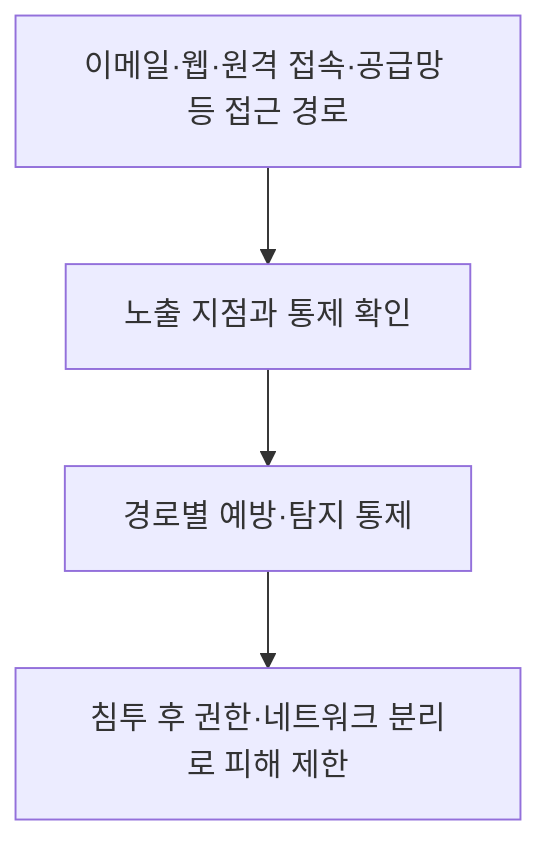
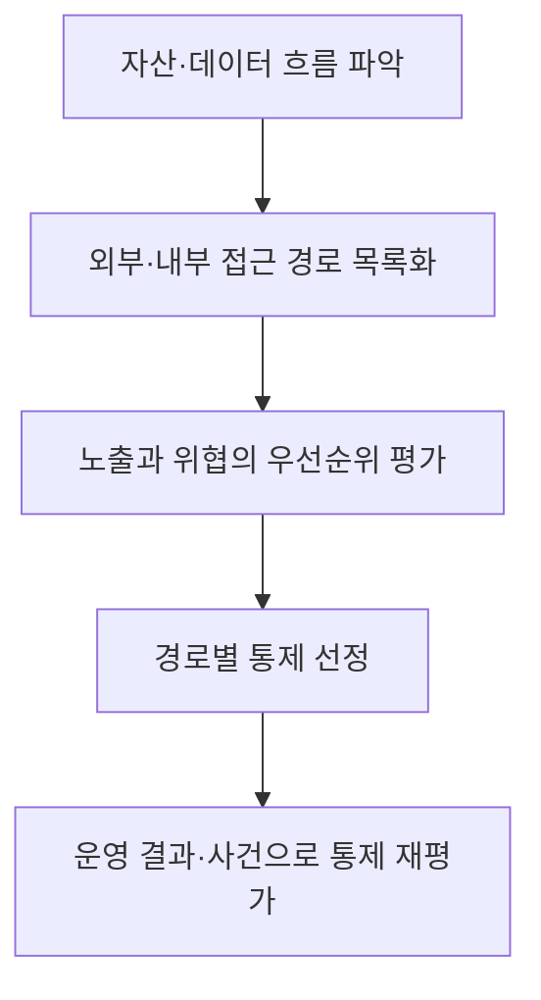

## 30초 인출

- **본질:** 공격 벡터는 공격자가 시스템이나 조직에 접근하기 위해 이용하는 경로나 수단이다.
- **메커니즘:** 피싱, 인터넷 공개 서비스 취약점, 원격 접속 서비스, 공급망 등으로 최초 접근을 얻을 수 있다. MITRE ATT&CK의 Initial Access는 이런 초기 발판을 얻는 여러 기법을 분류한다.
- **구분:** 공격 표면은 공격자가 접근·영향·정보 추출을 시도할 수 있는 경계 지점들의 집합이고, 공격 벡터는 실제 접근에 이용되는 경로·수단이다.

핵심 용어

- **공격 벡터:** 공격자가 시스템이나 네트워크에 접근하기 위해 이용하는 경로나 수단이다.
- **공격 표면:** 공격자가 시스템 경계에서 진입하거나 영향을 주거나 데이터를 추출하려 시도할 수 있는 지점들의 집합이다.
- **초기 접근(Initial Access):** MITRE ATT&CK에서 공격자가 네트워크에 최초 발판을 얻으려는 전술이다.
- **워터링 홀 공격:** 표적이 자주 방문하는 웹사이트를 침해하거나 악성 콘텐츠를 주입해 방문자를 노리는 공격 방식이다.

---
## 1교시 예상문제 (10점)

> 공격 벡터의 개념과 공격 표면과의 차이를 설명하고, 주요 유형 및 대응 원칙을 서술하시오.

---
## 1교시 10점 답안

### 1. 정의·목적

- **정의:** 공격 벡터는 공격자가 목표 시스템에 접근할 때 이용하는 경로나 수단이다.
- **목적:** 공격 벡터를 식별하고 통제해 최초 침투 가능성을 낮추고, 침투 후 피해 확산을 제한한다.

### 2. 공격 표면과의 구분

| 구분 | 공격 표면 | 공격 벡터 |
|---|---|---|
| 뜻 | 공격자가 시도할 수 있는 노출 지점의 집합 | 공격자가 실제 접근에 이용하는 경로·수단 |
| 예 | 공개 웹 서비스, 원격 접속, 사용자 단말 | 취약한 공개 서비스 악용, 피싱, 탈취 계정 이용 |

### 3. 대표 경로와 방어

경로별로 피싱 방어, 공개 서비스 패치, 원격 접속 인증, 공급망 검토 등 적절한 통제를 적용한다.

**제언:** 공격 표면을 정기적으로 점검하고, 각 접근 경로에 예방·탐지·피해 제한 통제를 겹쳐 적용한다.

---
## 2~4교시 예상문제 (25점)

> 제138회 3교시 5번 「IT 인프라 확장에 따른 사이버 위협(공격 벡터 및 표면)」을 바탕으로, 공격 벡터의 개념과 유형을 설명하고 공격 표면 관리 및 경로별 대응 방안을 논하시오. *(25점 예상문제)*

---
## 2~4교시 25점 답안

### Ⅰ. 개념과 위협 범위

공격 벡터는 공격자가 시스템에 접근하거나 악용할 때 이용하는 경로나 수단이다. NIST가 설명하는 공격 표면은 시스템 경계에서 공격자가 진입·영향·데이터 추출을 시도할 수 있는 지점들의 집합이므로, 표면은 노출 지점을 파악하고 벡터는 그 지점을 이용하는 경로를 분석하는 데 초점이 있다.

| 관점 | 질문 | 예시 |
|---|---|---|
| 공격 표면 | 어떤 경계 지점이 노출되어 있는가? | 인터넷 공개 서비스, 외부 원격 접속, 사용자 단말 |
| 공격 벡터 | 공격자는 어떤 경로로 접근하는가? | 취약점 악용, 피싱, 유효 계정, 공급망 침해 |

### Ⅱ. 주요 공격 벡터

MITRE ATT&CK의 Initial Access(TA0001)는 공격자가 네트워크에 발판을 얻기 위해 사용하는 여러 진입 벡터를 설명한다. 이는 ATT&CK의 여러 전술 가운데 하나이지, 모든 공격이 순서대로 거치는 고정된 첫 단계라는 뜻은 아니다.

| 경로 | 대표적인 접근 방식 | 관리 초점 |
|---|---|---|
| 이메일·웹 | 표적 피싱, 악성 콘텐츠, 드라이브바이 침해 | 메일·웹 콘텐츠 검사, 사용자 신고, 브라우저 보호 |
| 공개 서비스 | 인터넷 노출 애플리케이션의 취약점·오설정 악용 | 자산 식별, 패치, 안전한 설정, 외부 노출 점검 |
| 원격 접속 | VPN 등 외부 원격 서비스의 계정·서비스 악용 | 강한 인증, 권한 제한, 접속 모니터링 |
| 공급망·물리 | 제3자 또는 이동식 매체를 통한 접근 | 공급자 통제, 구성요소 관리, 매체 정책 |

### Ⅲ. 경로별 식별과 통제

자산과 데이터 흐름을 바탕으로 외부 공개 서비스, 사용자 접점, 원격 접속, 제3자 연계 등 접근 경로를 목록화한다. 위험과 사업 영향을 평가한 뒤 해당 경로에서 작동하는 예방·탐지 통제를 연결한다.

하나의 통제만으로 모든 벡터를 제거할 수 없으므로, 자산 관리와 경로별 통제의 운영 현황을 지속적으로 검토한다.

### Ⅳ. 공격 표면 관리와 심층방어

외부에서 접근 가능한 자산의 불필요한 노출을 줄이고, 침투가 발생해도 다른 시스템으로 확산되지 않도록 통제를 배치한다. 심층방어는 여러 통제층으로 위험을 줄이는 접근이며 모든 공격을 막는다는 보장은 아니다.

| 방어 단계 | 통제 예 | 기대 역할 |
|---|---|---|
| 노출 축소 | 불필요한 서비스 비공개·제거, 자산 목록 관리 | 공격 가능한 지점 감소 |
| 접근 통제 | 패치, 강한 인증, 최소 권한 | 취약점·계정 기반 진입 위험 감소 |
| 탐지 | 메일·엔드포인트·원격 접속 로그 분석 | 침해 징후의 조기 식별 |
| 피해 제한 | 네트워크 분리, 계정·권한 격리, 복구 준비 | 침투 후 확산·업무 영향 완화 |

### Ⅴ. 기술사적 제언

| 문제 | 해결 방안 |
|---|---|
| 공격 표면 목록의 누락·노후화 | 자산·클라우드·제3자 연계를 포함해 소유자와 갱신 절차를 지정 |
| 특정 경계 장비만으로 모든 경로를 막으려는 설계 | 이메일, 공개 서비스, 원격 접속, 공급망 등 경로별 통제 조합 적용 |
| 침투 차단에 치중해 침해 후 확산 대비가 부족 | 최소 권한·분리·모니터링·복구 통제를 함께 운영 |
| 통제 도입 후 효과 확인 부족 | 위험 기반 시험과 사건 분석으로 통제의 실제 작동 여부를 점검 |

---
## 출제 이력 및 참고자료

- **기출 이력:** 제138회 3교시 5번 「IT 인프라 확장에 따른 사이버 위협(공격 벡터 및 표면)」.
- MITRE, [Initial Access (TA0001)](https://attack.mitre.org/tactics/TA0001/) — 최초 발판 확보를 위한 진입 벡터와 관련 기법.
- NIST CSRC, [Attack Surface glossary](https://csrc.nist.gov/glossary/term/attack_surface) — 공격 표면 정의.
