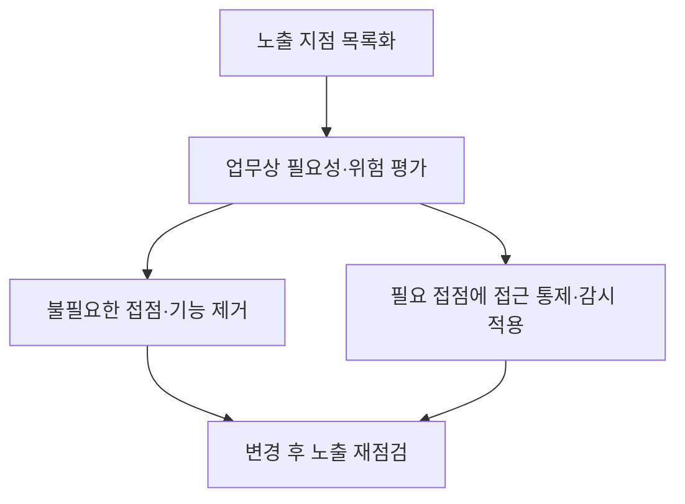
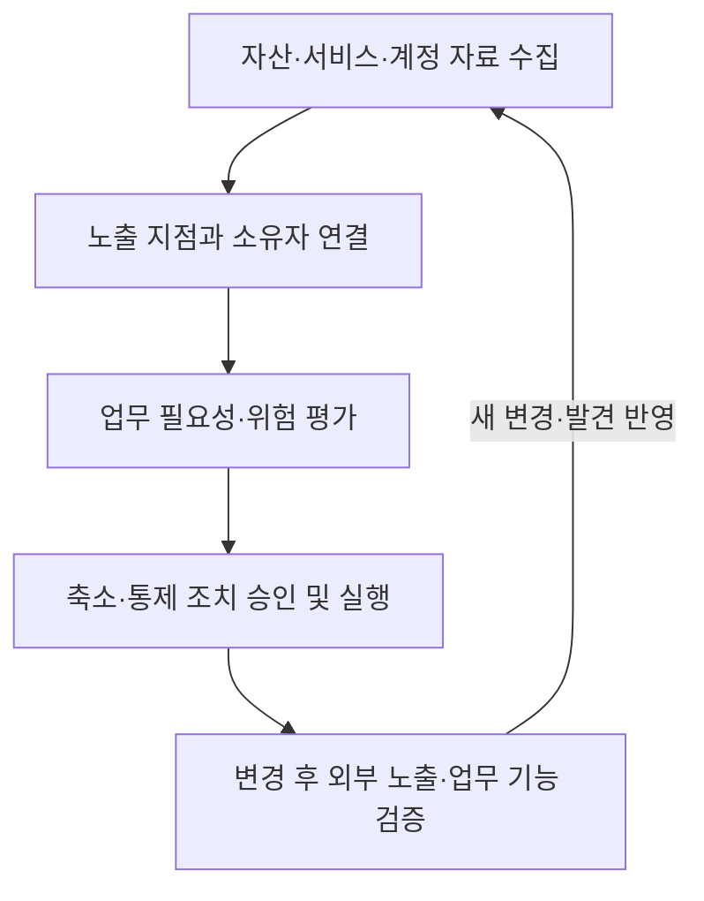

## 30초 인출

- **본질:** 공격 표면은 공격자가 시스템 경계에서 진입하거나 영향을 주거나 데이터를 추출하려 시도할 수 있는 지점들의 집합이다.
- **메커니즘:** 인터넷 공개 서비스, API, 원격 접속, 사용자 계정, 제3자 연결 등이 노출 지점에 포함될 수 있다. 표면을 목록화하고 업무상 필요성·위험을 평가해 불필요한 노출을 줄인다.
- **구분:** 공격 표면은 잠재적 접점의 범위이고, 공격 벡터는 공격자가 실제 접근에 이용하는 경로나 수단이다. 표면 축소는 위험을 줄이는 조치이지 모든 공격을 차단한다는 보장은 아니다.

핵심 용어

- **공격 표면:** 공격자가 시스템 경계에서 진입·영향·데이터 추출을 시도할 수 있는 지점들의 집합이다.
- **공격 표면 축소(ASR):** 불필요한 노출 지점과 기능을 줄이고 필요한 접점에 통제를 적용해 공격 가능성을 낮추는 활동이다.
- **공격 벡터:** 공격자가 목표에 접근하는 데 이용하는 경로나 수단이다.

---
## 1교시 예상문제 (10점)

> 공격 표면의 개념과 주요 구성 영역, 축소 원칙을 설명하고 공격 벡터와의 차이를 서술하시오.

---
## 1교시 10점 답안

### 1. 정의·목적

- **정의:** 공격 표면은 공격자가 시스템 경계에서 접근·영향·데이터 추출을 시도할 수 있는 지점들의 집합이다.
- **목적:** 노출 지점을 파악하고 불필요한 부분을 줄여 공격 가능성과 잠재 피해를 낮춘다.

### 2. 구성 영역

| 영역 | 노출 지점 예 |
|---|---|
| 기술·소프트웨어 | 공개 API, 애플리케이션, 구성요소 |
| 네트워크·인프라 | 공개 포트, 원격 접속 서비스, 클라우드 자원 |
| 계정·사람·제3자 | 사용자 계정, 협력사 연결, 운영 절차 |

### 3. 축소 원칙과 벡터 구분

공격 표면은 잠재 접점의 범위이고 공격 벡터는 이 가운데 실제 침투에 쓰이는 경로다.

**제언:** 자산과 업무 변화를 반영해 노출 목록을 갱신하고 축소 조치의 부작용을 검증한다.

---
## 2~4교시 예상문제 (25점)

> 제138회 3교시 5번 「IT 인프라 확장에 따른 사이버 위협(공격 벡터 및 공격 표면)」을 바탕으로, 공격 표면의 구성과 관리 절차를 설명하고 확장 환경에서의 축소·통제 방안을 논하시오. *(25점 예상문제)*

---
## 2~4교시 25점 답안

### Ⅰ. 개념과 공격 벡터의 구분

공격 표면은 시스템 경계에서 공격자가 진입하거나 영향을 주거나 데이터를 추출하려 시도할 수 있는 지점들의 집합이다. 공격 표면은 잠재 접점의 전체 범위를 가리키며, 공격 벡터는 실제 공격에 이용되는 경로나 수단을 가리킨다.

| 용어 | 초점 | 예시 |
|---|---|---|
| 공격 표면 | 노출된 접점의 집합 | 공개 웹 서비스, 원격 접속, 계정, 제3자 연결 |
| 공격 벡터 | 접점을 이용하는 실제 경로 | 공개 서비스 취약점 악용, 피싱, 탈취 계정 |

### Ⅱ. 주요 구성 영역

공격 표면은 기술 자산뿐 아니라 사람·계정·외부 연계까지 포함해 살펴야 한다. 분류는 자산과 환경에 맞게 정하고, 각 접점의 소유자와 업무 필요성을 기록한다.

| 영역 | 대표 접점 | 관리 질문 |
|---|---|---|
| 애플리케이션·소프트웨어 | 웹 서비스, API, 라이브러리, 관리자 인터페이스 | 공개 범위와 입력·인증 통제가 적절한가? |
| 네트워크·클라우드 | 포트, VPN, 스토리지, 관리 콘솔 | 외부 노출이 필요한가? 구성과 접근 권한은 제한됐나? |
| 계정·사람 | 사용자·관리자 계정, 인증 절차 | 권한·인증·계정 수명주기를 통제하는가? |
| 공급자·업무 연계 | 제3자 접속, 외부 서비스 연동 | 연결 범위와 책임·감사를 관리하는가? |

### Ⅲ. 식별과 지속 관리

클라우드와 동적 인프라에서는 자산이 생성·변경·폐기되므로, 특정 시점의 목록만으로는 현재 노출을 파악하기 어렵다. 자산 관리, 변경 관리, 외부 관측을 연결해 소유자·필요성·노출 상태를 검토한다.

### Ⅳ. 공격 표면 축소와 통제

불필요한 접점은 제거하고, 업무상 필요한 접점은 인증·권한·패치·감시 등 통제로 보호한다. 단순히 포트를 닫거나 구성요소를 줄이면 서비스 장애가 날 수 있으므로 변경 영향과 복구 절차도 확인한다.

| 조치 | 목적 | 적용 시 확인 |
|---|---|---|
| 미사용 서비스·인터페이스 제거 | 노출 접점 감소 | 업무 의존성과 변경 승인 |
| 공개 범위·네트워크 경로 제한 | 불필요한 접근 차단 | 서비스 대상·접속 원천 검증 |
| 패치·안전한 기본 설정 | 알려진 결함·오설정 위험 감소 | 적용 상태와 예외 관리 |
| 최소 권한·강한 인증 | 계정 악용 시 접근 범위 제한 | 관리자·제3자 계정 포함 여부 |
| 로깅·노출 재점검 | 이상 징후와 새 접점 식별 | 로그 가시성과 담당자 대응 |

### Ⅴ. 운영상 위험과 기술사적 제언

| 문제 | 해결 방안 |
|---|---|
| 클라우드·개발 자산의 생성·폐기로 목록이 빠르게 낡음 | 자산 변경과 노출 점검을 연결하고 소유자·갱신 책임을 지정 |
| 불필요한 접점 제거로 서비스 기능이 중단될 수 있음 | 업무 의존성 확인, 단계적 변경, 검증·복구 절차 운영 |
| 외부 표면만 보고 계정·제3자 접점을 빠뜨림 | 기술·계정·사람·공급자 연결을 함께 목록화 |
| 축소 조치를 완료로 간주해 새 노출을 놓침 | 운영 중 변경과 발견 사항을 반영해 재평가 |

**제언:** 자산 수명주기와 연결된 공격 표면 관리 절차를 두고, 축소 효과와 업무 영향을 함께 검증한다.

---
## 출제 이력 및 참고자료

- **기출 이력:** 제138회 3교시 5번 「IT 인프라 확장에 따른 사이버 위협(공격 벡터 및 공격 표면)」.
- NIST CSRC, [Attack Surface glossary](https://csrc.nist.gov/glossary/term/attack_surface) — 공격 표면 정의.
- MITRE, [Initial Access (TA0001)](https://attack.mitre.org/tactics/TA0001/) — 공격 벡터와 최초 접근 기법의 관계.
