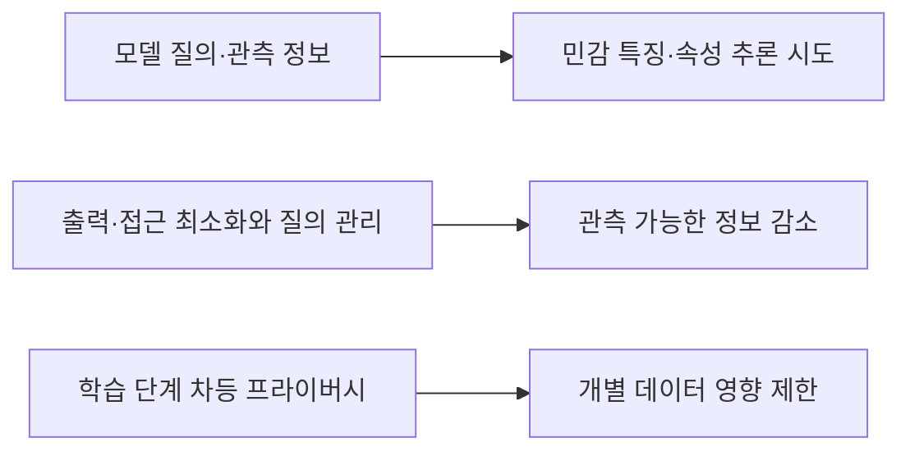
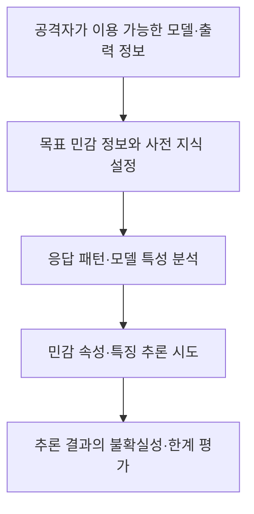

## 30초 인출

- **본질:** 모델 전도 공격은 모델의 관측 가능한 출력이나 접근 가능한 정보를 이용해 학습 데이터의 민감한 특징·속성을 추론하거나 재구성하려는 공격이다.
- **메커니즘:** 공격자는 모델의 응답에서 얻은 정보를 반복 분석해 특정 인물의 민감 속성이나 특정 클래스의 대표 특징을 추론할 수 있다. 성공 가능성과 복원 수준은 모델·데이터·공격자 지식과 접근 권한에 따라 달라진다.
- **구분:** 멤버십 추론은 특정 데이터가 학습에 포함됐는지를 판정하고, 모델 전도는 민감 정보·특징의 추론이나 재구성을 목표로 한다. 둘 다 정확한 원본 샘플 복원을 항상 뜻하지 않는다.

핵심 용어

- **모델 전도 공격:** 모델의 관측 가능한 동작을 이용해 학습 데이터의 민감한 특징·속성을 추론하거나 재구성하려는 공격이다.
- **멤버십 추론:** 특정 데이터가 모델의 학습 데이터에 포함됐는지 추정하는 공격이다.
- **차등 프라이버시(DP):** 개별 데이터 한 건의 포함 여부가 알고리즘 출력 분포에 미치는 영향을 수학적으로 제한하는 프라이버시 보장 방식이다.
- **DP-SGD:** 학습 중 개별 샘플의 기울기를 제한하고 노이즈를 더해 차등 프라이버시를 제공하도록 설계된 학습 방법이다.

---
## 1교시 예상문제 (10점)

> 모델 전도 공격의 개념과 멤버십 추론과의 차이, 주요 대응 방안을 설명하시오.

---
## 1교시 10점 답안

### 1. 정의·목적

- **정의:** 모델 전도 공격은 모델 출력 등 관측 정보를 이용해 학습 데이터의 민감한 특징이나 속성을 추론·재구성하는 공격이다.
- **목적:** 모델 제공자가 예상하지 못한 민감정보 노출을 찾아내고, 모델 접근·출력과 학습 과정의 프라이버시 위험을 줄인다.

### 2. 공격과 대응의 핵심

| 공격 목표 | 구분 |
|---|---|
| 모델 전도 | 학습 데이터의 민감 특징·속성을 추론하거나 재구성 |
| 멤버십 추론 | 주어진 특정 데이터가 학습에 포함됐는지 추정 |

출력 정밀도 제한은 위험 완화 수단 중 하나지만 단독으로 모델 전도를 막는다고 보장하지 않는다. 차등 프라이버시는 명시한 보장 범위와 누적 예산을 고려해 적용한다.

**제언:** 모델의 입력·출력·학습 데이터를 함께 위협 모델링하고, 프라이버시 위험을 시험해 완화책의 효과를 검증한다.

---
## 2~4교시 예상문제 (25점)

> 제138회 1교시 13번 「모델 전도 공격(Model Inversion Attack)」을 바탕으로, 공격 개념과 정보 추론 원리, 멤버십 추론과의 차이 및 프라이버시 보호 대책을 논하시오. *(25점 예상문제)*

---
## 2~4교시 25점 답안

### Ⅰ. 개념과 프라이버시 위협

모델 전도 공격은 배포된 모델의 출력이나 공개·접근 가능한 정보를 분석해 학습 데이터의 민감한 특징 또는 속성을 추론하거나 재구성하려는 공격이다. 성공 여부는 모델과 데이터, 모델 질의 조건, 공격자의 사전 지식에 따라 달라지며, 항상 학습 원본 자체를 그대로 복원하는 것은 아니다.

| 보호 대상 | 노출 가능 정보 | 영향 예 |
|---|---|---|
| 개인 데이터 | 민감 속성·개인별 특징 | 개인의 프라이버시 침해 |
| 학습 집단 | 특정 클래스의 대표 특징 | 집단 특성 노출 |
| 모델 출력 | 신뢰도·세부 예측 정보 | 추론에 활용할 추가 단서 |

### Ⅱ. 공격 원리와 조건

일부 모델 전도 연구는 예측 신뢰도와 배경 지식을 이용해 민감한 정보를 추론했다. 하지만 공격 방법이 모두 입력을 미분해 학습 데이터를 되살리는 것은 아니다. 모델의 종류와 공개된 정보에 따라 통계적 추론, 최적화 등 접근이 달라진다.

세부 확률을 감추거나 API 접근을 제한하면 공격 단서를 줄일 수 있으나, 레이블만 제공한다고 모든 추론이 불가능해지는 것은 아니다.

### Ⅲ. 모델 전도와 멤버십 추론 구분

두 공격은 모두 모델을 통한 프라이버시 누출을 다루지만 목표가 다르다. 모델 전도는 정보의 내용·특징을 추론하고, 멤버십 추론은 특정 표본이 학습에 포함됐는지를 추정한다.

| 구분 | 모델 전도 | 멤버십 추론 |
|---|---|---|
| 질문 | 모델에서 어떤 민감 정보·특징을 추론할 수 있나? | 이 데이터가 학습에 포함됐나? |
| 결과 | 속성·특징의 추론 또는 재구성 | 포함 여부에 대한 판정 |
| 의미 | 민감정보 노출 가능성 | 개인의 데이터 참여 사실 노출 |

### Ⅳ. 완화 통제

위험 완화는 모델 접근, 응답 정보, 학습 데이터 보호를 함께 다룬다. 각 조치는 공격 조건과 서비스 요구에 따라 효과가 다르므로, 위협 모델과 실증 평가를 통해 조합한다.

| 통제 층 | 대책 | 한계·검토점 |
|---|---|---|
| 접근 | 인증, 권한 최소화, 질의 속도·사용량 관리 | 승인된 대량 질의·내부자 위험까지 없애지는 않음 |
| 출력 | 필요한 정보만 반환, 신뢰도·세부 출력의 목적성 검토 | 출력 단순화만으로 모든 추론을 차단하지 못함 |
| 학습 | 차등 프라이버시 등 프라이버시 보호 학습 검토 | 보장 수준·누적 예산과 모델 효용 평가 필요 |
| 운영 | 비정상 이용 탐지, 보안·프라이버시 시험 | 탐지 품질과 대응 운영을 지속 개선해야 함 |

### Ⅴ. 기술사적 제언

| 문제 | 해결 방안 |
|---|---|
| 레이블만 반환하면 공격이 불가능하다고 오인 | 출력 최소화는 위험 저감책으로 두고 별도 공격 평가 수행 |
| 정확도만으로 프라이버시 보호를 판단 | 프라이버시 보장·누출 가능성과 업무 효용을 함께 평가 |
| DP 도입 시 예산·노이즈 효과를 검토하지 않음 | 명시적 프라이버시 예산과 누적 사용량을 관리하고 학습 품질 시험 |
| 특정 모델·데이터 조건의 실험을 일반화 | 실제 배포 조건과 공격자 권한을 반영한 위협 모델 수립 |

---
## 출제 이력 및 참고자료

- **기출 이력:** 제138회 1교시 13번 「모델 전도 공격(Model Inversion Attack)」.
- Fredrikson, Jha, Ristenpart, [Model Inversion Attacks that Exploit Confidence Information and Basic Countermeasures](https://www.cs.cmu.edu/~mfredrik/papers/fjr2015ccs.pdf) — 신뢰도 정보를 이용한 모델 전도 연구.
- NIST, [Adversarial Machine Learning: A Taxonomy and Terminology of Attacks and Mitigations](https://doi.org/10.6028/NIST.AI.100-2e2023) — 공격·완화의 생애주기와 용어 분류.
- Shokri et al., [Membership Inference Attacks against Machine Learning Models](https://arxiv.org/abs/1610.05820) — 멤버십 추론 문제 정의.
