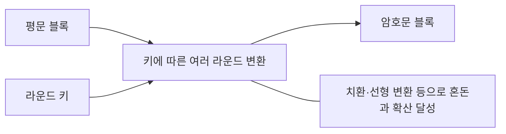
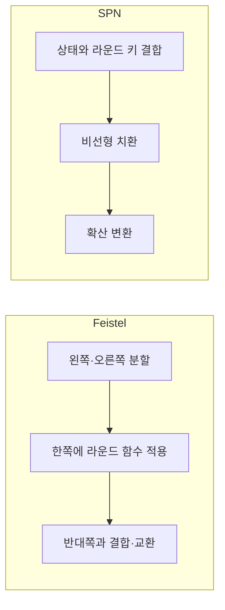
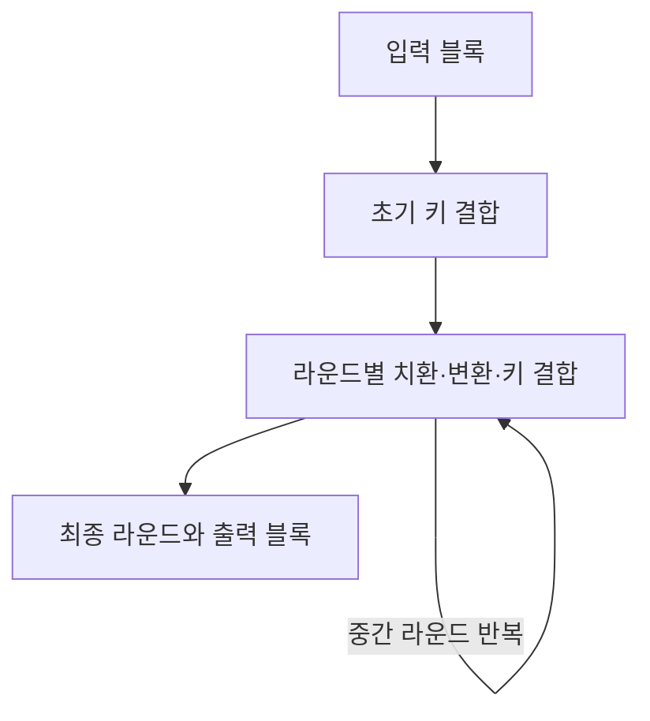

## 30초 인출

- **본질:** 블록 암호는 고정 길이 입력 블록을 비밀키로 같은 크기의 출력 블록에 대응시키는 대칭키 암호다.
- **메커니즘:** 키에서 라운드 키를 만들고 여러 라운드의 비선형 치환·선형 변환 등을 적용한다. Feistel과 SPN은 대표적인 설계 구조다.
- **활용:** 긴 메시지는 운용 모드로 처리한다. 모드에 따라 패딩 필요 여부가 다르며, 실무에서는 기밀성과 무결성을 함께 제공하는 인증 암호화(AEAD)를 우선 검토하고 nonce 규칙을 지킨다.

핵심 용어

- **블록 암호:** 고정 크기 블록을 키에 따라 같은 크기의 다른 블록으로 변환하는 대칭키 암호다.
- **혼돈(Confusion):** 암호문과 키 사이의 관계를 복잡하게 만들어 분석을 어렵게 하는 설계 목표다.
- **확산(Diffusion):** 평문의 통계적 구조가 암호문에 드러나지 않도록 입력 변화의 영향을 여러 출력 위치로 퍼뜨리는 설계 목표다.
- **운용 모드:** 블록 암호를 여러 블록의 데이터에 적용하는 방법이다.
- **AEAD:** 암호화와 함께 암호문·관련 데이터의 무결성 및 인증을 제공하는 방식이다.

---
## 1교시 예상문제 (10점)

> 블록 암호의 개념과 설계 원리, Feistel 및 SPN 구조의 차이를 설명하시오.

---
## 1교시 10점 답안

### 1. 정의·목적

- **정의:** 블록 암호는 고정 길이 평문 블록을 비밀키로 같은 크기의 암호문 블록으로 변환하는 대칭키 암호다.
- **목적:** 비밀키를 공유하는 당사자 사이에 데이터 기밀성을 제공한다.

### 2. 설계 원리와 구조

| 구조 | 핵심 원리 | 예 |
|---|---|---|
| Feistel | 블록을 나누고 한쪽에 라운드 함수를 적용해 다른 쪽과 결합 | DES |
| SPN | 치환층과 확산층을 반복 적용 | AES |

블록 암호 하나만으로 임의 길이 메시지 처리가 완성되는 것은 아니며, 운용 모드와 무결성 보호를 함께 선택한다.

**제언:** 검증된 알고리즘·인증 모드를 사용하고 키·nonce 관리 규칙까지 구현 점검에 포함한다.

---
## 2~4교시 예상문제 (25점)

> 블록 암호의 설계 원리와 Feistel·SPN 구조를 비교하고, 운용 모드와 실무 보안 고려사항을 설명하시오. *(KPC 기출 주제를 바탕으로 한 25점 예상문제)*

---
## 2~4교시 25점 답안

### Ⅰ. 개념과 설계 목표

블록 암호는 고정 크기의 입력 블록을 비밀키에 따라 같은 크기의 출력 블록으로 변환하는 대칭키 암호다. 안전한 설계는 키와 평문 구조가 암호문에서 단순한 관계로 드러나지 않도록 라운드 변환을 구성한다.

| 설계 목표 | 설명 | 구현 관점 |
|---|---|---|
| 혼돈 | 키·암호문 간 단순 관계를 어렵게 함 | 비선형 치환 등 |
| 확산 | 평문 통계와 국소 변화의 영향을 넓게 퍼뜨림 | 비트·바이트 혼합 및 선형 변환 등 |

### Ⅱ. Feistel과 SPN 구조

Feistel 구조는 블록의 한쪽에 라운드 함수를 적용하고 그 결과를 다른 쪽과 결합한 뒤 교환한다. 라운드 함수 자체가 역변환 가능하지 않아도 전체 구조를 역순 라운드로 복호화할 수 있다. SPN은 치환층과 확산층을 라운드마다 적용하며 복호화에는 각 변환의 역연산을 사용한다.

### Ⅲ. 라운드 구성과 블록 크기

라운드 구조는 키 스케줄에서 나온 라운드 키와 내부 변환을 반복해 한 블록을 처리한다. 예를 들어 AES는 128비트 블록을 사용하고 키 길이에 따라 라운드 수가 다르다.

블록 크기와 키 크기는 서로 다른 매개변수다. AES-128·192·256은 키 길이가 각각 다르지만 모두 128비트 블록을 처리한다.

### Ⅳ. 운용 모드와 데이터 보호

운용 모드는 블록 암호를 여러 블록의 메시지에 적용한다. CBC 등 일부 모드는 블록 정렬을 위해 패딩을 사용하지만 CTR·GCM처럼 패딩이 필요하지 않은 모드도 있다. 기밀성만 제공하는 모드는 별도 무결성 보호가 필요하므로 용도에 맞는 인증 암호화 모드를 검토한다.

| 운용 방식 | 제공 기능 | 주의 사항 |
|---|---|---|
| ECB·CBC·CTR 등 기밀성 모드 | 설정에 따른 기밀성 | 모드별 입력·IV·패딩 규칙 준수, 별도 인증 필요 여부 검토 |
| GCM 등 AEAD | 기밀성과 인증 | 키별 nonce 고유성 등 규격 조건을 반드시 준수 |
| 메시지 인증 결합 구성 | 기밀성 및 위변조 검출 가능 | 암호화·인증 순서와 키 분리를 검증된 설계에 맞춤 |

### Ⅴ. 운영상 위험과 기술사적 제언

| 문제 | 해결 방안 |
|---|---|
| 64비트 블록 암호에서 많은 데이터 처리로 충돌 위험 증가 | 데이터량·프로토콜을 검토하고 128비트 블록 등 현대 표준 사용 |
| 암호화만 적용해 암호문 위변조를 검증하지 못함 | AEAD 등 인증을 제공하는 검증된 구성 적용 |
| GCM nonce 재사용 등 모드 사용 규칙 위반 | 암호학적 라이브러리를 사용하고 키별 nonce 관리·시험 수행 |
| 알고리즘·모드 선택 오류와 자체 구현 | 표준 알고리즘, 검증된 라이브러리와 상호운용성 시험 적용 |

**제언:** 알고리즘 선택만으로 끝내지 말고 운용 모드, nonce·IV, 키 수명주기와 실패 처리를 함께 검증한다.

---
## 출제 이력 및 참고자료

- **기출 이력:** 기존 노트에는 KPC 제127회·제130회 블록 암호 구조·설계 원리 관련 주제가 기재되어 있음.
- NIST, [FIPS 197: Advanced Encryption Standard](https://csrc.nist.gov/pubs/fips/197/final) — AES 블록·키 크기 및 알고리즘.
- NIST, [SP 800-38A: Block Cipher Modes of Operation](https://csrc.nist.gov/pubs/sp/800/38/a/final) — 블록 암호의 기밀성 운용 모드.
- NIST, [SP 800-38D: Galois/Counter Mode (GCM)](https://csrc.nist.gov/pubs/sp/800/38/d/final) — GCM 인증 암호화.
- Bhargavan and Leurent, [On the Practical (In-)Security of 64-bit Block Ciphers](https://www.sweet32.info/SWEET32_CCS16.pdf) — 64비트 블록 크기의 생일 경계와 Sweet32 실증.
