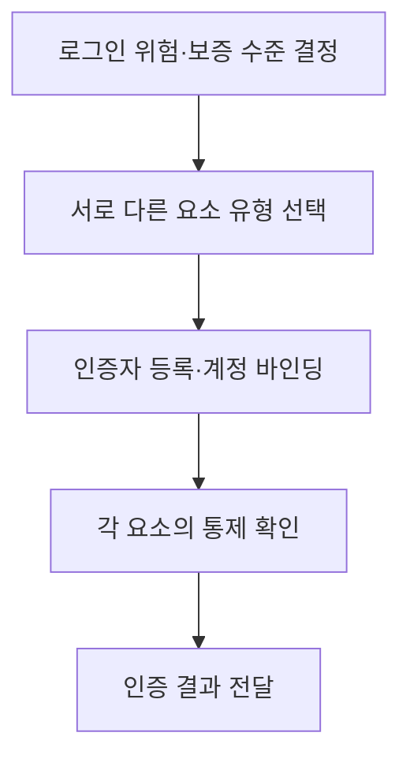

## 30초 인출

- **본질:** 식별은 주체가 누구인지 주장하고, 인증은 주체가 계정에 연결된 인증자를 통제함을 확인한다.
- **메커니즘:** 인증에는 지식(아는 것), 소유(가진 것), 생체(그 자체)의 세 가지 요소 유형이 있다. 다중요소인증은 서로 다른 유형의 요소를 결합한다.
- **구분:** 위치·행동은 위험 평가에 쓰이는 상황 신호일 수 있지만, NIST의 기본 인증 요소 유형은 세 가지다. 인가는 인증된 주체가 수행할 수 있는 일을 결정한다.

핵심 용어

- **식별(Identification):** 주체가 사용할 계정이나 신원을 주장하는 절차다.
- **인증(Authentication):** 주체가 계정에 연결된 인증자를 통제함을 확인하는 절차다.
- **인가(Authorization):** 인증된 주체가 접근할 자원과 수행할 작업을 결정하는 절차다.
- **인증 요소:** 지식·소유·생체의 세 가지 유형 가운데 인증에 사용되는 요소다.
- **다중요소인증(MFA):** 서로 다른 인증 요소 유형 두 가지 이상을 요구하는 인증이다.

---
## 1교시 예상문제 (10점)

> 식별·인증·인가의 차이를 설명하고 인증 요소의 유형과 다중요소인증의 원칙을 서술하시오.

---
## 1교시 10점 답안

### 1. 정의·목적

- **정의:** 식별은 신원을 주장하고, 인증은 그 주체가 계정에 연결된 인증자를 통제함을 확인한다.
- **목적:** 인증된 주체의 권한을 판정해 정보자산에 대한 접근을 통제한다.

### 2. 인증 요소와 MFA

| 요소 유형 | 증명하는 것 | 예 |
|---|---|---|
| 지식 | 알고 있는 것 | 비밀번호, PIN |
| 소유 | 가지고 통제하는 것 | 보안키, 인증기 앱 |
| 생체 | 개인의 신체적 특성 | 지문, 얼굴 특성 |

MFA는 예를 들어 지식과 소유처럼 서로 다른 요소 유형을 조합한다. 비밀번호 두 개는 둘 다 지식 요소이므로 MFA가 아니다.

**제언:** 업무 위험에 맞춰 요소 유형과 피싱 저항성, 복구 절차를 함께 설계한다.

---
## 2~4교시 예상문제 (25점)

> 식별·인증·인가의 역할을 구분하고 인증 요소와 다중요소인증의 원칙, 피싱 저항성 및 운영상 고려사항을 논하시오. *(KPC 제120·128회 기출 주제를 바탕으로 한 25점 예상문제)*

---
## 2~4교시 25점 답안

### Ⅰ. 접근통제에서의 식별·인증·인가

식별은 주체가 계정·신원을 주장하는 단계이고, 인증은 해당 주체가 계정에 바인딩된 인증자를 통제하는지 확인하는 단계다. 인가는 인증 결과를 바탕으로 자원과 작업의 권한을 판정하며, 책임추적은 수행한 활동을 기록·검토할 수 있게 한다.

| 기능 | 확인·결정 내용 | 예 |
|---|---|---|
| 식별 | 어떤 계정·주체를 주장하는가 | 사용자 ID 입력 |
| 인증 | 연결된 인증자를 통제하는가 | 보안키로 서명 응답 |
| 인가 | 어떤 자원·작업을 허용하는가 | 역할별 업무 권한 |
| 책임추적 | 어떤 주체가 어떤 활동을 했는가 | 감사 로그 |

### Ⅱ. 인증 요소 유형

NIST SP 800-63-4는 기본 인증 요소를 세 유형으로 분류한다. 행동·위치 정보는 위험기반 판단에 활용할 수 있지만, 그 자체를 기본 요소 유형에 더해 ‘네 번째 요소’라고 단정하지 않는다.

| 요소 유형 | 뜻 | 예 | 고려사항 |
|---|---|---|---|
| 지식 | 주체가 알고 있는 것 | 비밀번호, PIN | 피싱·재사용·추측 위험 |
| 소유 | 주체가 가진 인증자를 통제함 | 보안키, OTP 기기 | 분실·복구·기기 바인딩 관리 |
| 생체 | 주체의 신체 특성 | 지문·얼굴 특성 | 오인식·프라이버시·대체 수단 고려 |
| 상황 신호 | 접속 위험을 평가하는 맥락 | 위치·기기 상태·행동 패턴 | 보조 위험 신호로 사용하며 요소와 구분 |

### Ⅲ. MFA 구성 원칙

MFA는 서로 다른 인증 요소 유형을 둘 이상 사용한다. 같은 유형의 인증을 여러 번 요구하는 것만으로는 요소가 다양해지지 않는다.

예를 들어 비밀번호와 보안키는 지식·소유 조합이지만, 비밀번호와 추가 비밀번호는 지식·지식 조합이다. 요구 보증 수준과 적용 기준은 서비스 위험 및 해당 규정에 따라 정한다.

### Ⅳ. 피싱 저항성과 인증 수단 선택

인증의 강도는 요소 개수만으로 정할 수 없다. 피싱 저항성은 사용자의 주의에만 의존하지 않고 인증 프로토콜이 위조된 검증자에게 비밀이나 유효한 응답이 노출되는 것을 막는 특성이다.

| 수단 | 주요 특성 | 운영 고려 |
|---|---|---|
| 비밀번호 + SMS 코드 | 서로 다른 요소를 조합할 수 있으나 SMS는 제한된 대역외 인증 채널 | 번호 탈취·계정 복구 위험 관리 |
| OTP 코드 | 일회성 코드를 사용 | 피싱 프록시가 실시간으로 가로챌 수 있음 |
| 공개키 기반 보안키·패스키 | 검증자와 바인딩된 피싱 저항성 프로토콜 지원 가능 | 등록·분실·복구·플랫폼 지원 검토 |

### Ⅴ. 기술사적 제언

| 문제 | 해결 방안 |
|---|---|
| 같은 지식 요소를 두 번 써 MFA로 오해 | 인증 수단별 요소 유형을 확인하고 상이한 유형으로 조합 |
| SMS·OTP를 피싱 저항성 수단으로 간주 | 위험에 맞춰 검증자 바인딩을 제공하는 피싱 저항성 인증 선택 |
| 인증자를 분실하면 계정 복구가 약한 우회 경로가 됨 | 복구 경로의 보증 수준·본인확인·감사 절차를 함께 설계 |
| 요소 추가로 사용성·접근성이 저하 | 위험 기반 요구와 대체 수단을 마련하고 사용자 영향 평가 |

---
## 출제 이력 및 참고자료

- **기출 이력:** 기존 노트에 KPC 제120회·제128회 식별·인증·인증 요소·MFA 주제가 기록되어 있음.
- NIST, [SP 800-63-4: Digital Identity Guidelines](https://csrc.nist.gov/pubs/sp/800/63/4/final) — 최신 디지털 신원·인증 지침.
- NIST, [SP 800-63B-4: Authentication and Authenticator Management](https://csrc.nist.gov/pubs/sp/800/63/b/4/final) — 인증자와 인증 보증 수준.
- NIST CSRC, [Authentication Factor glossary](https://csrc.nist.gov/glossary/term/authentication_factor) — 지식·소유·생체의 세 인증 요소 유형.
- NIST CSRC, [Phishing resistance glossary](https://csrc.nist.gov/glossary/term/phishing_resistance) — 피싱 저항성 정의.
