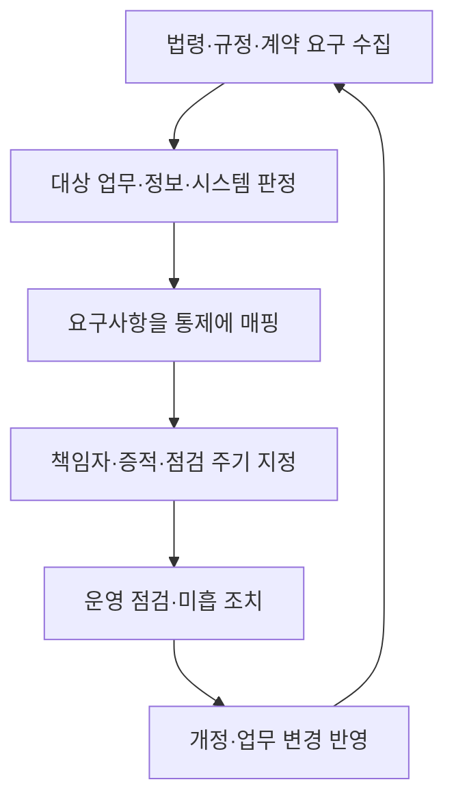

## 30초 인출

- **본질:** 정보보호 컴플라이언스는 조직에 적용되는 법령·규정·계약·표준의 요구사항을 식별하고 이행하는 관리 활동이다.
- **메커니즘:** 적용 범위를 정하고 요구사항을 통제·책임자·증적으로 연결한 뒤, 변경과 운영 상태를 주기적으로 점검·개선한다.
- **구분:** 인증 취득이나 문서 보유만으로 침해가 방지되거나 법적 책임이 면제되는 것은 아니다. 의무는 조직·서비스·처리 정보와 해당 법규에 따라 달라진다.

핵심 용어

- **정보보호 컴플라이언스:** 적용되는 법규·규정·계약·표준의 보안 요구사항을 조직의 통제와 운영에 반영하고 이행을 확인하는 활동이다.
- **ISMS-P:** 정보보호 및 개인정보보호를 위한 조치와 활동이 인증기준에 적합한지 심사·증명하는 관리체계 인증제도다.
- **GRC:** 거버넌스·위험관리·컴플라이언스를 연계해 조직의 의사결정과 통제를 관리하는 접근이다.
- **증적:** 통제가 설계되고 실제로 운영됐음을 확인할 수 있는 기록과 자료다.

---
## 1교시 예상문제 (10점)

> 정보보호 컴플라이언스의 개념과 관리 절차, 인증 및 실제 보안과의 관계를 설명하시오.

---
## 1교시 10점 답안

### 1. 정의·목적

- **정의:** 정보보호 컴플라이언스는 조직에 적용되는 보안 요구사항을 파악하고 통제·운영에 반영해 이행을 확인하는 활동이다.
- **목적:** 법적·계약상 의무와 정보보호 위험을 관리하고, 통제 운영의 근거를 유지한다.

### 2. 관리 절차

| 단계 | 핵심 활동 |
|---|---|
| 적용 범위 확인 | 조직·서비스·데이터에 적용되는 요구사항 식별 |
| 통제 연결 | 요구사항을 정책·절차·기술 통제에 매핑 |
| 이행 확인 | 책임자·증적·점검 주기 확인 |
| 개선 | 변경·미흡 사항을 반영해 통제 보완 |

ISMS-P는 인증기준에 따른 관리체계 인증이지만, 인증서 자체가 모든 침해를 막거나 법적 책임을 면제하지 않는다.

**제언:** 적용 요구사항을 실제 통제와 증적에 연결하고, 법규 변경과 업무 변경 때 함께 재검토한다.

---
## 2~4교시 예상문제 (25점)

> 제140회 4교시 5번 「국내 다양한 규제에 따른 정보보호 컴플라이언스」의 기출 주제를 바탕으로, 적용 요구사항의 식별·통제 매핑·이행 증명 절차와 운영상 유의사항을 논하시오. *(25점 예상문제)*

---
## 2~4교시 25점 답안

### Ⅰ. 개념과 적용 범위

정보보호 컴플라이언스는 조직에 적용되는 의무와 기준을 식별해 정책·통제·운영으로 구현하고 이행 여부를 확인하는 활동이다. 적용 법규는 조직 유형, 처리 정보, 서비스, 계약 관계에 따라 달라지므로 개별 조직의 범위를 먼저 확인한다.

| 요구 출처 | 예 | 적용 시 확인 |
|---|---|---|
| 법령·하위 규정 | 개인정보 보호법 및 관련 고시 | 적용 대상·처리 행위·시행일·예외 |
| 인증 기준 | ISMS-P 등 관리체계 인증 | 인증 의무 여부·범위·기준 버전 |
| 계약·내부 정책 | 위탁 계약, 보안 정책 | 의무 주체·통지·감사·보존 조건 |

### Ⅱ. 국내 개인정보 보호 요구의 예

개인정보 보호법 제64조의2는 조문에 열거된 위반행위 등에 대해 전체 매출액의 3%를 넘지 않는 범위에서 과징금을 부과할 수 있도록 정한다. 이는 모든 정보보호 위반에 자동 적용되는 일률적인 3% 과징금이 아니다. 법률·시행령의 적용 사유와 산정 기준을 각각 확인해야 한다.

| 확인 영역 | 현행 요구의 예 | 컴플라이언스 관리 |
|---|---|---|
| 과징금 | 법 제64조의2의 대상 행위 및 상한, 시행령의 산정 기준 | 해당 행위·매출 산정·감경 등 법령 적용 검토 |
| 접속기록 | 안전성 확보조치 기준상 통상 1년 이상, 일정 시스템은 2년 이상 보관·관리 | 적용 범위·보관 기간·점검·안전한 보관 확인 |
| ISMS-P | 정보보호·개인정보보호 관리활동이 인증기준에 맞는지 인증기관이 심사 | 인증 대상 여부·인증범위·기준 버전 확인 |

법령과 고시는 개정될 수 있으므로 실제 준수 판단 때에는 시행일 기준 최신 원문과 조직별 적용 조건을 확인한다.

### Ⅲ. 요구사항에서 운영 통제까지

조직은 적용되는 요구사항을 담당 업무와 정보자산에 연결하고, 각 항목을 통제·책임자·증적·점검 주기로 구체화한다. 인증 심사에 필요한 자료만 따로 만드는 방식보다 일상 운영에서 생성되는 기록을 통제 상태의 증거로 관리한다.

### Ⅳ. 증적과 지속적 개선

증적은 요구사항의 준수 판단과 통제 개선에 활용한다. 로그 등 개인정보 처리기록은 해당 기준의 보관 기간과 안전성 요구를 따르고, 불필요한 기록은 개인정보 최소수집·보유 원칙과 함께 검토한다.

| 관리 항목 | 증적 예 | 점검 질문 |
|---|---|---|
| 접근통제 | 권한 승인·검토 기록 | 권한이 업무 역할에 맞고 정기 재검토되는가? |
| 접속기록 | 시스템 로그·점검 결과 | 적용되는 보관 기간·점검·보호 조치를 이행하는가? |
| 위탁·제3자 | 계약·감독·점검 자료 | 책임과 처리 범위가 문서·운영에서 일치하는가? |
| 개선 조치 | 발견사항·시정 계획·완료 증적 | 원인과 재발방지까지 확인하는가? |

### Ⅴ. 기술사적 제언

| 문제 | 해결 방안 |
|---|---|
| 법령·계약 변경을 놓쳐 요구사항이 낡음 | 변경 감시와 법무·보안·개인정보 담당 검토를 통제 갱신에 연결 |
| 중복 기준을 별도 문서·심사로 관리 | 공통 통제와 개별 의무를 구분해 요구-통제-증적 관계를 통합 관리 |
| 인증 취득을 실질적 보안의 대체로 인식 | 실제 위협·운영 결과를 함께 점검하고 잔여 위험을 관리 |
| 증적은 있으나 통제가 운영되지 않음 | 표본 검증·운영 기록·시정 결과를 확인해 실효성을 평가 |

---
## 출제 이력 및 참고자료

- **기출 이력:** 제140회 4교시 5번 「국내 다양한 규제에 따른 정보보호 컴플라이언스에 대하여 다음을 설명하시오.」
- 국가법령정보센터, [개인정보 보호법 제64조의2](https://www.law.go.kr/lsLinkCommonInfo.do?chrClsCd=010202&lsJoLnkSeq=1029332301) — 과징금 부과 대상과 상한.
- 국가법령정보센터, [개인정보의 안전성 확보조치 기준](https://www.law.go.kr/행정규칙/개인정보의안전성확보조치기준) — 현행 접속기록 보관·점검 기준.
- KISA, [ISMS-P 인증제도](https://isms.kisa.or.kr/sysm/intro/selectSysmCertDetail.do) — 인증 목적·법적 근거·기준.
