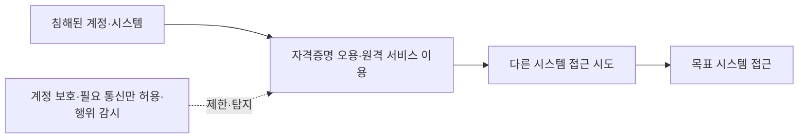
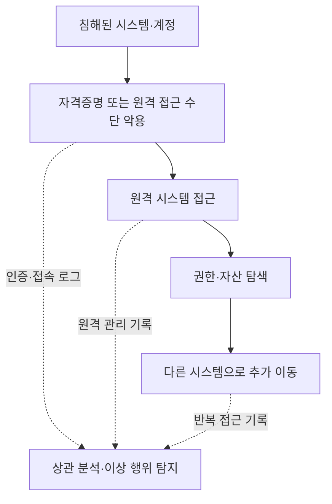

## 30초 인출

- **본질:** 측면 이동은 공격자가 네트워크에서 다른 시스템으로 접근해 목표를 향해 이동하는 행위다.
- **메커니즘:** 공격자는 탈취·오용한 계정, 원격 서비스, 취약점이나 정상 관리 도구 등을 이용해 원격 시스템에 접근할 수 있다. MITRE ATT&CK는 측면 이동을 TA0008 전술로 분류한다.
- **방어:** 업무상 필요한 통신만 허용하고 계정·자격증명을 보호하며, 원격 접근과 호스트 간 이동을 탐지·제한한다.

핵심 용어

- **측면 이동:** 공격자가 네트워크의 원격 시스템에 들어가 통제 범위를 넓히려는 행위다.
- **Pass-the-Hash(PtH):** 공격자가 획득한 비밀번호 해시를 활용해 평문 비밀번호를 복원하지 않고 인증을 시도하는 기법이다.
- **Living off the Land(LotL):** 공격자가 운영체제나 관리 환경에 이미 존재하는 도구를 악용하는 방식이다.
- **Windows LAPS:** Windows 단말의 로컬 관리자 암호를 관리·주기적으로 변경해 단말 간 공통 암호 사용 위험을 낮추는 기능이다.

---
## 1교시 예상문제 (10점)

> 측면 이동의 개념과 대표 메커니즘, 주요 대응 원칙을 설명하시오.

---
## 1교시 10점 답안

### 1. 정의·목적

- **정의:** 측면 이동은 공격자가 네트워크의 다른 시스템에 접근해 목표를 향해 이동하는 행위다.
- **공격 목표:** 최초 침해 지점에서 다른 시스템으로 접근 범위를 넓혀 목표 자산이나 권한에 도달한다.

### 2. 이동 흐름과 통제

| 위험 요인 | 통제 예 |
|---|---|
| 단말 간 불필요한 접근 | 네트워크 분리와 필요한 통신만 허용 |
| 공통 로컬 관리자 암호 | Windows LAPS 등으로 단말별 암호 관리 |
| 탈취 자격증명·원격 접속 오용 | 강한 인증, 최소 권한, 원격 접속 감시 |

**제언:** 내부망도 신뢰하지 않고 필요한 통신·권한만 허용하며, 계정 보호와 침해 탐지를 함께 적용한다.

---
## 2~4교시 예상문제 (25점)

> 제138회 3교시 5번 「IT 인프라 확장에 따른 사이버 위협(측면 이동)」의 기출 주제를 바탕으로, 측면 이동의 개념과 주요 경로를 설명하고 계정·네트워크·탐지 통제 방안을 논하시오. *(25점 예상문제)*

---
## 2~4교시 25점 답안

### Ⅰ. 개념과 권한 상승의 구분

측면 이동은 공격자가 네트워크의 원격 시스템에 진입하고 통제 범위를 넓히려는 행위다. 권한 상승은 한 시스템 또는 보안 경계 안에서 더 높은 권한을 얻는 행위라는 점에서 구분된다. 두 행위는 같은 침해 과정에서 함께 나타날 수 있다.

| 행위 | 이동·권한의 범위 | 예시 |
|---|---|---|
| 권한 상승 | 동일 시스템 등에서 더 높은 권한 취득 | 일반 권한에서 관리자 권한으로 변경 |
| 측면 이동 | 네트워크의 원격 시스템으로 접근 | 사용자 단말에서 파일·관리 서버로 이동 시도 |

### Ⅱ. 주요 경로와 방식

MITRE ATT&CK는 측면 이동을 독립된 전술로 분류하며, 공격자는 훔친 자격증명이나 합법적 원격 서비스, 정상 관리 도구 등을 사용할 수 있다.

| 경로 | 공격자가 악용하는 조건 | 관리 초점 |
|---|---|---|
| 유효 계정·자격증명 | 재사용·과도한 권한·보호 미흡 | 자격증명 보호와 권한 최소화 |
| 원격 서비스 | 불필요한 서비스 노출·접근 범위 과다 | 접근 원천·대상 제한과 인증 |
| 원격 시스템의 취약점 | 패치·설정 미흡 | 자산 관리와 취약점 조치 |
| 정상 관리 도구(LotL) | 관리 기능과 사용자 행위의 구분 부족 | 관리자 도구 사용 맥락·행위 분석 |

### Ⅲ. 이동 경로와 탐지 지점

공격자는 한 시스템에서 획득한 접근 권한이나 자격증명을 이용해 원격 서비스에 접근하고, 목표에 이를 때까지 시스템을 바꾸어 이동할 수 있다. 대응은 시스템 간 인증·통신·관리 활동의 연결을 파악하는 데 초점을 둔다.

### Ⅳ. 예방·탐지 통제

네트워크 분리와 자격증명 관리를 함께 적용하고, 필요한 원격 통신은 업무 목적·주체·대상에 맞게 제한한다. 단일 기술이 모든 측면 이동을 차단하는 것은 아니므로 예방과 탐지를 결합한다.

| 통제 영역 | 대응 | 적용 시 고려 |
|---|---|---|
| 네트워크 | 역할·업무에 따른 분리, 불필요한 호스트 간 통신 제한 | 필요한 업무 흐름을 사전 확인하고 예외를 관리 |
| 계정·암호 | 최소 권한, 공통 로컬 관리자 암호 제거, Windows LAPS 검토 | LAPS는 Windows 로컬 계정의 위험을 줄이는 통제이며 모든 인증·이동을 막지는 않음 |
| 인증·원격 접속 | 강한 인증, 관리 경로 제한, 안전한 원격 관리 구성 | 중요 시스템과 관리 접속의 보증 수준 강화 |
| 탐지·대응 | 계정·엔드포인트·원격 접속 기록 연결 분석 | 정상 관리 행위와 의심 행위의 맥락 구분 |

### Ⅴ. 기술사적 제언

| 문제 | 해결 방안 |
|---|---|
| 평면 네트워크에서 침해가 다른 시스템으로 번짐 | 업무상 필요한 통신만 허용하고 중요 자산을 분리 |
| 공통 관리자 암호·과도한 권한으로 자격증명 재사용이 쉬움 | 고유 암호 관리, 최소 권한, 관리자 계정 분리 적용 |
| 정상 원격 관리 도구의 악용을 놓침 | 주체·시간·대상·업무 맥락을 포함해 원격 행위를 탐지 |
| 경계 방어에 치중해 내부 이동을 감시하지 않음 | 인증·접속·엔드포인트 로그를 연계해 이동 징후를 분석 |

---
## 출제 이력 및 참고자료

- **기출 이력:** 제138회 3교시 5번 「IT 인프라 확장에 따른 사이버 위협(측면 이동)」.
- MITRE, [Lateral Movement (TA0008)](https://attack.mitre.org/tactics/TA0008/) — 측면 이동의 범위와 대표 방식.
- Microsoft Learn, [Windows LAPS overview](https://learn.microsoft.com/en-us/windows-server/identity/laps/laps-overview) — 로컬 관리자 암호의 관리·회전 및 측면 이동 완화 목적.
- Microsoft Learn, [Remote Credential Guard](https://learn.microsoft.com/en-us/windows/security/identity-protection/remote-credential-guard) — 원격 접속 시 자격증명 보호.
