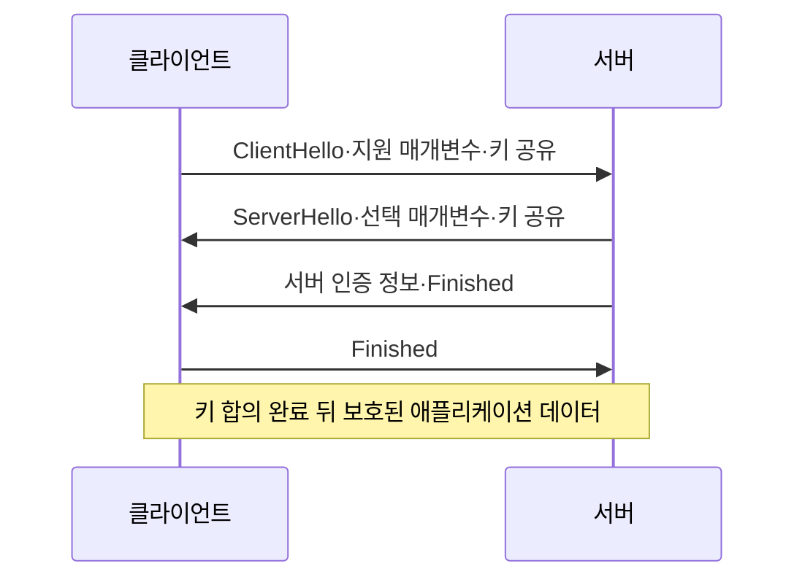
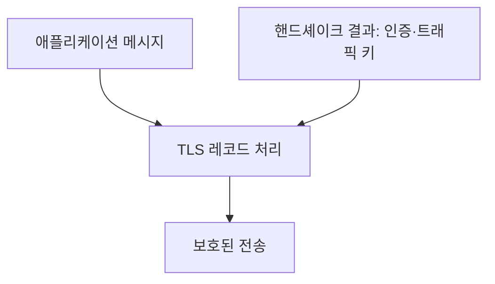
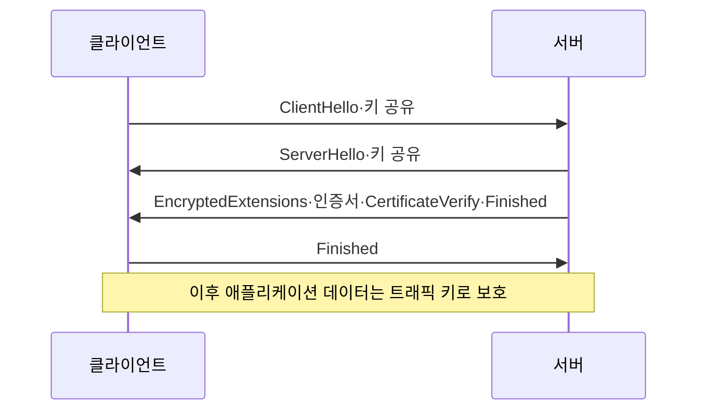

## 30초 인출

- **본질:** TLS는 통신 상대를 인증하고 전송 중인 데이터의 기밀성과 무결성을 보호하는 보안 프로토콜이다.
- **메커니즘:** 핸드셰이크에서 버전·알고리즘을 협상하고 인증·키 설정을 한 뒤, 레코드 계층이 세션 키와 AEAD로 애플리케이션 데이터를 보호한다.
- **주의:** TLS 1.3의 일반적인 전체 핸드셰이크는 1-RTT이며, PSK를 이용하는 0-RTT 조기 데이터는 재전송 위험과 제한된 순방향 비밀성을 가진다. TLS 1.3도 모든 구성에서 PFS를 보장하지는 않는다.

핵심 용어

- **핸드셰이크:** 통신 매개변수와 인증 정보를 교환하고 트래픽 키를 설정하는 절차다.
- **레코드 계층:** 핸드셰이크가 정한 트래픽 키를 사용해 TLS 메시지와 애플리케이션 데이터를 보호하는 계층이다.
- **AEAD:** 암호화와 함께 데이터 무결성·인증을 제공하는 알고리즘 구성이다.
- **순방향 비밀성(PFS):** 장기 인증키가 나중에 노출되어도 이전 세션의 트래픽 키를 복구하기 어렵게 하는 성질이다. TLS에서는 임시 DHE 키 합의 등이 이를 제공한다.
- **0-RTT 조기 데이터:** 재개 연결에서 클라이언트가 핸드셰이크 완료 전에 보내는 데이터로, 재전송될 수 있어 애플리케이션이 멱등성 등 안전 조건을 고려해야 한다.

---
## 1교시 예상문제 (10점)

> TLS의 목적과 핸드셰이크·레코드 처리 원리, TLS 1.3의 주요 특징을 설명하시오.

---
## 1교시 10점 답안

### 1. 정의·목적

- **정의:** TLS는 통신 상대 인증과 전송 데이터의 기밀성·무결성을 제공하는 보안 프로토콜이다.
- **목적:** 네트워크 도청·변조를 줄이고, 인증된 상대와 보호된 통신 채널을 수립한다.

### 2. 보호 채널 수립

| TLS 구성 | 역할 |
|---|---|
| 핸드셰이크 | 협상, 인증, 트래픽 키 설정 |
| 레코드 처리 | 애플리케이션 데이터의 암호화·무결성 보호 |

TLS 1.3은 전체 핸드셰이크를 일반적으로 1-RTT로 줄이고 인증 암호화 알고리즘을 사용한다. 0-RTT는 재전송에 안전한 요청으로 제한한다.

**제언:** TLS 1.3을 우선 적용하되, 인증서·키·알고리즘 구성과 0-RTT 요청의 재전송 안전성을 함께 점검한다.

---
## 2~4교시 예상문제 (25점)

> 제136회 2교시 6번 「TLS 1.2 취약점 및 TLS 1.3 권고 이유, 주요 개선사항」의 기출 주제를 바탕으로, TLS의 계층·핸드셰이크와 TLS 1.2·1.3의 차이, 배포 시 보안 고려사항을 논하시오. *(25점 예상문제)*

---
## 2~4교시 25점 답안

### Ⅰ. 개념과 보안 목적

TLS는 통신 상대의 인증과 전송 데이터의 기밀성·무결성을 제공하는 보안 프로토콜이다. 일반적으로 애플리케이션 프로토콜과 스트림 전송 계층 사이에서 사용되며, QUIC은 TLS 1.3 핸드셰이크를 통합하는 별도 전송 프로토콜이다.

| 보안 목적 | 제공 수단 |
|---|---|
| 통신 상대 인증 | 서버 인증서와 핸드셰이크 서명 검증; 클라이언트 인증은 설정에 따라 선택 |
| 기밀성 | 핸드셰이크에서 설정한 대칭 트래픽 키로 레코드 보호 |
| 무결성 | AEAD 인증 태그로 레코드 변조 검출 |

### Ⅱ. 프로토콜 구성

TLS 핸드셰이크는 통신 매개변수와 인증·키 설정을 협상하고, 레코드 처리는 합의된 트래픽 키로 데이터 메시지를 보호한다. 클라이언트 인증서 인증(mTLS)은 서버 인증과 별도로 선택해 설정한다.

### Ⅲ. 핸드셰이크와 키 설정

TLS 1.3의 전체 인증 핸드셰이크는 일반적으로 1-RTT다. 양측은 ClientHello·ServerHello에서 지원 매개변수와 키 공유를 협상하고, 서버는 인증 정보를 보내며 양측이 Finished 메시지를 검증해 핸드셰이크를 마친다. HelloRetryRequest 등으로 왕복이 추가될 수 있다.

임시 DHE 키 공유는 순방향 비밀성을 제공한다. TLS 1.3의 PSK 단독 키 합의는 새 DHE 기여가 없으므로 동일한 PFS를 제공하지 않으며, 0-RTT 데이터 키도 전체 순방향 비밀성을 제공하지 않는다.

### Ⅳ. TLS 1.2와 1.3의 차이

TLS 1.2는 구성에 따라 정적 RSA 키 교환 또는 DHE/ECDHE 키 교환을 사용할 수 있었다. 따라서 TLS 1.2 전체가 PFS가 없거나 모두 취약하다고 표현해서는 안 된다. TLS 1.3은 정적 RSA 키 교환과 비-AEAD 암호 스위트를 제거하고, 핸드셰이크와 암호군 협상을 단순화했다.

| 항목 | TLS 1.2 | TLS 1.3 |
|---|---|---|
| 키 설정 | 정적 RSA 및 (EC)DHE 등 선택 구성 | 인증서 기반 키 합의 또는 PSK 기반; DHE 조합 여부에 따라 PFS 달라짐 |
| 레코드 암호화 | 암호군에 따라 CBC, AEAD 등 | AEAD 계열 |
| 일반 전체 핸드셰이크 | 보통 2-RTT | 보통 1-RTT |
| 재개 조기 데이터 | 표준 0-RTT 조기 데이터 없음 | 선택적 0-RTT; 재전송·PFS 제약 고려 |

### Ⅴ. 기술사적 제언

| 문제 | 해결 방안 |
|---|---|
| 레거시 버전·취약 암호 구성 노출 | TLS 1.3을 우선 적용하고 상호운용성 요구에 맞게 안전한 TLS 1.2 구성을 유지하며 구형 프로토콜·암호를 제한 |
| TLS 1.2를 일괄적으로 취약하다고 보거나 TLS 1.3만으로 PFS가 보장된다고 오해 | 협상된 버전·키 합의·PSK 모드를 점검해 실제 보안 속성을 확인 |
| 서버 인증서·개인키 운용 미흡 | 인증서 검증, 키 접근·회전·폐기 절차 및 만료 모니터링 운영 |
| 0-RTT 조기 데이터 재전송으로 부작용 발생 | 멱등성이 보장되는 요청만 허용하고 애플리케이션별 재전송 방어 적용 |
| mTLS 인증서·신뢰 관계 관리 복잡 | 클라이언트 인증 필요 구간을 명확히 정하고 인증서 발급·회수·갱신을 관리 |

---
## 출제 이력 및 참고자료

- **기출 이력:** 제136회 2교시 6번 「TLS 1.2 취약점이 발견되어 TLS 1.3 사용을 권고」 및 TLS 개념·계층 구조·1.2 취약점·1.3 개선사항.
- IETF, [RFC 9846: The Transport Layer Security (TLS) Protocol Version 1.3](https://www.rfc-editor.org/rfc/rfc9846.html) — 2026년 7월 발행, RFC 8446을 대체한 최신 TLS 1.3 규격.
- IETF, [RFC 5246: TLS 1.2](https://www.rfc-editor.org/rfc/rfc5246.html) — TLS 1.2 규격 및 키 교환 구성.
- IETF, [RFC 8470: Using Early Data in HTTP](https://www.rfc-editor.org/rfc/rfc8470.html) — 0-RTT 조기 데이터와 재전송 고려사항.
- NIST, [SP 800-52 Rev. 2: TLS Implementations](https://csrc.nist.gov/pubs/sp/800/52/r2/final) — TLS 구현 구성 지침.
