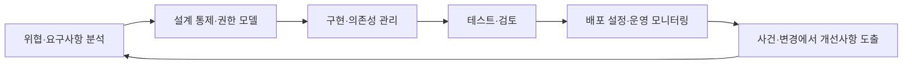

## 30초 인출

- **본질:** OWASP Top 10은 웹 애플리케이션의 주요 보안 위험을 개발자·보안팀이 공통으로 인식하도록 정리한 awareness document다.
- **메커니즘:** 2025판은 테스트 데이터와 현장 설문을 함께 반영해 10개 위험 범주를 제시한다. 완전한 취약점 목록이나 보안 보증 기준으로 쓰지 않는다.
- **핵심 변화:** A01 Broken Access Control은 1위를 유지했고, A03 Software Supply Chain Failures와 A10 Mishandling of Exceptional Conditions가 새 범주로 포함됐다. SSRF는 A01에 통합됐다.

핵심 용어

- **OWASP Top 10:** 웹 애플리케이션의 핵심 위험을 개발·보안 조직이 공유하도록 만든 인식 제고 자료다.
- **Broken Access Control:** 사용자가 허용된 권한을 벗어나 데이터를 읽거나 변경하거나 기능을 수행할 수 있는 접근통제 실패다.
- **Software Supply Chain Failures:** 의존성뿐 아니라 빌드·배포 등 소프트웨어 공급망에서 신뢰·보안 통제가 실패하는 위험 범주다.
- **Mishandling of Exceptional Conditions:** 오류·비정상 조건을 안전하게 처리하지 못해 발생하는 위험 범주다.

---
## 1교시 예상문제 (10점)

> OWASP Top 10의 목적과 2025판의 주요 항목 및 활용 시 유의사항을 설명하시오.

---
## 1교시 10점 답안

### 1. 정의·목적

- **정의:** OWASP Top 10은 웹 애플리케이션의 주요 보안 위험을 개발자와 보안팀이 공통으로 이해하도록 정리한 자료다.
- **목적:** 위험 인식을 높이고 개발·운영 보안 개선의 출발점을 제공한다.

### 2. 2025판의 항목

| 순위 | 위험 범주 |
|---:|---|
| A01 | Broken Access Control |
| A02 | Security Misconfiguration |
| A03 | Software Supply Chain Failures |
| A04 | Cryptographic Failures |
| A05 | Injection |
| A06 | Insecure Design |
| A07 | Authentication Failures |
| A08 | Software or Data Integrity Failures |
| A09 | Security Logging and Alerting Failures |
| A10 | Mishandling of Exceptional Conditions |

OWASP는 2025판을 테스트 데이터와 커뮤니티 설문을 반영한 위험 인식 자료로 설명한다. 항목을 전체 위협 목록이나 인증 체크리스트로 오해하지 않는다.

**제언:** 조직의 애플리케이션과 위협에 맞춰 Top 10을 상세 검증 기준·테스트와 함께 활용한다.

---
## 2~4교시 예상문제 (25점)

> KPC 제124회 「OWASP Top 10의 주요 취약점 변화 추이 및 대응 방안」의 기출 주제를 바탕으로, OWASP Top 10:2025의 주요 개정과 위험 관리·개발 생명주기별 대응 방안을 논하시오. *(25점 예상문제)*

---
## 2~4교시 25점 답안

### Ⅰ. 목적과 적용 범위

OWASP Top 10은 웹 애플리케이션의 주요 보안 위험을 공통 언어로 알리는 awareness document다. 각 범주는 여러 CWE와 위험 유형을 묶으므로 특정 취약점 하나를 뜻하지 않으며, 이 자료만으로 보안 완성이나 인증을 판단할 수 없다.

| 활용 목적 | 적용 방법 | 한계 |
|---|---|---|
| 위험 인식·공통 언어 | 개발·운영·보안팀의 교육·우선순위 논의 | 조직별 위험과 전체 취약점 목록을 대체하지 않음 |
| 개선 계획 수립 | 위험 범주를 요구사항·테스트·통제에 연결 | 단순 목록 점검만으로 실제 취약 여부를 판정할 수 없음 |

### Ⅱ. 2021판에서 2025판으로의 변화

2025판은 A01 Broken Access Control이 1위를 유지하고, 보안 설정 오류가 2위로 올라왔다. 공급망 실패를 별도 범주로 확대하고 예외 조건 처리 실패를 새 범주로 추가했다. SSRF는 별도 A10이 아니라 A01 범주에 포함된다.

| 관점 | 2021판 | 2025판 변화 |
|---|---|---|
| 접근통제 | A01 | A01로 1위 유지, SSRF 포함 |
| 보안 설정 | A05 | A02로 상승 |
| 구성요소·공급망 | A06 취약·오래된 구성요소 | A03 Software Supply Chain Failures로 범위를 확대 |
| 암호·인젝션 | A02·A03 | A04·A05로 이동 |
| 오류 처리 | 별도 A10 아님 | A10 Mishandling of Exceptional Conditions 신설 |

OWASP의 방법론은 기여된 테스트 데이터와 커뮤니티 설문을 함께 고려한다. 따라서 순위 변화는 항목별 위험의 보편적·절대적 확률을 뜻하지 않는다.

### Ⅲ. 위험을 개발 생명주기에 연결

Top 10은 설계·구현·배포·운영 전반의 개선 항목을 도출하는 데 사용한다. 다만 자동화 도구가 모든 범주, 특히 설계 결함을 완전히 찾아준다고 가정해서는 안 된다.

### Ⅳ. 핵심 위험의 통제 예

Top 10 범주는 서로 겹칠 수 있으므로, 실제 시스템의 위협 모델과 데이터 흐름에 맞춰 통제와 테스트를 설계한다.

| 위험 예 | 예방·탐지 통제 예 | 검증 관점 |
|---|---|---|
| A01 접근통제 실패 | 서버 측 객체·기능별 권한 확인 | 다른 사용자·역할·테넌트 권한 부정 시험 |
| A02 보안 설정 오류 | 안전한 기본값과 설정 변경 관리 | 배포 환경·클라우드 공개 범위 점검 |
| A03 공급망 실패 | 의존성·빌드·배포 출처 관리 | 구성요소 목록과 무결성·변경 추적 검토 |
| A05 인젝션 | 컨텍스트에 맞는 입력 처리와 안전한 API 사용 | 코드·동적 시험으로 입력 경계 검증 |
| A09 로그·경보 실패 | 보안 이벤트 기록과 대응 경보 연결 | 기록 완전성·경보 조치 흐름 시험 |
| A10 예외 조건 처리 실패 | 오류·타임아웃·실패 상태의 안전한 처리 | 비정상 입력·의존 서비스 장애 시 동작 확인 |

### Ⅴ. 기술사적 제언

| 문제 | 해결 방안 |
|---|---|
| Top 10을 점검 목록으로만 사용해 설계 위험을 놓침 | 애플리케이션 위협 모델·보안 요구사항·수용 기준으로 연결 |
| A01 권한 검증이 UI나 클라이언트에만 존재 | 서버 측에서 모든 객체·기능 요청 권한을 검증하고 자동화 시험 추가 |
| 공급망 위험이 직접 의존성 목록에만 한정 | 전이 의존성·빌드·배포 출처까지 범위에 포함해 추적·검증 |
| 자동 검사 통과를 보안 보증으로 오해 | 수동 설계 검토·동적 시험·운영 모니터링과 함께 사용 |

---
## 출제 이력 및 참고자료

- **기출 이력:** KPC 제124회 「OWASP Top 10의 주요 취약점 변화 추이 및 대응 방안」.
- OWASP, [Top 10:2025](https://top10.owasp.org/2025/) — 최신 10개 위험 범주.
- OWASP, [Introduction to Top 10:2025](https://top10.owasp.org/2025/0x00_2025-Introduction/) — 2021판 대비 변경 및 순위 산정 방법.
- OWASP, [A01:2025 Broken Access Control](https://top10.owasp.org/2025/A01_2025-Broken_Access_Control/) — SSRF 통합 등 범주 설명.
