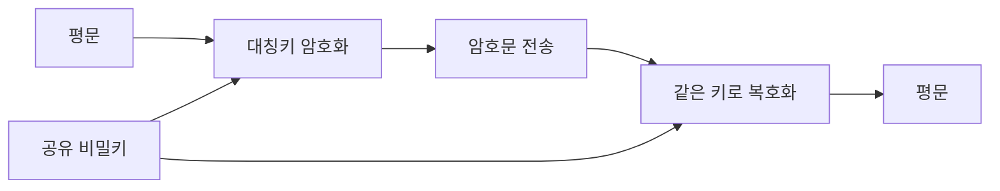
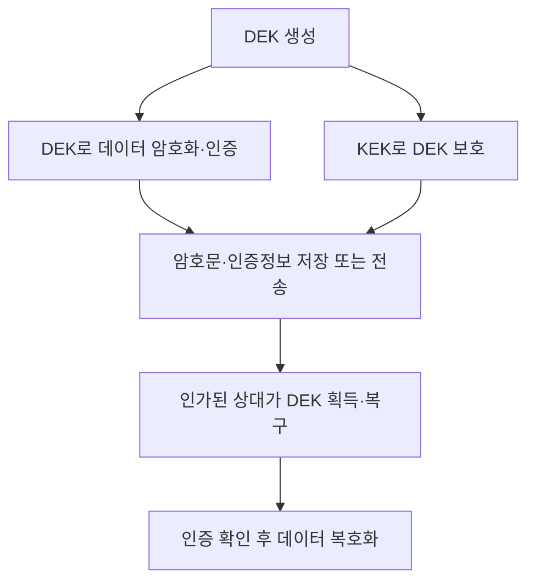

## 30초 인출

- **본질:** 대칭키 암호는 암호화와 복호화에 동일한 비밀키를 쓰는 암호 방식이다.
- **메커니즘:** 송신자와 수신자는 비밀키를 안전하게 공유하고, 블록 암호나 스트림 암호로 데이터를 처리한다. 기밀성만 필요한지 무결성도 필요한지에 맞춰 운용 방식을 선택한다.
- **관리:** 키의 생성·배포·보호·회전·폐기 전 과정을 관리한다. 대규모 사용자 쌍마다 별도 키를 공유하는 완전연결 구조라면 키가 `N(N−1)/2`개 필요하지만, 이는 KDC/KMS 등 중앙형 키 관리 구조의 키 수를 뜻하지 않는다.

핵심 용어

- **대칭키 암호:** 암호화와 복호화에 같은 비밀키를 사용하는 암호 방식이다.
- **블록 암호:** 고정 크기 데이터 블록을 키에 따라 변환하는 대칭키 암호다. AES가 대표적이다.
- **스트림 암호:** 키스트림을 생성해 데이터와 결합하는 대칭키 암호 방식이다. ChaCha20이 대표적이다.
- **엔벨로프 암호화:** 데이터 암호화 키(DEK)로 데이터를 보호하고, 별도 키 암호화 키(KEK)로 DEK를 보호하는 구조다.
- **키 관리:** 키의 생성·배포·저장·사용·회전·복구·폐기를 통제하는 활동이다.

---
## 1교시 예상문제 (10점)

> 대칭키 암호의 개념과 동작 원리, 공개키 암호와의 차이 및 주요 관리 과제를 설명하시오.

---
## 1교시 10점 답안

### 1. 정의·목적

- **정의:** 대칭키 암호는 암호화와 복호화에 동일한 비밀키를 사용하는 암호 방식이다.
- **목적:** 데이터를 효율적으로 암호화해 기밀성을 제공하고, 인증 기능은 MAC·AEAD 등 별도 구성으로 제공한다.

### 2. 동작 원리

| 대칭키 암호 | 공개키 암호 |
|---|---|
| 같은 비밀키로 암·복호화 | 공개키·개인키 쌍 사용 |
| 데이터 암호화에 효율적으로 사용 | 키 설정·전자서명 등에서 활용 |
| 키를 안전하게 공유·관리해야 함 | 공개키의 진위 확인과 개인키 보호 필요 |

**제언:** 데이터 암호화는 검증된 대칭키 방식으로 수행하고, 키는 데이터와 분리해 수명주기별로 관리한다.

---
## 2~4교시 예상문제 (25점)

> 제132회 1교시 4번 「대칭 암호화와 비대칭 암호화」의 기출 주제를 바탕으로, 대칭키 암호의 구조와 키 관리 문제를 설명하고 공개키 암호·하이브리드 구성과 비교하여 적용 방안을 논하시오. *(25점 예상문제)*

---
## 2~4교시 25점 답안

### Ⅰ. 개념과 암호 기능

대칭키 암호는 동일한 비밀키를 암호화와 복호화에 사용하는 암호 방식이다. 데이터 처리에는 효율적이지만, 암호화 기능만으로 메시지 출처 확인이나 변조 검출이 자동 제공되지는 않는다.

| 요구 보안 기능 | 대칭키 구성 예 | 제공 기능 |
|---|---|---|
| 기밀성 | 블록·스트림 암호 | 인가되지 않은 데이터 해독 방지 |
| 무결성·인증 | MAC 또는 AEAD | 변조·위조 검출 |
| 키 합의·서명 | 공개키 방식 등 | 대칭키 암호와 다른 역할 |

### Ⅱ. 알고리즘 구조와 키 관리

대칭키 암호는 블록 암호 또는 스트림 암호 형태로 구성된다. 키가 노출되면 그 키에 의존하는 보호 데이터가 위험해지므로, 키 생성·접근·보관·사용 기간과 폐기를 함께 통제한다.

완전연결된 통신 당사자 N명이 각 쌍마다 독립 키를 공유하면 키 수는 `N(N−1)/2`다. 이는 모든 조직이 이 구조를 사용해야 한다는 뜻이 아니며, KDC·세션별 키 합의·KMS 등을 사용하면 관리 구조가 달라진다.

### Ⅲ. 대칭키와 공개키 비교

대칭키와 공개키는 서로 대체하기보다 서로 다른 암호 기능을 맡는다. 공개키 방식은 키 합의·서명 등에서 사용할 수 있고, 대칭키는 실제 데이터 보호에 널리 쓰인다.

| 비교 항목 | 대칭키 암호 | 공개키 암호 |
|---|---|---|
| 키 구조 | 공유 비밀키 | 공개키와 개인키의 쌍 |
| 주된 사용 | 데이터 암호화, MAC·AEAD | 키 합의·키 수송, 디지털 서명 |
| 운영상 과제 | 키를 안전하게 공유하고 권한·수명주기 관리 | 개인키 보호, 공개키 신뢰·인증 관리 |
| 통신 구조 예 | KDC·공유 키·합의된 세션 키 | 인증서로 상대를 인증한 뒤 (EC)DHE로 세션 키를 합의하거나 공개키로 키를 수송 |

### Ⅳ. 하이브리드 방식과 암호 운용

하이브리드 암호화는 데이터에는 대칭키를 쓰고 해당 데이터 키는 별도 키 보호 방식으로 감싼다. 네트워크 프로토콜은 RSA로 키를 직접 암호화하는 방식만 있는 것이 아니며, TLS의 임시 키 합의처럼 양측이 세션 키를 공동 계산할 수도 있다.

AEAD는 기밀성과 무결성·인증을 함께 제공한다. GCM 등 모드의 nonce/IV 사용 조건과 키별 사용 제한을 지켜야 하며, 이를 위반하면 보안이 약화될 수 있다.

### Ⅴ. 기술사적 제언

| 문제 | 해결 방안 |
|---|---|
| 키가 소스코드·설정 파일·로그에 노출 | KMS/HSM 등 보호된 키 관리 수단과 최소 권한 접근 적용 |
| 키 유출 뒤 영향 범위·복구 계획 불명확 | 데이터 키 분리, 사용량·수명 정책, 폐기·복구 절차를 정의 |
| 암호화로 무결성도 보장된다고 오해 | 데이터 보호 요구에 따라 검증된 AEAD 또는 별도 인증 구성 사용 |
| 회전이 과거 암호문을 자동으로 새 키로 바꾼다고 오해 | 키 교체와 암호문 재암호화를 구분하고 필요한 데이터에 별도 재암호화 계획 적용 |
| 대칭키 관리 문제를 모든 쌍별 키 저장으로 해결 | KDC·키 합의·엔벨로프 방식 등 신뢰·규모·업무 흐름에 맞는 아키텍처 선택 |

---
## 출제 이력 및 참고자료

- **기출 이력:** 제132회 1교시 4번 「대칭 암호화와 비대칭 암호화」.
- NIST, [SP 800-57 Part 1 Rev. 5: Recommendation for Key Management](https://csrc.nist.gov/pubs/sp/800/57/pt1/r5/final) — 키 수명주기 관리 지침.
- NIST, [FIPS 197: Advanced Encryption Standard](https://csrc.nist.gov/pubs/fips/197/final) — AES 대칭 블록 암호.
- NIST, [SP 800-38D: GCM and GMAC](https://csrc.nist.gov/pubs/sp/800/38/d/final) — AEAD 방식인 GCM.
- AWS, [KMS envelope encryption](https://docs.aws.amazon.com/kms/latest/developerguide/kms-cryptography.html) — DEK·KEK를 이용한 엔벨로프 암호화 예.
