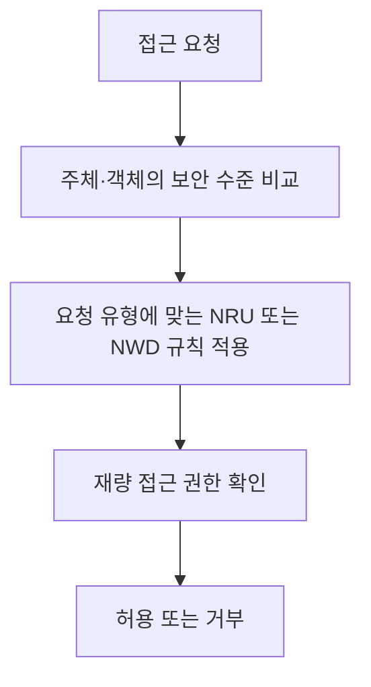

## 30초 인출

- **본질:** Bell–LaPadula(BLP)는 보안 등급을 이용해 정보의 기밀성 흐름을 제한하는 강제적 접근통제 모델이다.
- **메커니즘:** 주체의 보안 수준과 객체의 분류 수준을 비교해 단순 보안 속성(No Read Up)과 스타 속성(No Write Down)을 적용한다. 재량적 접근통제 속성도 함께 정의한다.
- **범위:** BLP의 직접 접근 규칙은 기밀성 흐름을 다루며 무결성이나 은닉 채널까지 자동으로 보장하지 않는다.

핵심 용어

- **단순 보안 속성:** 주체는 자신보다 높은 보안 수준의 객체를 읽을 수 없다(No Read Up).
- **스타(*) 속성:** 주체는 자신보다 낮은 보안 수준의 객체에 쓸 수 없다(No Write Down).
- **재량적 보안 속성:** 접근 행렬 등 재량적 접근통제 규칙에 따라 접근 가능 여부를 제한한다.
- **보안 수준 지배(Dominance):** 분류 등급과 범주·구획을 함께 비교해 주체가 객체보다 같거나 높은 권한을 갖는지 판단하는 관계다.

---
## 1교시 예상문제 (10점)

> Bell–LaPadula 모델의 목적과 단순 보안 속성·스타 속성, 주요 한계를 설명하시오.

---
## 1교시 10점 답안

### 1. 정의·목적

- **정의:** BLP는 주체·객체의 보안 수준을 비교해 정보의 기밀성 흐름을 통제하는 접근통제 모델이다.
- **목적:** 상위 기밀 정보가 낮은 등급으로 직접 유출되는 것을 접근 규칙으로 제한한다.

### 2. 핵심 접근 규칙

| 주체보다 객체의 수준 | 읽기 | 쓰기 |
|---|---|---|
| 높음 | 금지: No Read Up | 허용 가능: Write Up |
| 같음 | 허용 가능 | 허용 가능 |
| 낮음 | 허용 가능: Read Down | 금지: No Write Down |

BLP는 기밀성 중심 모델이므로 무결성 정책과 은닉 채널 분석은 별도로 고려한다.

**제언:** BLP 규칙을 적용할 때 보안 등급·범주와 별도 무결성·은닉 채널 통제를 함께 설계한다.

---
## 2~4교시 예상문제 (25점)

> KPC 제127회 「벨라파듈라(Bell-LaPadula) 모델과 비바(Biba) 모델의 원리 및 규칙 비교」의 기출 주제를 바탕으로, 두 모델의 보안 목표·접근 규칙과 적용 시 한계를 설명하시오. *(25점 예상문제)*

---
## 2~4교시 25점 답안

### Ⅰ. BLP 모델의 목적과 보안 수준

BLP는 보안 수준이 다른 주체와 객체 사이의 정보 흐름을 제한해 기밀성을 보호하는 모델이다. 주체와 객체는 계층 등급과 범주·구획으로 표현될 수 있으며, 지배 관계에 따라 접근을 판단한다.

| 보안 요소 | 의미 |
|---|---|
| 주체 수준 | 주체가 접근할 수 있는 최대 등급·범주 |
| 객체 분류 | 객체의 기밀 등급·범주 |
| 지배 관계 | 등급이 같거나 높고 필요한 범주를 포함하면 지배 |

### Ⅱ. BLP 접근 속성

BLP는 강제적 보안 규칙에 더해 재량적 보안 속성을 둔다. 따라서 주체·객체의 등급 관계만 맞아도 자동 허용되는 것은 아니며, 접근 행렬 등 재량 권한도 확인한다.

| 속성 | 규칙 | 기밀성 목적 |
|---|---|---|
| 단순 보안 속성 | No Read Up | 낮은 등급 주체가 더 높은 객체를 읽지 못하게 함 |
| 스타(*) 속성 | No Write Down | 높은 등급 정보를 낮은 객체에 기록하지 못하게 함 |
| 재량적 보안 속성 | 접근 행렬 등 허용 규칙 확인 | 등급이 허용해도 명시 권한 없는 접근 제한 |

### Ⅲ. 읽기·쓰기 판정

같은 등급이라도 범주·구획이 맞지 않으면 지배 관계가 성립하지 않을 수 있다. 아래 판정은 등급과 필요한 범주를 포함한 지배 관계를 기준으로 한 요약이다.

| 객체 수준과 주체 수준의 관계 | 읽기 요청 | 쓰기 요청 |
|---|---|---|
| 객체가 더 높음 | 거부 (NRU) | 허용 가능 (Write Up) |
| 동일 | 허용 가능 | 허용 가능 |
| 객체가 더 낮음 | 허용 가능 (Read Down) | 거부 (NWD) |

허용 가능은 BLP 강제 규칙이 그 요청을 막지 않는다는 뜻이며, 재량 권한과 시스템 정책도 통과해야 한다.

### Ⅳ. BLP와 Biba 비교 및 한계

BLP는 기밀성, Biba는 무결성에 초점을 둔다. 두 정책의 방향은 서로 반대처럼 보이지만, 각기 다른 보안 목표를 형식화하므로 한 모델이 다른 요구를 대신하지 않는다.

| 항목 | Bell–LaPadula | Biba |
|---|---|---|
| 주된 보안 목표 | 기밀성 | 무결성 |
| 읽기 규칙 | No Read Up | No Read Down |
| 쓰기 규칙 | No Write Down | No Write Up |
| 주된 위험 통제 | 높은 기밀 정보의 하향 유출 제한 | 낮은 무결성 정보의 상위 객체 오염 제한 |

BLP의 직접 접근 규칙은 공유 자원 사용 시간·상태 변화 등 은닉 채널을 모두 다루지 않으며, 가용성과 무결성을 포괄하는 완전한 보안 모델도 아니다.

### Ⅴ. 기술사적 제언

| 문제 | 해결 방안 |
|---|---|
| BLP만으로 기밀성·무결성·가용성 모두 보장한다고 오인 | 보안 목표별 모델과 통제를 함께 적용하고 잔여 위험 평가 |
| 등급 규칙만 확인하고 재량 권한을 빠뜨림 | 강제 등급 관계와 접근 행렬 등 재량 권한을 모두 검사 |
| 직접 읽기·쓰기 통제 밖의 은닉 채널 위험 | 공유 자원·시간·상태 기반 채널을 별도 분석하고 용량 저감 조치 검증 |
| 업무 협업을 위해 고등급 정보를 하향 공개 | 승인된 탈분류·신뢰 주체 절차를 명시하고 범위·근거·감사 기록 통제 |

---
## 출제 이력 및 참고자료

- **기출 이력:** KPC 제127회 「보안 모델 중 벨라파듈라(Bell-LaPadula) 모델과 비바(Biba) 모델의 원리 및 규칙 비교」.
- Bell and LaPadula, [Secure Computer Systems: Mathematical Foundations (1973)](https://apps.dtic.mil/sti/pdfs/AD0770768.pdf) — 기밀성 모델의 형식적 기반.
- Biba, [Integrity Considerations for Secure Computer Systems (1977)](https://www.cerias.purdue.edu/apps/reports_and_papers/view/2834) — 무결성 모델 원문 보고서 정보.
- NIST, [7th DoD/NBS Computer Security Conference Proceedings](https://csrc.nist.gov/CSRC/media/Publications/conference-paper/1984/09/24/7th-dod-nbs-computer-security-conference/documents/1984-7th-conference-proceedings.pdf) — 보안 모델과 은닉 채널 관련 논의.
