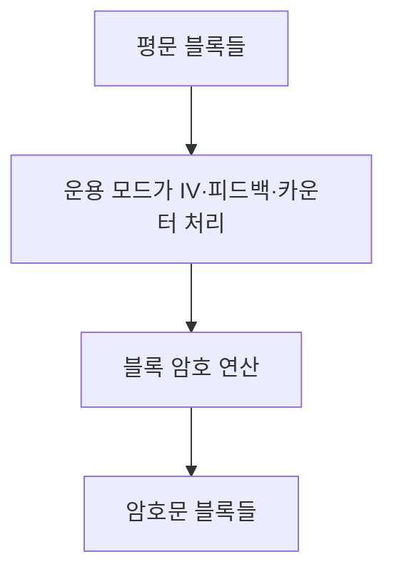
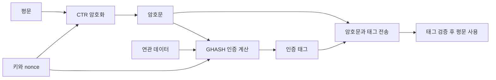

## 30초 인출

- **본질:** 블록 암호 운용 모드는 AES 같은 블록 암호를 여러 블록의 데이터에 적용하는 방법이다.
- **메커니즘:** ECB는 블록을 독립 암호화하고, CBC는 이전 암호문을 다음 입력에 섞으며, CTR은 고유 카운터를 암호화해 평문과 XOR한다. GCM은 CTR 방식 암호화에 인증 태그를 결합한다.
- **주의:** ECB는 반복 패턴을 드러내고, CBC·CTR·GCM은 IV 또는 nonce 조건을 지켜야 한다. 기밀성과 무결성이 함께 필요하면 용도에 맞는 AEAD를 선택한다.

핵심 용어

- **운용 모드:** 블록 암호를 여러 데이터 블록에 적용하는 규칙이다.
- **초기화 벡터(IV):** CBC·CFB·OFB 등의 첫 처리에 쓰이는 값이며, 생성·고유성 조건은 모드별 규격을 따른다.
- **Nonce:** CTR·GCM 등에서 암호 연산에 넣는 값으로, 같은 키 아래 재사용하면 보안이 깨질 수 있다.
- **AEAD:** 평문을 암호화하면서 연관 데이터의 인증도 제공하는 방식이다.
- **인증 태그:** 복호화 데이터나 연관 데이터가 변조되었는지 확인하는 값이다.

---
## 1교시 예상문제 (10점)

> 블록 암호 운용 모드의 정의와 목적을 설명하고, ECB·CBC·CTR 및 GCM의 차이를 서술하시오.

---
## 1교시 10점 답안

### 1. 정의·목적

- **정의:** 블록 암호 운용 모드는 고정 크기 블록 암호를 여러 블록의 데이터에 적용하는 절차다.
- **목적:** 데이터 블록 간 관계와 IV·카운터 처리 방법을 정해 긴 데이터를 암호화하며, GCM 같은 모드는 인증도 제공한다.

### 2. 핵심 방식

| 모드 | 블록 처리 | 핵심 성질 |
|---|---|---|
| ECB | 각 블록 독립 암호화 | 동일 블록의 반복 패턴이 드러날 수 있음 |
| CBC | 이전 암호문과 현재 평문을 결합 | 암호화가 순차적이며 IV 사용 |
| CTR | 카운터 암호문과 평문을 XOR | 카운터 블록을 병렬 처리할 수 있고 재사용 금지 |
| GCM | CTR 암호화와 인증 태그 생성 | 기밀성과 무결성·인증을 함께 제공하는 AEAD |

**제언:** 기밀성만 필요한지 인증도 필요한지 먼저 정하고, 모드의 IV·nonce 조건을 구현과 운영에서 함께 검증한다.

---
## 2~4교시 예상문제 (25점)

> KPC 제127회 기출 주제를 바탕으로, 블록 암호 운용 모드 ECB·CBC·CFB·OFB·CTR의 동작 및 특성을 비교하고 AEAD 모드의 적용 시 고려사항을 설명하시오. *(25점 예상문제)*

---
## 2~4교시 25점 답안

### Ⅰ. 운용 모드의 역할

블록 암호는 정해진 크기의 입력 블록을 변환한다. 운용 모드는 입력 데이터가 여러 블록일 때 블록을 연결하거나 카운터·피드백을 사용해 암호화 방법을 정한다. NIST SP 800-38A는 ECB, CBC, CFB, OFB, CTR을 기밀성 모드로 규정한다.

### Ⅱ. 5개 기밀성 모드의 동작

각 모드는 블록 암호에 입력을 공급하는 방식이 다르다. ECB를 제외한 모드의 IV·카운터 조건은 해당 규격을 따라야 한다.

| 모드 | 블록 간 처리 | 핵심 특성 |
|---|---|---|
| ECB | 각 블록을 독립 처리 | 같은 키에서 같은 평문 블록은 같은 암호문 블록을 만들어 패턴을 노출할 수 있음 |
| CBC | 평문 블록과 직전 암호문을 XOR한 뒤 암호화 | 암호화는 직렬 의존, IV 필요, 블록 정렬을 위한 패딩 사용 가능 |
| CFB | 직전 암호문을 블록 암호에 넣어 생성한 출력과 평문을 결합 | 피드백 방식으로 블록 암호를 스트림 방식처럼 사용 |
| OFB | 블록 암호 출력을 다음 입력으로 피드백하고 평문과 결합 | 키스트림 생성 방식이며 같은 키에서 IV 재사용 금지 |
| CTR | nonce와 카운터를 암호화해 평문과 XOR | 블록 연산 병렬화 가능, 카운터 블록 중복 방지 필요 |

### Ⅲ. 선택에 영향을 주는 기준

운용 모드는 패턴 노출, 병렬 처리, 패딩 여부, 오류 전파 특성에서 차이가 난다. 모드 자체가 변조를 탐지하는지는 별도로 확인해야 한다.

| 기준 | ECB | CBC | CFB·OFB | CTR |
|---|---|---|---|---|
| 반복 패턴 은닉 | 제공하지 않음 | IV 조건을 지킬 때 블록 간 난독화 | IV 조건을 지킬 때 블록 간 난독화 | 고유한 nonce·카운터 조건 필요 |
| 암호화 병렬 처리 | 가능하나 패턴 노출 | 블록 간 직렬 의존 | 피드백 때문에 순차 의존 | 카운터 블록별 병렬 처리 가능 |
| 패딩 | 블록 정렬 필요 | 블록 정렬 필요 | 스트림 방식 처리로 일반적인 블록 패딩 불필요 | 불필요 |
| 변조 인증 | 없음 | 없음 | 없음 | 없음 |

### Ⅳ. AEAD와 GCM

GCM은 CTR 방식의 암호화와 GHASH 기반 인증 태그를 결합한다. 암호화 데이터 외에도 연관 데이터를 인증할 수 있으며, 수신자는 태그를 검증한 뒤 평문을 사용해야 한다. 같은 키에서 nonce를 재사용하면 기밀성·인증 안전성이 손상될 수 있다.

GCM은 강력한 인증 암호화 선택지지만, nonce 관리와 태그 검증이 올바를 때만 의도한 보안 속성을 제공한다. 저장장치에는 XTS-AES가 용도에 맞을 수 있으나, NIST는 XTS가 데이터나 출처 인증을 제공하지 않는다고 명시한다.

| 적용 상황 | 설계 확인 |
|---|---|
| 네트워크·응용 데이터의 기밀성 및 인증 | GCM 등 AEAD 지원 여부와 nonce 고유성 확인 |
| 저장장치의 블록 단위 암호화 | XTS-AES 적용 범위와 별도 무결성 통제 확인 |
| 기존 CBC 데이터 처리 | IV 생성, 패딩 처리, 인증을 암호화와 별도로 보완했는지 확인 |

### Ⅴ. 기술사적 제언

| 문제 | 해결 방안 |
|---|---|
| ECB 사용이나 암호화만 적용해 데이터 패턴·변조 위험이 남음 | 용도에 맞는 AEAD를 우선 검토하고, 불가피한 기밀성 전용 모드는 별도 인증 통제를 적용 |
| GCM nonce 재사용 또는 인증 실패 데이터 사용 | 키별 nonce 고유성 관리와 인증 태그 검증을 강제하고, 검증 전 평문을 사용하지 않도록 구현 |
| 저장장치용 XTS를 데이터 인증까지 제공하는 것으로 오해 | XTS의 인증 부재를 반영해 무결성·출처 확인을 별도 설계 |

---
## 출제 이력 및 참고자료

- **기출 이력:** KPC 제127회 「블록 암호 운용 모드(ECB, CBC, CFB, OFB, CTR)의 특징과 장단점 비교 및 최신 동향」.
- NIST, [SP 800-38A: ECB, CBC, CFB, OFB, CTR](https://csrc.nist.gov/pubs/sp/800/38/a/final).
- NIST, [SP 800-38D: GCM and GMAC](https://csrc.nist.gov/pubs/sp/800/38/d/final).
- NIST, [SP 800-38E: XTS-AES mode](https://csrc.nist.gov/pubs/sp/800/38/e/final).
