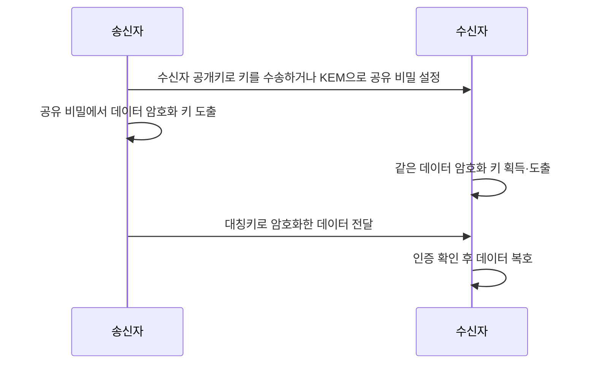
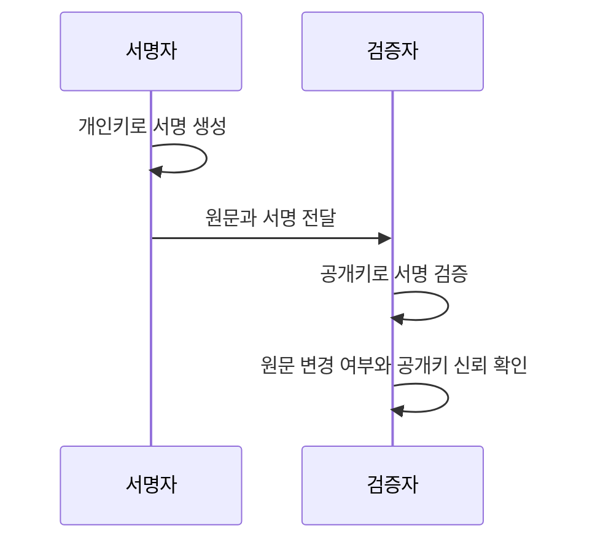

## 30초 인출

- **본질:** 비대칭 암호는 서로 다른 공개키와 개인키를 사용하는 공개키 암호 기법이다.
- **메커니즘:** 공개키로 암호화한 정보는 대응 개인키로 복호화할 수 있고, 서명은 개인키로 생성해 공개키로 검증한다. 키 합의와 서명은 암호화와 서로 다른 기능이다.

핵심 용어

- **공개키**: 키 쌍 중 공개해도 되는 키로, 알고리즘에 따라 암호화·검증 등에 사용한다.
- **개인키**: 대응 공개키와 짝을 이루며 소유자가 비밀로 보호하는 키다.
- **키 합의**: 두 당사자가 공개 채널을 통해 같은 공유 비밀을 도출하는 절차다.
- **전자서명**: 서명자가 개인키로 서명을 생성하고 검증자가 공개키로 진위를 확인하는 암호학적 수단이다.
- **하이브리드 암호**: 공개키 방식으로 대칭키를 설정·전달하고 대칭키로 데이터를 보호하는 구성이다.

---

## 1교시 예상문제 (10점)

> 비대칭키 암호화의 개념과 기밀성·전자서명에서 공개키와 개인키의 사용을 설명하시오. (예상)

---

## 1교시 10점 답안

### 1. 정의·목적

정의: **비대칭 암호**는 수학적으로 연결된 **공개키**와 **개인키**를 서로 다른 목적으로 사용하는 암호 방식이다.
목적: 기밀성, 키 합의, 전자서명 등 공개 채널에서 필요한 보안 기능을 제공한다.

### 2. 키 사용

| 기능 | 생성·처리 키 | 검증·복호 키 | 보안 성질 |
|---|---|---|---|
| 기밀성 암호화 | 수신자의 공개키 | 수신자의 개인키 | 대응 개인키 보유자가 복호 |
| 전자서명 | 서명자의 개인키 | 서명자의 공개키 | 서명 검증과 변경 탐지 |

제안: 공개키의 소유자 확인과 개인키 보호를 암호 알고리즘 선택과 함께 설계한다.

---

## 2~4교시 예상문제 (25점)

> 비대칭키 암호의 구성과 기밀성·전자서명·키 합의 메커니즘을 설명하고, 대칭키 암호와의 연계 및 운영상 유의점을 제시하시오. (예상)

---

## 2~4교시 25점 답안

### Ⅰ. 개요

정의: **비대칭 암호**는 대응 관계를 가진 공개키와 개인키를 사용하는 공개키 암호 기술이다.
목적: 공개 채널에서 기밀성·키 설정·전자서명 기능을 제공한다.

| 구성 | 역할 |
|---|---|
| 공개키 | 공유 가능한 키; 암호화·서명검증 등에 사용 |
| 개인키 | 소유자가 통제하는 키; 복호·서명생성 등에 사용 |
| 신뢰 연결 | 공개키를 특정 사용자·서비스와 연결해 키 위장을 방지 |

### Ⅱ. 기밀성 메커니즘

실제 대용량 데이터 보호에는 대칭 암호를 쓰고, 공개키 암호화 또는 키 캡슐화 방식으로 데이터 키를 설정하는 하이브리드 구성이 일반적이다. 키 합의 방식은 공개키 암호화와 달리 양측이 공유 비밀을 도출하는 절차다.

### Ⅲ. 전자서명 메커니즘

전자서명은 서명 검증과 변경 탐지에 쓰인다. 공개키가 누구의 키인지 확인해야 하며, 서명 검증 자체만으로 법적 부인방지가 모든 맥락에서 자동 성립한다고 단정할 수 없다. NIST FIPS 186-5는 전자서명 알고리즘과 서명 기능을 규정한다.

### Ⅳ. 대칭 방식과의 비교 및 알고리즘 선택

| 비교 항목 | 비대칭 방식 | 대칭 방식 |
|---|---|---|
| 키 관계 | 공개키·개인키 쌍 | 통신 당사자가 공유하는 비밀키 |
| 주요 용도 | 서명, 키 설정, 일부 암호화 | 대량 데이터 암·복호 |
| 키 배포 | 공개키 배포·소유 확인 필요 | 비밀키를 안전하게 공유·갱신해야 함 |
| 성능 설계 | 연산·알고리즘 특성 고려 | 데이터 처리에 적합한 대칭키 사용 |

양자내성 전환 시에는 기능 차이를 구분해야 한다. NIST FIPS 203의 ML-KEM은 공유 비밀을 설정하는 KEM이며, 그 공유 비밀을 대칭키 알고리즘에 사용한다. 이를 일반 데이터의 직접 암호화 알고리즘으로 설명하지 않는다.

### Ⅴ. 기술사적 제언

| 문제 | 해결 방안 |
|---|---|
| 키 유형이 혼재하거나 공개키 신뢰가 검증되지 않으면 암호화·서명 구성의 보안 효과가 약해질 수 있다. | 먼저 자산별 기능(데이터 암호화, 키 합의, 서명)을 분류하고 공개키 신뢰 검증·개인키 보관 책임을 설계 심사 기준으로 확정한 뒤, 암호화·키 합의의 양자내성 전환 영향까지 시험한다. |

## 출제 이력 및 참고자료

- 제132회 1교시 4번은 `대칭 암호화와 비대칭 암호화`를 다룬 기출이다. 본 예상 문항은 공개키 기능과 구성별 차이를 묻도록 재구성했다.
- NIST, *Digital Signature Standard*, FIPS 186-5: https://csrc.nist.gov/pubs/fips/186-5/final
- NIST, *Recommendation for Pair-Wise Key-Establishment Schemes*, SP 800-56A Rev. 3: https://csrc.nist.gov/pubs/sp/800/56/a/r3/final
- NIST, *Module-Lattice-Based Key-Encapsulation Mechanism Standard*, FIPS 203: https://csrc.nist.gov/pubs/fips/203/final

## 연결 토픽

- 대칭키 암호화
- 공개키 기반 구조(PKI)
- 전자서명
- 양자내성암호
