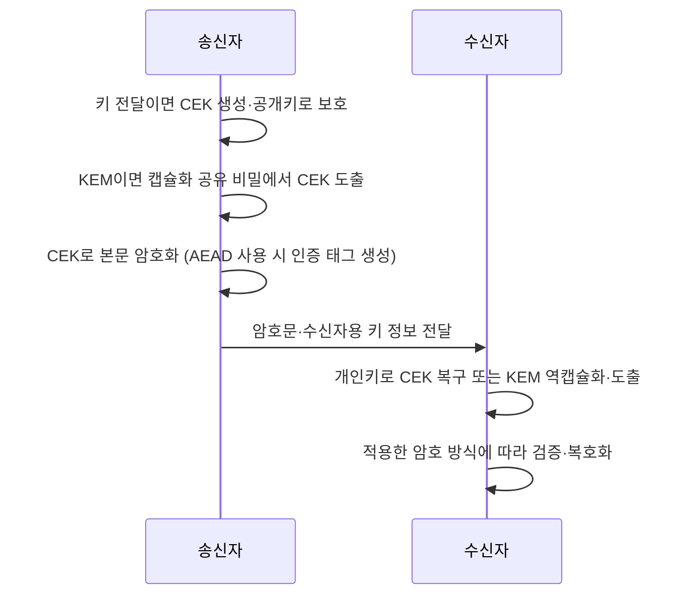

## 30초 인출

- **본질:** 전자봉투는 대칭키로 데이터를 암호화하고 수신자가 얻을 수 있도록 그 키를 공개키 방식으로 설정해 함께 전달하는 하이브리드 구성이다.
- **메커니즘:** 송신자는 암호문과 수신자별 키 설정 정보를 보내고, 수신자는 개인키 암호해독 또는 KEM 공유 비밀에서 키를 도출해 본문을 복호화한다.

핵심 용어

- **전자봉투**: 암호화된 데이터와 수신자용 데이터 암호키 설정 정보를 함께 전달하는 하이브리드 암호 구성이다.
- **CEK(Content-Encryption Key)**: 메시지 내용의 암호화에 쓰는 대칭키다.
- **키 캡슐화(KEM)**: 공개 채널에서 공유 비밀을 설정하기 위한 캡슐화·역캡슐화 알고리즘이다.
- **전자서명**: 발신자 공개키로 서명 검증과 변경 탐지를 제공하는 별도 기능이다.

---

## 1교시 예상문제 (10점)

> 전자봉투의 생성 절차와 개봉 절차를 설명하시오. (예상)

---

## 1교시 10점 답안

### 1. 정의·목적

정의: **전자봉투**는 본문을 대칭키로 암호화하고 수신자에게 필요한 키 설정 정보를 함께 보내는 하이브리드 암호 구성이다.
목적: 대량 데이터의 대칭 암호 효율을 이용하면서 수신자별로 키를 전달·설정한다.

### 2. 생성과 개봉

| 단계 | 처리 |
|---|---|
| 생성 | 키 전달 방식은 CEK를 생성해 수신자 공개키로 보호; KEM 방식은 캡슐화로 공유 비밀을 만든 뒤 CEK를 도출 → CEK로 본문 암호화 → 암호문과 수신자용 키 정보 전달 |
| 개봉 | 개인키로 보호된 CEK를 복구하거나 KEM 공유 비밀에서 동일한 CEK를 도출 → 적용한 암호 방식에 따라 본문 검증·복호화 |

제안: 수신자 공개키의 신뢰와 개인키 보호를 전자봉투 구성의 필수 운영 항목으로 둔다.

---

## 2~4교시 예상문제 (25점)

> 전자봉투의 생성·개봉 메커니즘과 전자서명과의 차이를 설명하고, 안전한 키 관리 및 양자내성 전환 시 고려사항을 제시하시오. (예상)

---

## 2~4교시 25점 답안

### Ⅰ. 개요

정의: **전자봉투**는 본문 암호문과 수신자가 복구할 수 있는 데이터 암호키 정보를 한 메시지로 구성하는 하이브리드 방식이다.
목적: 대칭키의 처리 효율과 공개키 기반 키 설정을 함께 활용해 기밀성을 제공한다.

| 구성 | 기능 |
|---|---|
| 본문 암호문 | 대칭키로 보호한 데이터 |
| 수신자별 키 정보 | CEK를 복구·설정할 수 있는 정보 |
| 알고리즘·메타데이터 | 복호화에 필요한 매개변수·식별정보 |

### Ⅱ. 생성과 개봉

IETF CMS Enveloped-Data는 내용 암호화키를 생성하고 수신자별 키 관리 정보를 암호문과 함께 전달하는 구조를 정의한다. 수신자 수에 따라 같은 암호문에 복수의 수신자용 키 정보를 둘 수 있다.

### Ⅲ. 암호화 방식과 키 설정

| 키 설정 방식 | 수신 절차 | 유의점 |
|---|---|---|
| 공개키 기반 키 전달 | 수신자 개인키로 전달된 CEK를 복구 | 공개키 신뢰·개인키 보관 필요 |
| 키 합의 | 양측 계산으로 공유 비밀을 도출하고 CEK 파생 | 상호 인증·키 파생·프로토콜 문맥 필요 |
| KEM | 수신자 공개키로 캡슐화하고 개인키로 역캡슐화해 공유 비밀 설정 | KEM은 데이터 암호화 자체가 아니라 키 설정 기능 |

NIST FIPS 203의 ML-KEM은 KEM 표준이다. 이를 전자봉투에 적용할 때에는 해당 KEM에서 설정한 공유 비밀과 별도의 대칭 암호 구성·프로토콜을 함께 설계한다.

### Ⅳ. 보안 성질과 운영 위험

| 성질·위험 | 설명 |
|---|---|
| 기밀성 | 적절한 암호·키 관리 시 수신자가 본문을 복호화 |
| 발신자 인증 | 봉투만으로 발신자의 신원을 보장하지 않음 |
| 무결성 | 선택한 본문 암호 방식의 변조 검출 특성과 프로토콜을 확인 |
| 키 손실·유출 | 개인키 분실은 기존 봉투 개봉을 막고, 유출은 보호자료 노출로 이어질 수 있음 |

전자서명은 발신자 확인과 변경 탐지에 쓰이며 전자봉투의 기밀성과 목적이 다르다. 서명과 암호화를 조합할 때 적용 표준의 처리순서와 검증 규칙을 따른다.

### Ⅴ. 기술사적 제언

| 문제 | 해결 방안 |
|---|---|
| 장기간 보존되는 전자봉투는 키 설정 알고리즘 변경 때 과거 데이터 복호 가능성과 신규 암호방식을 함께 다뤄야 한다. | 먼저 보존기간이 긴 중요 자료의 알고리즘·수신자키 의존성을 목록화하고, 표준 KEM·대칭암호를 이용한 상호운용 시험과 키 복구 시나리오를 완료한 뒤 전환 범위를 확대한다. |

## 출제 이력 및 참고자료

- 제133회 1교시 4번은 전자봉투 생성·개봉 절차를 다룬 기출이다. 본 예상 문항은 키 설정·전자서명 구분까지 포함하도록 확장했다.
- IETF, *Cryptographic Message Syntax (CMS)*, RFC 5652: https://www.rfc-editor.org/rfc/rfc5652
- NIST, *Module-Lattice-Based Key-Encapsulation Mechanism Standard*, FIPS 203: https://csrc.nist.gov/pubs/fips/203/final

## 연결 토픽

- 비대칭키 암호화
- 전자서명
- 키 캡슐화(KEM)
