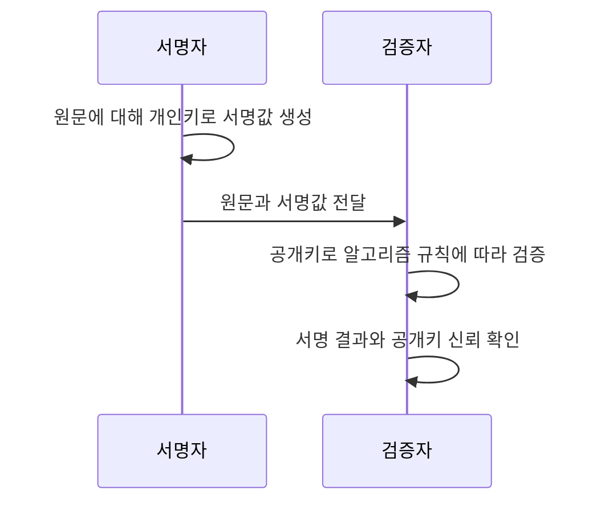

## 30초 인출

- **본질:** 전자서명은 서명자의 개인키로 생성하고 대응 공개키로 검증하는 데이터 인증 수단이다.
- **메커니즘:** 검증자는 서명이 해당 데이터와 일치하는지 확인하며, 공개키가 실제 서명자에게 속하는지도 신뢰 체계로 확인한다.

핵심 용어

- **전자서명**: 전자 데이터의 서명자와 변경 여부를 검증하기 위해 비대칭키 서명 알고리즘으로 생성하는 값이다.
- **서명자 개인키**: 전자서명을 생성하는 서명자 통제 키다.
- **서명자 공개키**: 서명을 검증하며 신뢰할 수 있는 신원과 연결해야 하는 공개 키다.
- **메시지 다이제스트**: 해시 알고리즘이 원문에서 계산한 고정 길이 요약값이다.
- **부인방지**: 서명과 키 관리·신원확인·법적 절차를 바탕으로 서명 행위에 대한 부인을 다루는 보안·법적 특성이다.

---

## 1교시 예상문제 (10점)

> 전자서명의 생성·검증 원리와 주요 보안 성질을 설명하시오. (예상)

---

## 1교시 10점 답안

### 1. 정의·목적

정의: **전자서명**은 **서명자 개인키**로 데이터에 대해 생성하고 **공개키**로 검증하는 암호학적 값이다.
목적: 서명자 공개키의 신뢰가 확인된 조건에서 데이터 변경과 서명자 키의 관계를 확인한다.

### 2. 생성과 검증

| 단계 | 동작 |
|---|---|
| 생성 | 서명 알고리즘으로 원문에 대한 서명값을 개인키로 생성 |
| 전달 | 원문과 전자서명을 수신자에게 전달 |
| 검증 | 신뢰된 공개키로 서명값과 원문이 일치하는지 확인 |

제안: 서명 검증과 공개키 신뢰 확인을 별도 단계로 구현하고 개인키 접근을 통제한다.

---

## 2~4교시 예상문제 (25점)

> 전자서명의 생성·검증 메커니즘과 보안 성질을 설명하고, RSA·DSA 계열 및 포스트양자 전환 시 유의사항을 제시하시오. (예상)

---

## 2~4교시 25점 답안

### Ⅰ. 개요와 보안 성질

정의: **전자서명**은 개인키로 데이터에 대해 생성하고 대응 공개키로 진위를 검증하는 암호학적 기법이다.
목적: 서명자의 공개키 신뢰를 전제로 데이터 변경 여부와 서명 키의 관계를 검증한다.

| 성질 | 의미 | 한계 |
|---|---|---|
| 변경 탐지 | 원문 변경 시 서명 검증에 실패 | 데이터 기밀성을 제공하지 않음 |
| 서명자 키 확인 | 대응 공개키로 만든 서명인지 확인 | 공개키와 실제 신원의 연결은 별도 확인 |
| 부인 관련 증거 | 서명·키관리·신뢰 절차를 통해 판단자료 제공 | 모든 상황에서 법적 부인방지를 자동 보장하지 않음 |

### Ⅱ. 서명 생성·검증

전자서명은 개인키로 원문을 암호화한 값과 같지 않다. 표준 서명 알고리즘이 원문 또는 해시를 입력으로 서명값을 만들고 검증 결과를 반환한다.

### Ⅲ. 키·신뢰 관리

| 관리 대상 | 통제 |
|---|---|
| 서명 개인키 | 생성·보관·사용 권한 제한, 유출·폐기 절차 |
| 공개키·인증서 | 서명자와의 연결, 유효기간·폐기상태 확인 |
| 서명 정책 | 알고리즘·용도·검증시점·증거 보존 기준 정의 |

공개키가 서명자에게 속한다는 보증은 인증서 등 신뢰체계로 확인한다. 서명 검증 성공만으로 실명의 서명이나 법적 효력을 자동 확정하지 않는다.

### Ⅳ. 알고리즘 계열과 전환

| 계열 | 용도·상태 |
|---|---|
| RSA 서명 | FIPS 186-5에서 서명 생성·검증 알고리즘으로 규정 |
| ECDSA·EdDSA | FIPS 186-5의 타원곡선 기반 서명 알고리즘 |
| DSA | FIPS 186-5에서는 기존 서명의 검증 목적만 유지 |
| ML-DSA·SLH-DSA | NIST의 포스트양자 전자서명 표준(FIPS 204·205) |

알고리즘 전환은 서명 생성뿐 아니라 검증기·인증서·장기검증 자료·상호운용성까지 확인한다. 실무 적용 전 최신 표준과 정정사항을 확인한다.

### Ⅴ. 기술사적 제언

| 문제 | 해결 방안 |
|---|---|
| 코드·문서 서명 체계가 장기 운영되면 개인키 유출과 알고리즘 전환이 함께 서비스 신뢰에 영향을 준다. | 먼저 배포·업데이트처럼 서명 위조 시 다수 시스템에 영향이 번지는 키부터 소유자·사용처·검증기를 식별하고, 키 보호와 새 알고리즘 검증을 병행한 교체 순서를 정한다. |

## 출제 이력 및 참고자료

- 제126회 4교시 5번은 RSA와 DSA 비교를 묻는 기출이다. 본 예상 문항은 서명 원리와 현재 표준 상태도 함께 설명하도록 확장했다.
- NIST, *Digital Signature Standard*, FIPS 186-5: https://csrc.nist.gov/pubs/fips/186-5/final
- NIST, *Module-Lattice-Based Digital Signature Standard*, FIPS 204: https://csrc.nist.gov/pubs/fips/204/final
- NIST, *Stateless Hash-Based Digital Signature Standard*, FIPS 205: https://csrc.nist.gov/pubs/fips/205/final

## 연결 토픽

- 비대칭키 암호화
- 전자봉투
- 공개키 기반 구조(PKI)
