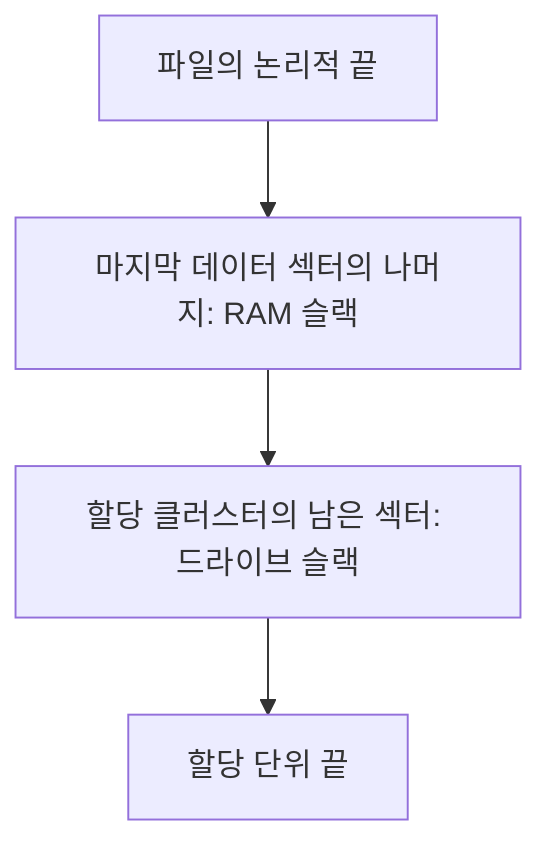

## 30초 인출

- **본질:** 파일슬랙은 파일의 논리적 끝과 그 파일에 할당된 마지막 저장 단위의 끝 사이에 남는 공간이다.
- **메커니즘:** 섹터와 클러스터 같은 저장 단위가 파일 길이와 맞지 않아 생긴다. 운영체제·파일시스템에 따라 내용이 0으로 채워지거나 잔존 바이트가 남을 수 있다.
- **포렌식 의미:** 잔존 데이터가 있을 수 있지만 삭제된 파일 전체가 복원된다는 뜻은 아니다. 할당영역·비할당영역 등 다른 증거와 함께 해석한다.

핵심 용어

- **파일슬랙:** 파일의 논리적 끝과 파일에 할당된 마지막 저장 단위의 끝 사이의 미사용 공간이다.
- **RAM 슬랙:** 전통적인 구분에서 파일의 끝부터 파일 데이터가 놓인 마지막 섹터의 끝까지 남은 부분이다.
- **드라이브 슬랙:** 전통적인 구분에서 마지막 데이터 섹터의 끝부터 파일에 할당된 클러스터 끝까지의 부분이다.
- **비할당 공간:** 파일시스템이 현재 파일에 할당하지 않은 영역이며, 파일슬랙과 구분한다.

---
## 1교시 예상문제 (10점)

> 파일슬랙의 발생 원리와 RAM 슬랙·드라이브 슬랙의 차이, 포렌식상 의미를 설명하시오. *(예상문제)*

---
## 1교시 10점 답안

### 1. 정의·목적

- **정의:** 파일슬랙은 파일 데이터의 논리적 끝과 할당된 마지막 저장 단위의 끝 사이에 있는 미사용 공간이다.
- **목적:** 파일시스템이 사용하지 않는 영역의 잔존 바이트를 조사해 파일·매체 상태를 분석하는 데 활용한다.

### 2. 구성과 발생

| 구분 | 위치 | 분석상 유의점 |
|---|---|---|
| RAM 슬랙 | 파일 끝부터 마지막 데이터 섹터 끝까지 | 패딩·잔존 여부는 시스템 동작에 따라 다름 |
| 드라이브 슬랙 | 마지막 데이터 섹터 끝부터 할당 클러스터 끝까지 | 이전 데이터가 남을 수 있으나 항상 잔존하는 것은 아님 |

**제언:** 파일슬랙에서 찾은 바이트는 원본 증거와 파일시스템 메타데이터를 대조해 잔존·복원 근거를 구분한다.

---
## 2~4교시 예상문제 (25점)

> 파일슬랙의 발생 구조와 유형을 설명하고, 디지털 포렌식 수집·분석 과정에서의 활용과 증거 해석 시 유의사항을 제시하시오. *(25점 예상문제)*

---
## 2~4교시 25점 답안

### Ⅰ. 파일슬랙의 정의와 범위

NIST는 파일슬랙을 파일의 논리적 끝과 마지막 저장 단위의 끝 사이의 데이터로 정의하며, 일부 경우 삭제 파일의 잔존 데이터가 포함될 수 있다고 설명한다. 파일슬랙은 비할당 공간이나 파티션 끝의 여유영역과 다른 분석 대상이다.

| 공간 | 기준 | 구분 |
|---|---|---|
| 파일슬랙 | 파일 논리 끝과 마지막 할당 단위 끝 | 특정 파일의 마지막 할당 단위에 속함 |
| 비할당 공간 | 파일시스템의 현재 파일 할당 여부 | 현재 파일이 차지하지 않는 영역 |
| 볼륨 끝 여유영역 | 파티션·볼륨 경계 | 파일의 마지막 할당 단위와 무관할 수 있음 |

### Ⅱ. 마지막 저장 단위에서의 구조

파일 길이가 섹터 경계와 맞지 않으면 마지막 섹터에 파일 데이터와 RAM 슬랙이 함께 존재할 수 있다. 그 뒤 같은 할당 클러스터의 남은 부분은 드라이브 슬랙으로 구분한다. 섹터·클러스터 크기와 슬랙 초기화 동작은 매체·파일시스템·운영체제에 따라 달라질 수 있다.

### Ⅲ. 수집·보존 절차

포렌식 분석은 조사 권한과 사건 목적을 확인한 뒤 데이터 출처와 획득방법을 정한다. 원본 변경을 줄이고, 획득한 데이터의 무결성·취급 이력을 기록한다.

| 단계 | 주요 활동 |
|---|---|
| 준비 | 매체·파일시스템·사건범위와 법적 권한 확인 |
| 획득 | 적절한 이미징·수집방법으로 원본 데이터 보존 |
| 검증 | 수집물 식별, 해시·획득도구·설정 기록 |
| 분석 | 승인된 사본에서 파일 메타데이터·할당·슬랙 영역 확인 |
| 보고 | 바이트 위치·도구·분석조건·한계·해석근거 기록 |

### Ⅳ. 분석 결과 해석

파일슬랙의 내용만으로 과거 파일의 존재·작성자·시점을 단정하지 않는다. 잔존 데이터는 덮어쓰기·초기화·파일시스템 처리에 따라 없거나 불완전할 수 있다.

| 관찰 결과 | 해석 원칙 |
|---|---|
| 사람이 읽을 수 있는 문자열 발견 | 주변 바이트·출처·파일 형식과 함께 확인 |
| 기존 파일 조각처럼 보이는 데이터 | 관련 메타데이터·타임라인·다른 아티팩트로 교차검증 |
| 내용이 없거나 0으로 채워짐 | 데이터가 원래 없었는지, 초기화·덮어쓰기가 있었는지 구분 어려움 |
| 복구된 조각 | 전체 파일·실제 사용내용으로 오인하지 않도록 복구 범위 표시 |

### Ⅴ. 기술사적 제언

| 문제 | 해결 방안 |
|---|---|
| 파일시스템·운영체제에 따른 슬랙 처리 차이 때문에 잔존 바이트의 의미를 잘못 일반화할 수 있다. | 파일시스템·환경별 검증 시험자료를 우선 마련하고, 그 조건에서 확인된 동작만 해석 근거로 사용하며 미검증 환경은 보고서에 한계로 남긴다. |

---
## 출제 이력 및 참고자료

- NIST, [File Slack glossary](https://www.nist.gov/glossary-term/38421).
- NIST, [SP 800-86: Guide to Integrating Forensic Techniques into Incident Response](https://csrc.nist.gov/pubs/sp/800/86/final).
