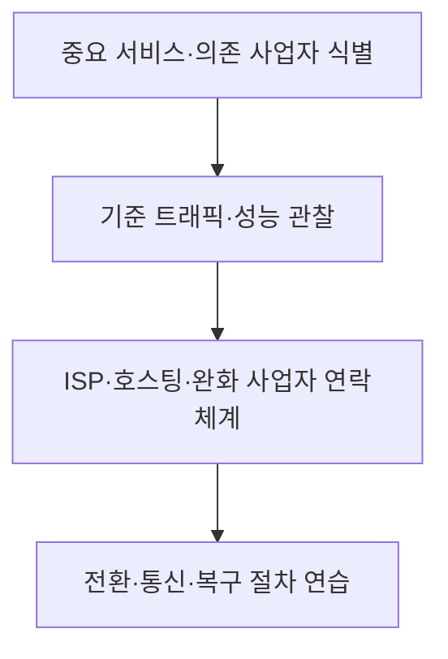

## 30초 인출

- **본질:** DDoS는 다수의 출발점에서 트래픽이나 요청을 보내 서비스의 가용성을 떨어뜨리는 분산 서비스 거부 공격이다.
- **메커니즘:** 공격은 회선·프로토콜 처리·애플리케이션 자원을 겨냥할 수 있으므로, 영향을 받는 계층을 먼저 찾아 해당 사업자와 협력해 완화한다.

핵심 용어

- **DDoS**: 여러 시스템에서 발생한 공격 트래픽으로 대상 서비스의 정상 제공을 방해하는 공격이다.
- **반사·증폭 공격**: 공격자가 제3자 서버를 이용해 피해자에게 응답 트래픽을 보내도록 유도해 트래픽 영향을 키우는 유형이다.
- **스크러빙**: 공격 트래픽과 정상 트래픽을 구분해 공격을 줄이고 필요한 트래픽을 전달하는 완화 서비스다.
- **RTBH(Remotely Triggered Black Hole)**: 특정 목적지로 향하는 트래픽을 라우팅 차원에서 폐기하도록 하는 조치다. 공격 완화에는 쓰일 수 있지만 해당 목적지의 정상 트래픽도 차단할 수 있다.

---

## 1교시 예상문제 (10점)

> DDoS 공격의 개념과 주요 유형, 대응방안을 설명하시오. (예상)

---

## 1교시 10점 답안

### 1. 정의·목적

정의: DDoS는 다수의 시스템에서 트래픽이나 요청을 보내 대상 서비스의 가용성을 저해하는 공격이다.
목적: 회선, 네트워크 처리, 애플리케이션 자원을 소진시켜 정상 사용자의 서비스 이용을 방해한다.

### 2. 유형과 대응

| 유형 | 주로 압박하는 자원 | 대응 방향 |
|---|---|---|
| 대역폭형 | 회선 용량 | ISP·전문 완화 사업자와 상류 정화 협력 |
| 프로토콜형 | 네트워크·연결 처리 | 공격 특성에 맞는 네트워크 필터링·용량 보호 |
| 애플리케이션형 | 웹·응용 처리 자원 | 요청 분석, 서비스별 제한·캐시 등 적용 |

제안: 공격 유형별 연락처와 완화 전환 기준을 사전에 정해 발생 시 바로 적용한다.

---

## 2~4교시 예상문제 (25점)

> DDoS 공격 유형별 원리와 영향, 예방·실시간 완화·복구 및 운영상 대응방안을 설명하시오. (예상)

---

## 2~4교시 25점 답안

### Ⅰ. 개요

정의: 분산 서비스 거부 공격은 다수의 출발점에서 트래픽이나 요청을 보내 대상 서비스의 가용성을 떨어뜨리는 공격이다.
목적: 정상 사용자가 서비스를 이용하지 못하게 하거나 성능을 저하시킨다.

| 자원 계층 | 공격이 겨냥하는 대상 |
|---|---|
| 네트워크 용량 | 인터넷 회선·패킷 전달 능력 |
| 프로토콜 처리 | 연결·세션 상태 등 장비 자원 |
| 애플리케이션 | 웹·응용 기능의 요청 처리 능력 |

### Ⅱ. 공격 유형과 영향

| 유형 | 작동 방식 | 서비스 영향 |
|---|---|---|
| 대역폭형 | 다량의 트래픽을 보내 회선·경로 용량을 압박 | 정상 트래픽 전달 지연·실패 |
| 프로토콜형 | 프로토콜 처리나 연결 상태 자원을 압박 | 신규 연결·패킷 처리가 어려워짐 |
| 애플리케이션형 | 서비스 기능에 요청을 집중 | 특정 기능·응용 서버의 응답 저하 |
| 반사·증폭 | 제3자 시스템이 피해자에게 응답하도록 유도 | 출발지 은폐와 트래픽 영향 확대 가능 |

공격 유형이 겹칠 수 있으므로 트래픽 양만으로 공격을 단정하지 않고, 대상 자원·요청 특성·서비스 상태를 함께 확인한다.

### Ⅲ. 예방과 준비

사전 준비에는 보호 대상과 의존 서비스를 정리하고, ISP·호스팅·보안 사업자와 연락·요청 절차를 맞추는 일이 포함된다. 네트워크 사업자는 출발지 주소 위조 방지 등 자기 네트워크의 통제도 적용한다. NIST SP 800-189는 주소 위조 방지와 라우팅 차원의 완화 기법을 다룬다.

### Ⅳ. 탐지·완화·복구

완화 방법은 공격 경로와 서비스 영향에 따라 다르다. 상류 정화·스크러빙은 용량형 공격에, 서비스별 제한 등은 애플리케이션 공격에 검토할 수 있다. RTBH는 공격 목적지의 트래픽을 폐기해 다른 네트워크를 보호하는 수단이지만 해당 서비스도 이용 불가하게 할 수 있으므로 영향과 적용 주체를 따져야 한다.

### Ⅴ. 기술사적 제언

| 문제 | 해결 방안 |
|---|---|
| 사업자 연락과 기술 전환을 장애 중 처음 조율하면 완화까지 늦어질 수 있다. | 핵심 서비스별로 상류 정화·스크러빙·RTBH 적용 권한과 서비스 영향도를 비교하고, 허용 가능한 중단 수준에 따라 우선 전환 수단과 승인자를 사전 결정한다. |

## 출제 이력 및 참고자료

- 본 문항은 주제에 맞춰 구성한 예상 문제이며, 특정 기출 문구를 인용하지 않았다.
- NIST, *Resilient Interdomain Traffic Exchange: BGP Security and DDoS Mitigation*, SP 800-189: https://csrc.nist.gov/pubs/sp/800/189/final
- CISA, FBI, MS-ISAC, *Understanding and Responding to Distributed Denial-of-Service Attacks*: https://www.cisa.gov/resources-tools/resources/understanding-and-responding-distributed-denial-service-attacks

## 연결 토픽

- 침해사고 대응
- 네트워크 보안
- 가용성·업무연속성
