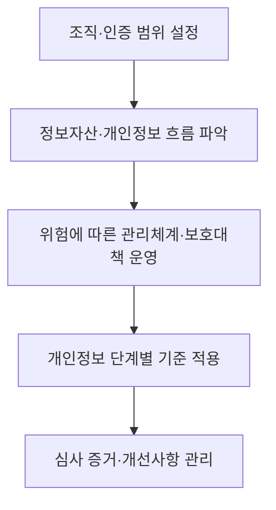

## 30초 인출

- **본질:** PIMS는 개인정보 처리 위험을 조직의 관리체계로 통제하는 개념이자 과거 국내 인증제도의 명칭이다.
- **메커니즘:** 현재 국내 인증은 ISMS-P로 통합되어 관리체계 운영, 정보보호 대책, 개인정보 처리단계 보호를 함께 심사한다.

핵심 용어

- **PIMS(Personal Information Management System)**: 개인정보 보호를 위해 조직이 정책·위험·처리단계별 보호조치를 관리하는 체계다. 국내 PIMS 인증제도는 ISMS-P로 통합됐다.
- **ISMS-P**: 정보보호와 개인정보보호 관리체계가 인증기준에 적합한지 확인하는 국내 인증제도다.
- **개인정보 처리단계 요구사항**: 개인정보의 수집, 보유·이용, 제공, 파기 및 정보주체 권리 보호를 다루는 인증 기준이다.

---

## 1교시 예상문제 (10점)

> PIMS의 개념과 관리영역을 설명하고 현행 ISMS-P와의 관계를 설명하시오. (예상)

---

## 1교시 10점 답안

### 1. 정의·목적

정의: PIMS는 조직의 개인정보 처리 위험을 관리하고 보호조치를 운영하는 개인정보 관리체계다.
목적: 개인정보 처리 전 과정에서 정보주체의 권리와 개인정보를 보호한다.

### 2. 관리영역과 현행 제도

| 관리영역 | 핵심 내용 |
|---|---|
| 관리체계 운영 | 정책·위험관리·점검·개선 |
| 보호대책 | 인적·물리·기술적 보호조치 |
| 개인정보 처리단계 | 수집·보유 및 이용·제공·파기·권리보호 |

국내 PIMS 인증제도는 ISMS와 통합되어 현재 ISMS-P 기준에 반영되어 있다.

제안: 인증 여부와 무관하게 실제 개인정보 처리 흐름을 ISMS-P 관리체계와 연결해 점검한다.

---

## 2~4교시 예상문제 (25점)

> PIMS의 관리영역과 개인정보 처리단계별 통제를 설명하고 ISMS-P 통합 이후 운영 시 유의사항을 제시하시오. (예상)

---

## 2~4교시 25점 답안

### Ⅰ. 개요

정의: 개인정보 관리체계(PIMS)는 개인정보 처리 위험을 파악하고 보호조치를 조직적으로 운영·개선하는 체계다.
목적: 개인정보 처리의 책임과 보호 활동을 조직의 업무에 정착시킨다.

| 구분 | 의미 |
|---|---|
| PIMS | 개인정보 보호 관리체계를 가리키며 국내 과거 인증제도의 명칭 |
| ISMS-P | 정보보호와 개인정보보호를 통합한 현행 국내 인증제도 |

### Ⅱ. 관리체계 구성

현행 ISMS-P 인증기준은 관리체계 수립·운영, 보호대책 요구사항, 개인정보 처리단계 요구사항으로 구성된다. KISA가 게시한 기준은 각각 16개, 64개, 21개 항목이다.

### Ⅲ. 개인정보 처리단계 통제

| 처리 단계 | 통제 초점 |
|---|---|
| 수집 | 수집 목적·항목과 고지·동의 등 근거 확인 |
| 보유·이용 | 접근·이용 범위와 보유 필요성 관리 |
| 제공 | 제공 근거와 수신자·목적 관리 |
| 파기 | 보유 필요가 끝난 정보의 파기 관리 |
| 권리보호 | 정보주체 요청을 처리하고 이력을 관리 |

인증기준은 개인정보의 흐름을 따라 보호 요구사항을 제시한다. 세부 법적 요건과 기간은 적용되는 법령·고시의 현행 원문으로 별도 확인한다.

### Ⅳ. 통합 인증 운영

통합 인증은 중복 점검을 줄일 수 있지만, 정보보호 통제만으로 개인정보 처리단계 요구사항이 자동 충족되는 것은 아니다. 인증 범위와 실제 처리 업무, 위탁·제공 흐름, 정보주체 권리 처리까지 함께 확인한다.

### Ⅴ. 기술사적 제언

| 문제 | 해결 방안 |
|---|---|
| 인증 준비에서 모든 통제항목을 같은 깊이로 점검하면 처리 업무 변경에 따른 개인정보 위험을 먼저 찾지 못할 수 있다. | 신규 수집·제공·위탁처럼 처리 흐름을 바꾸는 변경을 우선 심사 대상으로 삼고, 변경 승인 시 ISMS-P 처리단계 요구사항과 영향받는 업무 소유자를 함께 확인한다. |

## 출제 이력 및 참고자료

- 본 문항은 주제에 맞춰 구성한 예상 문제이며, 특정 기출 문구를 인용하지 않았다.
- KISA ISMS-P 인증기준: https://isms.kisa.or.kr/sysm/intro/selectSysmCertDetail.do
- KISA, ISMS-P 인증제도 연혁 자료: https://isms.kisa.or.kr/board/file/bbs_0000000000000014/14/FILE_000000000000750/202107141700113011901763919.pdf

## 연결 토픽

- 개인정보보호 관리체계 인증(ISMS-P)
- 개인정보 생애주기 관리
- 정보보호 관리체계(ISMS)
