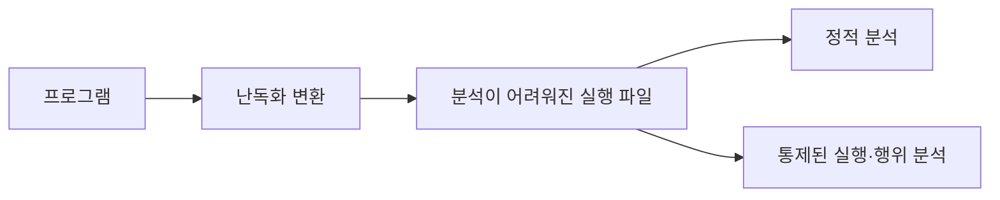
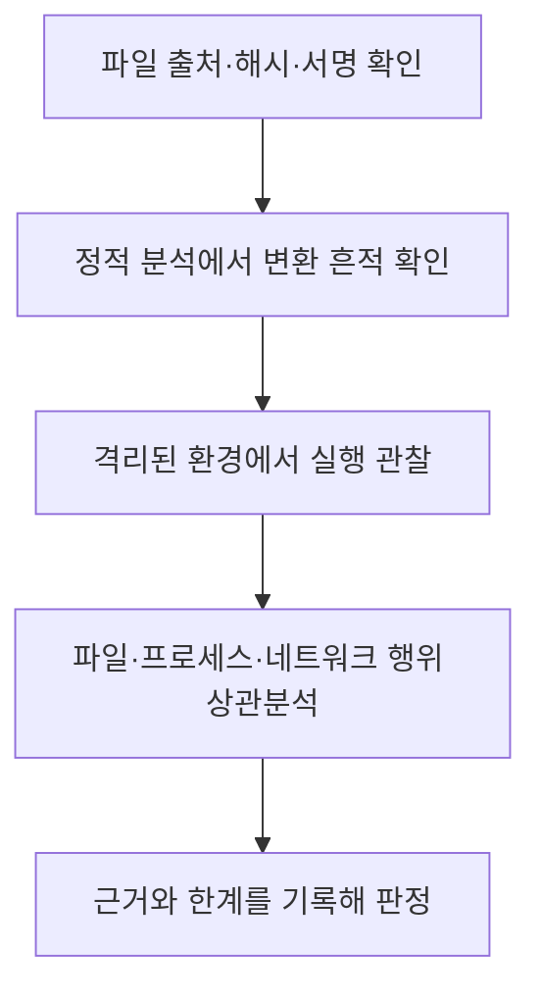

## 30초 인출

- **본질:** 코드 난독화는 프로그램을 읽거나 분석하기 어렵게 바꾸는 변환이다.
- **메커니즘:** 정당한 앱에서는 역공학을 지연하는 보호 수단으로 쓰이고, 악성코드에서는 정적 분석·탐지를 어렵게 할 수 있어 행위 분석과 함께 판단한다.

핵심 용어

- **코드 난독화**: 프로그램의 이해·분석을 어렵게 하도록 코드나 실행 파일을 변환하는 기법이다.
- **제어 흐름 변환**: 프로그램의 분기·반복 구조를 바꾸어 실행 경로의 분석을 어렵게 하는 난독화다.
- **역난독화**: 변환된 코드의 구조와 동작을 분석해 이해 가능한 형태로 복원하려는 작업이다.

---

## 1교시 예상문제 (10점)

> 코드 난독화의 개념과 주요 기법, 보안상 유의점을 설명하시오. (예상)

---

## 1교시 10점 답안

### 1. 정의·목적

정의: 코드 난독화는 프로그램의 구조와 의미를 분석하기 어렵게 바꾸는 소프트웨어 변환 기법이다.
목적: 정당한 사용에서는 역공학을 지연하는 데 활용되며, 악성코드에서는 분석 회피에 악용될 수 있다.

### 2. 기법과 분석

| 기법 | 분석에 미치는 영향 |
|---|---|
| 식별자·문자열 변환 | 의미 있는 이름이나 문자열을 바로 알아보기 어렵게 함 |
| 제어 흐름 변환 | 분기·호출 관계의 추적을 어렵게 함 |
| 패킹·실행 중 복호화 | 정적 파일만으로 실행 내용을 파악하기 어렵게 함 |

제안: 난독화만으로 악성 여부를 결론 내리지 말고 실행 행위와 파일 출처를 함께 분석한다.

---

## 2~4교시 예상문제 (25점)

> 코드 난독화의 원리와 주요 유형을 설명하고 정당한 활용 및 악용에 대한 분석·대응방안을 제시하시오. (예상)

---

## 2~4교시 25점 답안

### Ⅰ. 개요

정의: 코드 난독화는 프로그램의 기능을 유지하려는 목적 아래 코드 구조를 변형해 분석을 어렵게 하는 기법이다. 실제 변환 결과가 모든 환경에서 의미를 완전히 보존하는지는 시험으로 확인해야 한다.
목적: 역공학을 늦추는 보호와 악성 행위의 분석 회피 모두에 사용될 수 있다.

### Ⅱ. 주요 변환 유형

| 유형 | 변환 예 | 주로 어려워지는 분석 |
|---|---|---|
| 레이아웃·이름 | 변수·함수 이름 변경, 디버그 정보 제거 | 코드 목적 파악 |
| 데이터 | 문자열 인코딩·런타임 복호화, 자료 표현 변경 | 설정·상수 추적 |
| 제어 흐름 | 분기·상태 구조 변형 | 호출·실행 경로 추적 |
| 패킹 | 실행 중 코드 복원 | 정적 파일 분석 |

### Ⅲ. 보안상 양면성

| 맥락 | 기대 또는 악용 목적 | 분석 관점 |
|---|---|---|
| 정당한 소프트웨어 보호 | 구현 세부·지식재산 역공학을 지연 | 배포 출처와 정상 기능, 무결성 확인 |
| 악성 코드 | 분석·탐지 회피, 설정·페이로드 은닉 | 실행 행위, 네트워크·파일·프로세스 변화 확인 |

난독화 자체는 악성 행위의 증거가 아니다. 출처·서명·실행 행위·주변 파일과 함께 판단한다.

### Ⅳ. 탐지와 분석 대응

정적 분석과 통제된 동적 분석은 서로 보완한다. 안전한 분석 환경과 실행 조건을 갖추고, 분석 도구의 결과를 단독 판정으로 쓰지 않는다.

### Ⅴ. 기술사적 제언

| 문제 | 해결 방안 |
|---|---|
| 정적 탐지 규칙만으로는 정상 보호 코드와 분석 회피 코드를 구별하기 어렵다. | 난독화 흔적은 단독 차단 기준으로 쓰지 말고, 출처·서명 신뢰도와 실행 중 행위 신호를 묶은 위험 점수로 분류한 뒤 고위험 파일만 격리 분석에 우선 배정한다. |

## 출제 이력 및 참고자료

- 본 문항은 주제에 맞춰 구성한 예상 문제이며, 특정 기출 문구를 인용하지 않았다.
- OWASP Mobile Application Security Testing Guide, Obfuscation: https://mas.owasp.org/MASTG/knowledge/generic/MASVS-RESILIENCE/MASTG-KNOW-0111/
- Collberg, Thomborson, Low, *Breaking Abstractions and Unstructuring Data Structures*: https://www2.cs.arizona.edu/~collberg/content/research/papers/collberg98breaking.pdf

## 연결 토픽

- 악성코드 분석
- 리버스 엔지니어링
- 모바일 애플리케이션 보안
